# SmartLynq+ モジュールを使用した高速デバッグ ポートのシステム デザイン例

## 概要

この章では、SmartLynq+ モジュールと高速デバッグ ポート (HSDP) の両方を利用する Versal™ ベースのシステムをビルドする方法について説明します。また、 SmartLynq+ モジュールを設定し、JTAG または HSDP のいずれかを使用して Linux イメージをダウンロードする方法も学習します。

> **重要:** このチュートリアルには、SmartLynq+ モジュール、VCK190 または VMK180 評価ボード、および Linux ホストマシンが必要です。

## デザイン例: HSDP のイネーブル

HSDP をイネーブルにするには、前の章で構築した VCK190 または VMK180 プロジェクト (または、`<design-package>/smartlynq_plus/vck190/design_files/vck190_edt_versal_hsdp.xpr.zip` デザイン パッケージに含まれるプリビルドプロジェクト) から開始し、HSDP サポートを含めるようにプロジェクトを変更します。

### HSDP をイネーブルにするようにデザインを変更

このデザインでは、[「スカラー型エンジンと適応型エンジンを使用したシステム デザイン例」](../docs/5-system-design-example.md)でビルドしたプロジェクトを使用し、HSDP インターフェイスをイネーブルにします。これには、Vivado™ IP インテグレーターを使用します。

1. [「スカラー型エンジンと適応型エンジンを使用したシステム デザイン例」](../docs/5-system-design-example.md)で作成した Vivado プロジェクトを開きます。

   `C:/edt/edt_versal/edt_versal.xpr`

2. Flow Navigator の **\[IP Integrator]** → **\[Open Block Design]** をクリックします。

   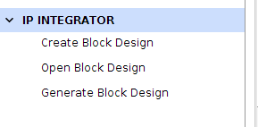

3. Versal ACAP CIPS IP コアをダブルクリックし、**\[Debug]** → **\[Debug Configuration]** をクリックします。 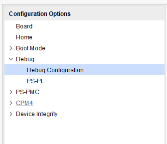

4. **\[High-Speed Debug Port (HSDP)]** の下の **\[Pathway to/from Debug Packet Controller (DPC)]** を **\[AURORA]** にします。

   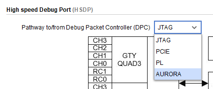

5. 次のオプションを設定します。

   - **\[GT Selection]**: **HSDP1 GT**
   - **\[GT Refclk Selection]**: **REFCLK1**
   - **\[GT Refclk Freq (MHz)]**: **156.25**

   > **注記:** ライン レートは 10.0 Gb/s に固定されます。

6. **\[OK]** をクリックして変更を保存します。CIPS IP 上に 2 つのポート (`gt_refclk1` および `HSDP1_GT`) が作成されます。

7. **\[IP Integrator]** ページで `gt_refclk1` を右クリックし、**\[Make External]** をクリックします。**HSDP1_GT** も同じように設定します。

   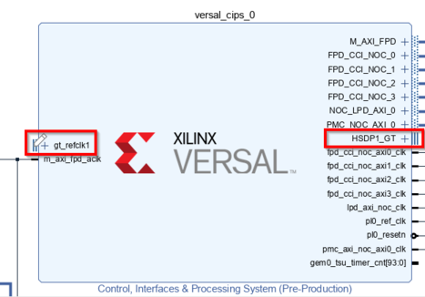

   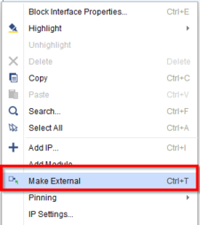

8. **\[Validate Design]** をクリックして **\[Save]** をクリックします。

### デバイス イメージの合成、インプリメント、生成

1. Flow Navigator で **\[Program and Debug]** → **\[Generate Device Image]** をクリックしてインプリメンテーションを開始します。

   デバイス イメージの生成が完了すると、[Device Image Generation Completed] ダイアログ ボックスが開きます。

   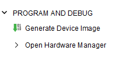

### ハードウェア (XSA) のエクスポート

1. Vivado ツールバーから **\[File]** → **\[Export]** → **\[Export Hardware]** をクリックします。[Export Hardware] ダイアログ ボックスが開きます。

   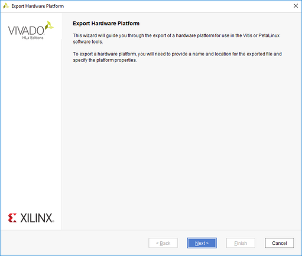

2. **\[Fixed]** を選択して **\[Next]** をクリックします。

3. **\[Include Device Image]** を選択し、**\[Next]** をクリックします。

4. エクスポートするファイルの名前 (例: `edt_versal_wrapper_with_hsdp`) を指定します。**\[Next]** をクリックします。

5. **\[Finish]** をクリックします。

## PetaLinux を使用した HSDP がイネーブルになった Linux イメージの作成

この例では、前の手順でビルドした HSDP がイネーブルになった XSA を使用して PetaLinux プロジェクトを再構築します。PetaLinux プロジェクトは、[「スカラー型エンジンと適応型エンジンを使用したシステム デザイン例」](../docs/5-system-design-example.md)に従って作成されたことを前提としています。

> **重要:** 前の章で PetaLinux プロジェクトを作成せずにこのチュートリアルを実行する場合は、[「サンプル プロジェクト: PetaLinux を使用した Linux イメージの作成」](./5-system-design-example.md#サンプル-プロジェクト-petalinux-を使用した-linux-イメージの作成)の手順 1 ～ 12 に従って、新しい PetaLinux プロジェクトを作成します。

このサンプル プロジェクトには、Linux ホスト マシンが必要です。PetaLinux ツールの依存関係とインストール手順については、『etaLinux ツールの資料: リファレンス ガイド』 ([UG1144](https://japan.xilinx.com/cgi-bin/docs/rdoc?v=latest;d=ug1144-petalinux-tools-reference-guide.pdf)) を参照してください。

1. 次のコマンドを使用して、[「サンプル プロジェクト: PetaLinux を使用した Linux イメージの作成」](./5-system-design-example.md#サンプル-プロジェクト-petalinux-を使用した-linux-イメージの作成)で作成した PetaLinux プロジェクト ディレクトリに移動します。

   `$ cd led_example`

2. 新しいハードウェア プラットフォーム プロジェクトの XSA を、PetaLinux ビルド ルートの 1 つ上のディレクトリにある Linux ホスト マシンにコピーします。

   > **注記:** 前の手順で生成したアップデート済みの XSA ファイルを使用するようにしてください。

3. 次のコマンドを実行して BSP を再設定します。

   ```
   $ petalinux-config --get-hw-description=<path till the directory containing the respective xsa file>
   ```

4. 次のコマンドを使用して、Linux イメージをビルドします。

   ```
   $ petalinux-build
   ```

5. ビルドが完了したら、次のコマンドを使用してブート イメージをパッケージにします。

   ```
   $ petalinux-package --force --boot --atf --u-boot
   ```

   > **注記:** パッケージされた Linux ブート イメージは、 PetaLinux ビルド ルートの `<PetaLinux-project>/images/Linux/` ディレクトリに含まれます。このディレクトリの場所は、次の手順で使用するため、メモしておいてください。PetaLinux のビルドに使用したマシン (Windows ベースの PC など) とは別のマシンを使用し、SmartLynq+ を使用して Linux ブート イメージをダウンロードする場合は、このチュートリアルに進む前に、このディレクトリの内容をそのマシンに移動しておく必要があります。

## SmartLynq+ モジュールの設定

Linux イメージがビルドされてパッケージされたら、JTAG または HSDP のいずれかを使用して VCK190 または VMK180 ボードにロードできます。HSDP を使用して接続するように SmartLynq+ モジュールを設定する手順は、次のとおりです。

1. VCK190 USB-C コネクタと SmartLynq+ モジュールの間を USB-C ケーブルを使用して接続します。

   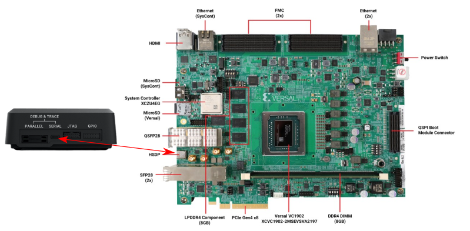

2. SmartLynq+ をイーサネットまたは USB のいずれかに接続します。

   * **[Using Ethernet]:** SmartLynq+ のイーサネット ポートとローカル エリア ネットワーク間をイーサネット ケーブルで接続します。
   * **[Using USB]:** SmartLynq+ の USB ポートと PC 間を提供されている USB ケーブルで接続します。

3. 電源アダプターを SmartLynq+ に接続し、VCK190/VMK180 ボードの電源を入れます。

   > **注記:** ボードを起動する前に、イーサネットケ ーブルをターゲット デバイスに接続してください。

4. SmartLynq+ の起動が完了すると、`eth0` または `usb0` の下の画面に IP アドレスが表示されます。この IP アドレスは、イーサネットおよび USB の両方のユース ケースで SmartLynq+ への接続に使用される IP アドレスであるため、メモしておいてください。

   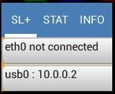

   > **注記:** イーサネットを使用する場合、SmartLynq+ はネットワーク上で検出された DHCP サーバーから IP アドレスを取得します。USB を使用する場合、USB ポートの IP アドレスは固定されており、`10.0.0.2` です。

5. デザイン パッケージ (`<design-package>/smartlynq_plus/xsdb`) から Linux ダウンロード スクリプトをコピーします。

### SmartLynq+ をシリアル端末として使用

SmartLynq+ は、VCK190 からの UART 出力をリモートで表示するためのシリアル端末としても使用できます。この機能は、リモート設定に物理的なアクセスができない場合に便利です。SmartLynq+ モジュールには、VCK190 上の UART に直接接続するために使用できる minicom アプリケーションが事前にインストールされています。

1. `PuTTY` (Windows) や `ssh` (UNIX ベースのシステム) などの SSH クライアントを使用して、SmartLynq+ ディスプレイに表示される IP アドレスに接続します。

   * ユーザー名: `xilinx`
   * パスワード: `xilinx`

   たとえば、SmartLynq+ に IP アドレス `192.168.0.10` が表示された場合、`ssh xilinx@192.168.0.10` コマンドを実行する必要があります。

2. デフォルトでは、minicom アプリケーションはハードウェア フロー制御を使用します。ザイリンクス ボード上の UART に正常に接続するには、ハードウェア フロー制御は VCK190 UART で使用されないので、ディスエーブルにする必要があります。これには、`sudo minicom -s` を実行して機能をディスエーブルにし、minicom 設定モードにします。または、ルートとして次のコマンドを実行し、minicom のデフォルト設定を変更します。

   ```
   echo "pu rtscts No" | sudo tee -a /etc/minicom/minirc.dfl
   ```

3. 最後に、次を実行して VCK190/VMK180 シリアル端末出力に接続します。

   ```
   sudo minicom --device /dev/ttyUSB1
   ```

4. この端末は開いたままにして、次のセクションに進みます。

   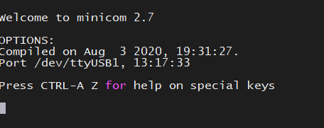

### JTAG または HSDP を介した Linux イメージのブート

SmartLynq+ を使用すると、SD カードを使用せずに Linux イメージを VCK190/VMK180 に直接ダウンロードできます。Linux イメージは JTAG または HSDP を使用して読み込むことができます。

このチュートリアルに含まれるデザイン パッケージには、SmartLynq+ モジュールを使用して前のステップで作成した Linux イメージをダウンロードするスクリプトが含まれます。このスクリプトは、JTAG または HSDP のいずれかを使用できます。

1. SmartLynq+ モジュールにアクセスできるマシンで、Vivado Tcl シェルを開きます。

   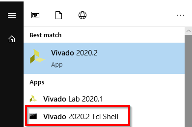

2. PetaLinux のビルドに使用したマシンで作業している場合は、作業ディレクトリを PetaLinux ビルド ルートに変更するか、上記の手順で `images/Linux` ディレクトリがローカル マシンに転送された場所に変更します。

3. Vivado Tcl シェルで次のコマンドを実行し、HSDP を使用してイメージをダウンロードします。

   ```
   xsdb Linux_download.tcl <smartlynq+ ip> images/Linux HSDP
   ```

   これにより、JTAG を使用して `BOOT.BIN` が読み込まれ、HSDP リンクがオート ネゴシエートされ、残りのブート イメージは HSDP を使用して読み込まれます。これにより、JTAG と比較して、速度がかなり速くなります。

   

   > **注記:** スクリプトの最後の引数を `FTDI-JTAG` に変更して、JTAG を使用して Linux イメージをダウンロードすることもできます。`xsdb Linux-download <smartlynq+ ip> images/Linux FTDI-JTAG`これは、JTAG を使用してすべての Linux ブート イメージをプログラムします。HSDP を使用する場合のダウンロード速度の違いに注意してください。

4. Versal ブート メッセージは、前のセクションで開いた端末の VCK190 UART から表示できます。

   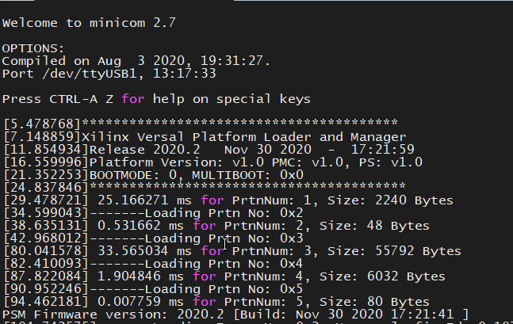

5. JTAG または HSDP のいずれかを使用した Linux の起動が完了すると、次のログイン画面が表示されます。

   

## 便利なリンク

* AXA-ILA、AXA-VIO、PCIe™ デバッガー、DDRMC キャリブレーション インターフェイスなどの PL ハードウェア デバッグ コアの使用については、『Vivado Design Suite ユーザー ガイド: プログラムおよびデバッグ』 ([UG908](https://japan.xilinx.com/support/documentation/sw_manuals/xilinx2020_2/ug908-vivado-programming-debugging.pdf)) を参照してください。

* SmartLynq+ モジュールの詳細は、『SmartLynq+ モジュール ユーザー ガイド』 ([UG1258](https://japan.xilinx.com/support/documentation/boards_and_kits/smartlynq/ug1258-smartlynq-cable.pdf)) を参照してください。

## サマリ

このセクションでは、HSDP を使用し、SmartLynq+ モジュールを接続し、リモート UART アクセス用に SmartLynq+ を設定し、HSDP を使用して Linux イメージをボードにダウンロードするデザインを作成しました。

© Copyright 2020-2021 Xilinx, Inc.

Apache ライセンス、バージョン 2.0 (以下「ライセンス」) に基づいてライセンス付与されています。本ライセンスに準拠しないと、このファイルを使用することはできません。ライセンスのコピーは、[http://www.apache.org/licenses/LICENSE-2.0](http://www.apache.org/licenses/LICENSE-2.0) から入手できます。

適切な法律で要求されるか、書面で同意された場合を除き、本ライセンスに基づいて配布されるソフトウェアは、明示的または黙示的を問わず、いかなる種類の保証または条件もなく、「現状のまま」配布されます。ライセンスに基づく権限と制限を管理する特定の言語については、ライセンスを参照してください。

<p align="center"><sup>この資料は 2021 年 3 月 30 日時点の表記バージョンの英語版を翻訳したもので、内容に相違が生じる場合には原文を優先します。資料によっては英語版の更新に対応していないものがあります。
日本語版は参考用としてご使用の上、最新情報につきましては、必ず最新英語版をご参照ください。</sup></p>
