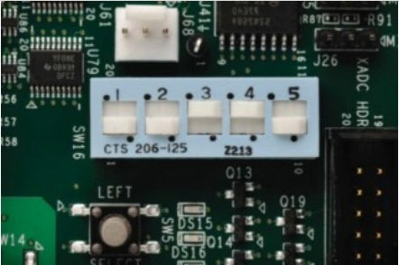
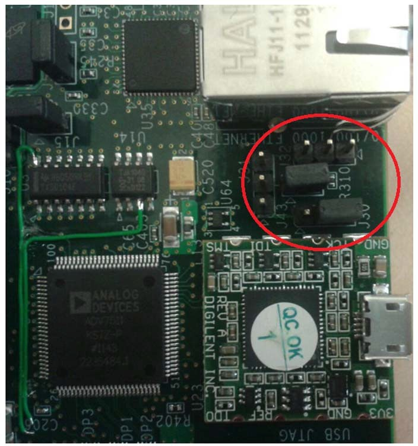
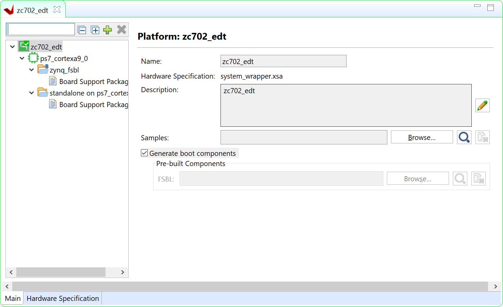
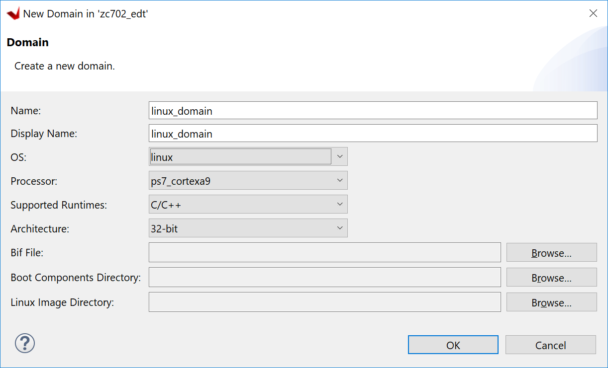
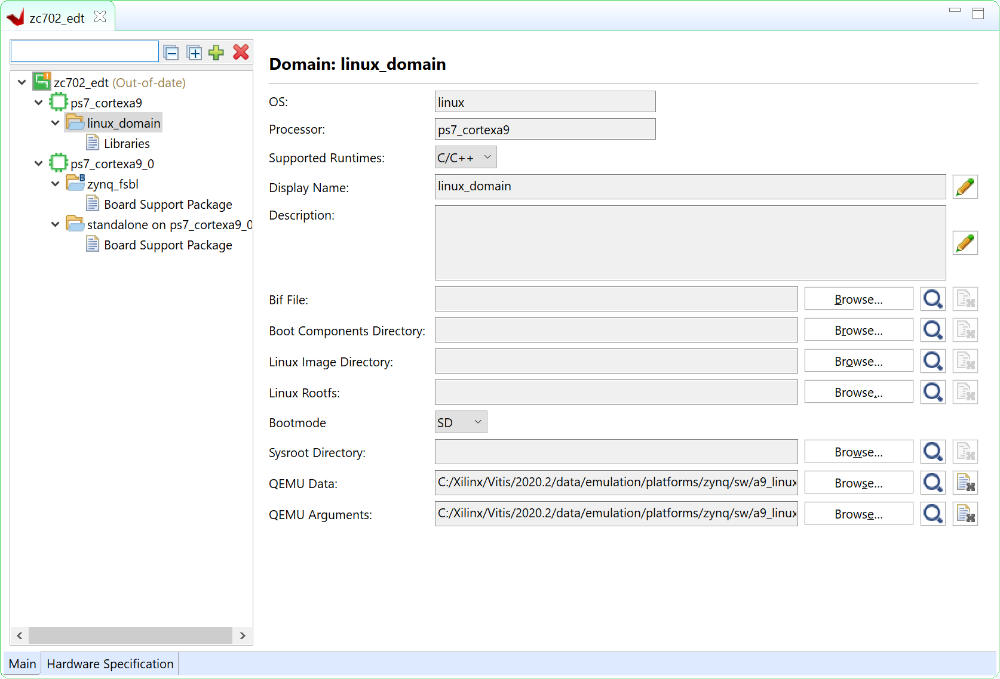
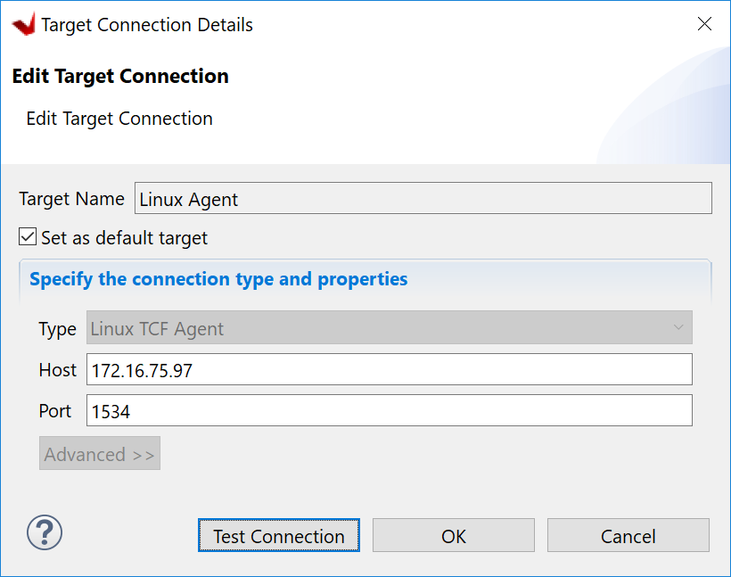
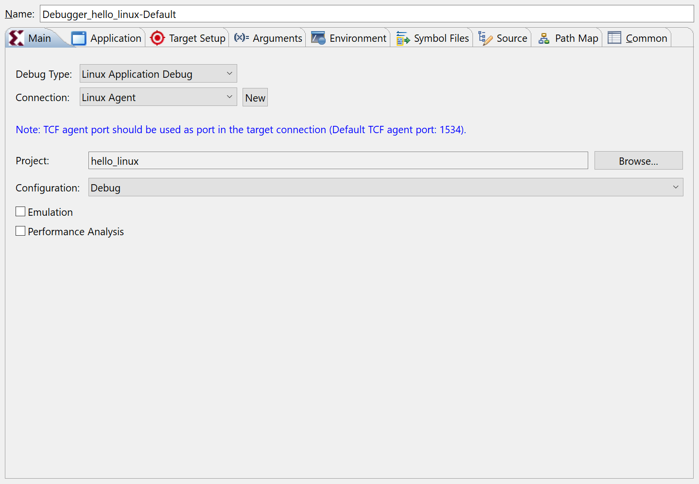
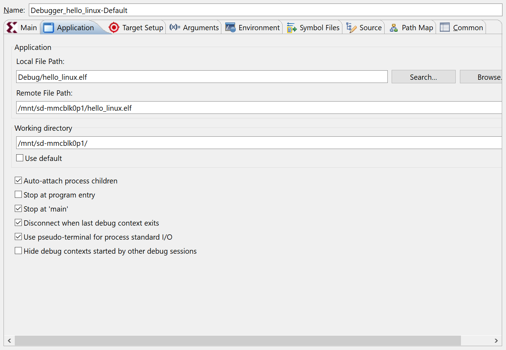
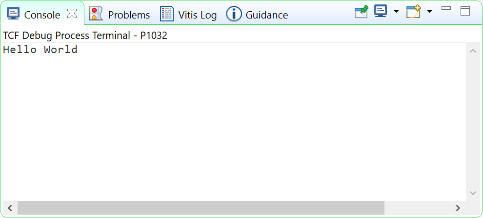
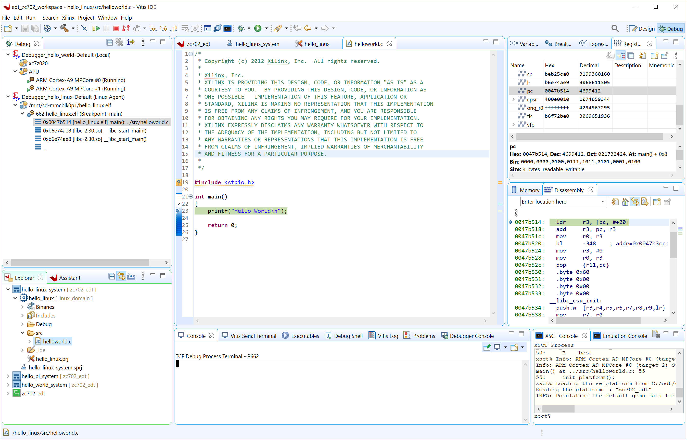

<th width="100%" colspan="6"><h1>Zynq-7000 SoC Embedded Design Tutorial 2020.2 (UG1165)</h1>
</th>

  </tr>

</table>

# Building and Debugging Linux Applications for Zynq-7000 SoCs

The earlier examples highlighted the creation of standalone applications. This chapter demonstrates how to develop Linux applications.

## Example 4: Creating Linux Images

In this example, you will configure and build a Linux operating system platform for an Arm™ Cortex-A9 core based APU on a Zynq® 7000 device. You can configure and build Linux images using the PetaLinux tool flow, along with the board-specific BSP. The Linux application is developed in the Vitis IDE.

### Input and Output Files

- Input:
  - Hardware XSA (``system_wrapper.xsa`` generated in [Example 1](./2-using-zynq.md#example-1-creating-a-new-embedded-project-with-zynq-soc))
  - [PetaLinux ZC702 BSP](https://www.xilinx.com/support/download/index.html/content/xilinx/en/downloadNav/embedded-design-tools.html)

- Output:
  - PetaLinux boot images (``BOOT.BIN``, ``image.ub``)
  - PetaLinux application (hello_linux)

 **IMPORTANT!:**

> 1. This example requires a Linux host machine with PetaLinux installed. Refer to the _PetaLinux Tools Documentation: Reference Guide_ ([UG1144](https://www.xilinx.com/cgi-bin/docs/rdoc?v=latest;d=ug1144-petalinux-tools-reference-guide.pdf)) for information about dependencies for PetaLinux 2020.2.

> 2. This example uses the [PetaLinux ZC702 BSP](https://www.xilinx.com/support/download/index.html/content/xilinx/en/downloadNav/embedded-design-tools.html) to create a PetaLinux project. Ensure that you have downloaded the zc702 BSP for PetaLinux as instructed on the [PetaLinux Tools download page](https://www.xilinx.com/member/forms/download/xef.html?filename=xilinx-zc702-v2020.2-final.bsp).

### Creating a PetaLinux Image

1. Create a PetaLinux project using the following command:

    ```bash
    petalinux-create -t project -s <path to the xilinx-zc702-v2020.2-final.bsp>
    ```

    **Note:** ``xilinx-zc702-v2020.2-final.bsp`` is the PetaLinux BSP for the zc702 Production Silicon Rev 1.0 Board.

    This creates a PetaLinux project directory, ``xilinx-zc702-2020.2``.

2. Reconfigure the project with ``system_wrapper.xsa``:

   - The created PetaLinux project uses the default hardware setup in the ZC702 Linux BSP. In this example, you will reconfigure the PetaLinux project based on the Zynq design that you configured using the Vivado® Design Suite in [Example 1](./2-using-zynq.md#example-1-creating-a-new-embedded-project-with-zynq-soc).

   - Copy the hardware platform ``system_wrapper.xsa`` to the Linux host machine.

   - Reconfigure the project using the following command:

   ```bash
   cd xilinx-zc702-2020.2
   petalinux-config --get-hw-description=<path containing system_wrapper.xsa>
   ```

    This command opens the PetaLinux Configuration window. You can review these settings. If required, make changes in the configuration. For this example, the default settings from the BSP are sufficient to generate the required boot images. Select **Exit** and press **Enter** to exit the configuration window.

    If you would prefer to skip the configuration window and keep the default settings, run the following command instead:

    ```
    petalinux-config --get-hw-description=<path containing system_wrapper.xsa> --silentconfig
    ```

3.  Build the PetaLinux project:

    - In the `<PetaLinux-project>` directory, e.g. ``xilinx-zc702-2020.2``, build the Linux images using the following command:

    ```bash
    petalinux-build
    ```

    After the above statement executes successfully, verify the images
     and the timestamp in the images directory in the PetaLinux project
     folder using the following commands:

    ``` bash
    cd images/linux
    ls -al
    ```

    - `boot.scr` is for U-Boot to load the kernel and rootfs during boot time
    - `image.ub` contains kernel image, device tree and rootfs.

4.  Generate the boot image using the following command:

    ```bash
    petalinux-package --boot --fsbl zynq_fsbl.elf --u-boot
    ```

    This creates a ``BOOT.BIN`` image file in the ``<petalinux-project>/images/linux/`` directory.

    **Note:** The option to add bitstream, `--fpga`, is missing
    from the above command intentionally because so far the hardware
    configuration is based only on a PS with no design in the PL. If a bitstream is present in the design, `--fpga` can be added in the
    ``petalinux-package`` command as shown below:

    ```bash
    petalinux-package --boot --fsbl zynq_fsbl.elf --fpga system.bit --u-boot u-boot.elf
    ```

    Refer to `petalinux-package --boot --help` for more details about the boot image package command.


### Booting Linux on the Target Board

You will now boot Linux on the Zynq-7000 SoC ZC702 target board using
JTAG mode.

**Note:** Additional boot options are explained in [Linux Booting and Debug in the Software Platform](./7-linux-booting-debug.md).

1. Copy the `BOOT.BIN`, `image.ub`, and `boot.scr` files to the SD card.

2. Set up the board as described in [Setting Up the Board](./2-using-zynq.md#setting-up-the-board).

3. Change the boot mode to SD boot.

    - Change **SW16[5:1]** to **01100**

    

4.  Make sure Ethernet Jumper J30 and J43 are as shown in the following figure.

    

    Ethernet is optional in this example. It is required in Example 5.    

5.  Launch the Vitis software platform and open the same workspace you
    used in [Using the Zynq SoC Processing System](2-using-zynq.md).

6.  If the serial terminal is not open, connect the serial communication
    utility with the baud rate set to **115200**.

    **Note:** This is the baud rate that the UART is programmed to on
    Zynq devices.

7.  Power on the target board.

8.  The Linux login prompt will appear. Use user name `root` and password `root` to log in.

## Example 5: Creating a Hello World Application for Linux in the Vitis IDE


### Creating Linux Domain

Now that Linux is running on the board, you can create a Linux domain
followed by a Linux application. The steps to create a Linux domain
are given below:

1.  Go to the Explorer view in the Vitis software platform and expand
    the **zc702_edt** platform project.

2.  Open the platform by double clicking **platform.spr**.

3.  The platform view opens. Click the **+** button in the right corner
    to add a domain, as shown in the following figure.

    

4.  When the New Domain dialog box opens, enter the details as given
    below:

    | Option                    | Value        |
    | ------------------------- | ------------ |
    | Name                      | linux_domain |
    | Display Name              | linux_domain |
    | OS                        | Linux        |
    | Processor                 | ps7_cortexa9 |
    | Supported Runtimes        | C/C++        |
    | Architecture              | 32-bit       |
    | Bif file                  | Keep blank   |
    | Boot Components Directory | Keep blank   |
    | Linux image directory     | Keep blank   |

    

    - Click **OK** to finish, and observe that the Linux domain has been added to the zc702_edt as shown below.

    

    **Note**: If you fill in the Bif File, Boot Components Directory, and Linux Image Directory options, Vitis can help to generate ``sd_card.img`` when you build the system project in the Linux host OS. In this case, it is helpful to use the ``ext4`` root file system. In the examples in this tutorial, which use ``initramfs``, it is only required to copy files to the FAT32 partition into the SD card, so this feature will not be used.

5. Build the platform:

    - Click the hammer button on the tool bar to build the platform.

    Now you have a Linux domain and are ready to create Linux applications.


### Creating Linux Applications in the Vitis IDE

1. Create a Linux application:

   - Click **File → New → Application Project**.
   - Click **Next** on the welcome page.
   - Select platform: **zc702_edt**. Click **Next**.
   - Enter the application project name, **hello_linux**, and the target processor, **psu_cortexa9 SMP**.
   - Keep the default domain: **linux_domain**.
   - Keep the SYSROOT, rootfs, and kernel image empty, and click **Next**.
   - Select the **Linux Hello World** template. Click **Finish**.

   **Note:** If you input an extracted SYSROOT directory, Vitis can find include files and libraries in SYSROOT. SYSROOT is generated by the PetaLinux project `petalinux-build --sdk`. Refer to the _PetaLinux Tools Documentation: Reference Guide_ ([UG1144](https://www.xilinx.com/cgi-bin/docs/rdoc?v=2020.2;d=ug1144-petalinux-tools-reference-guide.pdf)) for more information about SYSROOT generation.

   **Note:** If you input a rootfs and kernel image, Vitis can help to generate the ``SD_card.img`` when building the Linux system project.

2. Build the **hello_linux** application.

   - Select **hello_linux**.
   - Click the hammer button to build the application.

### Preparing the Linux Agent for Remote Connection

The Vitis IDE needs a channel to download the application to the running target. When the target runs Linux, it uses TCF Agent running on Linux. TCF Agent is added to the Linux rootfs from the PetaLinux configuration by default. When Linux boots up, it launches TCF Agent automatically. The Vitis IDE talks to TCF Agent on the board using an Ethernet connection.

1. Prepare for running the Linux application on the ZC702 board. Vitis can download the Linux application to the board, which runs Linux through a network connection. It is important to ensure that the connection between the host machine and the board works well.

   - Make sure the USB UART cable is still connected with the ZC702 board. Turn on your serial console and connect to the UART port.
   - Connect an Ethernet cable between the host and the ZC702 board.
       - It can be a direct connection from the host to the ZC702 board.
       - You can also connect the host and the ZC702 board using a router.
   - Power on the board and let Linux run on ZC702 (see [Verifying the Image on the ZC702 Board](#verify-the-image-on-the-zc702-board)).
   - Set up a networking software environment.
       - If the host and the board are connected directly, run `ifconfig eth0 192.168.1.1` to set up an IP address on the board. Go to **Control Panel → Network and Internet → Network and Sharing Center**, and click **Change Adapter Settings**. Find your Ethernet adapter, then right-click and select **Properties**. Double-click **Internet Protocol Version 4 (TCP/IPv4)**, and select **Use the following IP address**. Input the IP address **192.168.1.2**. Click **OK**.
       - If the host and the board are connected through a router, they should be able to get an IP address from the router. If the Ethernet cable is plugged in after the board boots up, you can get the IP address manually by running the `udhcpc eth0` command, which returns the board IP address.
       - Have the host and the zc702 board ping each other to make sure the network is set up correctly.

2. Set up the Linux agent in the Vitis IDE.

   - Click the **Target Connections** icon on the toolbar.
   - It can also be launched by going to **Window → Show View...** and then looking for the target.

   

   - In the Target Connections window, double-click **Linux TCF Agent → Linux Agent[default]**.
   - Input the IP address of your board.
   - Click **Test Connection**.

   

   - Vitis should return a pop-up confirmation for success.

   

### Running the Linux Application from the Vitis IDE

1. Run the Linux application:

   - Right-click **hello_linux**, and select **Run As → Run Configurations**.
   - Expand **Single Application Debug** and select **Debugger_hello_linux-Default**. If it doesn't exist, click the **New Launch Configuration** button or double click **Single Application Debug** to create a new launch configuration for hello_linux.
   - Review the configurations:
       - Debug type: **Linux Application Debug**
       - Connection: **Linux Agent**
   - Click **Run**.

   

   

   - The console should print **Hello World**.

    


2. Disconnect the connection:

   - Click the **Terminate** button on the toolbar or press **Ctrl+F2**.
   - Click the **Disconnect** button on the toolbar.

### Debugging a Linux Application from the Vitis IDE

Debugging Linux applications requires the Linux agent to be set up properly. Refer to [Preparing the Linux Agent for Remote Connection](#prepare-linux-agent-for-remote-connection) for detailed steps.

1. Debug the Linux application:

   - Right-click **hello_linux**, then select **Debug As → Debug Configurations**.
   - Expand **Single Application Debug** and select **Debugger_hello_linux-Default**.
   - Review the configurations:
     - Debug type: **Linux Application Debug**
     - Connection: **Linux Agent**
   - Click **Debug**.

    The debug configuration has identical options to the run configuration. The difference between debugging and running is that debugging stops at the `main()` function.

2. Try the debugging features:

    Hello World is a simple application. It does not contain much to debug, but you can try the following to explore the Vitis debugger:

    - Review the tabs on the upper right corner: Variables, Breakpoints, Expressions, and the rest.
    - Review the call stack on the left.
    - The next line to execute has a green background.
    - Step over by clicking the icon on the toolbar or pressing **F6** on the keyboard. The printed string will be shown on the Console panel.

    

3. Disconnect the connection:

   - Click the **Terminate** button on the toolbar or press **Ctrl+F2**.
   - Click the **Disconnect** button on the toolbar.


## Summary

In this chapter, you learned how to:

- Create a Linux boot image with PetaLinux.
- Create simple Linux applications with the Vitis IDE.
- Run and debug using the Vitis IDE.

See the [next chapter](./5-using-gp-port-zynq.md) to learn how to use the GP port in Zynq devices.

© Copyright 2015–2021 Xilinx, Inc.

Licensed under the Apache License, Version 2.0 (the "License"); you may not use this file except in compliance with the License. You may obtain a copy of the License at

http://www.apache.org/licenses/LICENSE-2.0

Unless required by applicable law or agreed to in writing, software distributed under the License is distributed on an "AS IS" BASIS, WITHOUT WARRANTIES OR CONDITIONS OF ANY KIND, either express or implied. See the License for the specific language governing permissions and limitations under the License.