<th width="100%" colspan="6"><h1>Zynq UltraScale+ MPSoC Embedded Design Tutorial 2020.2 (UG1209)</h1>
</th>

  </tr>

</table>


# Building Standalone Software for PS Subsystems

This chapter lists the steps to configure and build software for PS subsystems.

In the previous chapter, [Zynq UltraScale+ MPSoC Processing System Configuration](3-system-configuration.md), you created and exported the hardware
design from Vivado. The exported XSA file contains the hardware
handoff, the processing system initialization (``psu_init``),
and the PL bitstream (if the hardware is exported as post-implementation). In this chapter, you will import the XSA into the Vitis™ IDE to generate software for the processing system.

You will use the Vitis IDE to perform the following tasks:

1. Create a platform project for the hardware XSA. The first stage boot loader (FSBL) and PMU firmware for the PMU (platform management unit) will be created as boot components in this platform project.

2. Create bare-metal applications for the application processing unit (APU).

3. Create a system project for the APU and real time processing unit (RPU).

## Example 2: Creating a Platform Project Using Vitis IDE

The main processing units in the Zynq UltraScale+ processing system are listed below:

- **Application processing unit:** Quad-core Arm® Cortex™-A53 MPCore processors
- **Real time processing unit:** Dual-core Arm Cortex™-R5F MPCore processors
- **Graphics processing unit:** Arm Mali™ 400 MP2 GPU
- **Platform management unit (PMU):** Xilinx MicroBlaze™ based platform management unit

The platform project reads in hardware information from the XSA file and contains the runtime environment for the above processing units. Application software can link against the libraries generated in the platform project.

### Example Input and Output Files

- Input: hardware handoff XSA file (``edt_zcu102_wrapper.xsa``)
- Output:
  - Standalone BSP libraries for Arm Cortex-A53
  - Boot components (FSBL: ``zynqmp.elf`` and PMUFW: ``pmufw.elf``)

### Creating the Platform Project

The following steps show how to create a platform project with a standalone domain for Arm Cortex-A53.

1. Launch the Vitis IDE:

   - From the open Vivado IDE, click **Tools → Launch Vitis IDE**; or
   - From Windows Start menu, select **Xilinx Design Tools → Xilinx Vitis 2020.2**; or
   - Double-click the `C:\Xilinx\Vitis\2020.2\bin\vitis.bat` file.

2. Select the workspace `C\edt\edt_zcu102_workspace` and continue.

   

   >**Note:** If the directory doesn't exist, Vitis will create it.

3. In the Vitis IDE, go to **File → New → Platform Project**.

4. In the Create New Platform page, enter the platform name `zcu102_edt` and click **Next**.

5. In the Platform view, go with the default tab **Create from hardware specification (XSA)**.

   > **Note:** Use the **Select a platform from repository** tab when you have a pre-built platform and you'd like to copy it to local to modify it.

6. Click **Browse...** to select the XSA file exported from previous chapter.

7. Select the preferred operating system, processor, and architecture.

  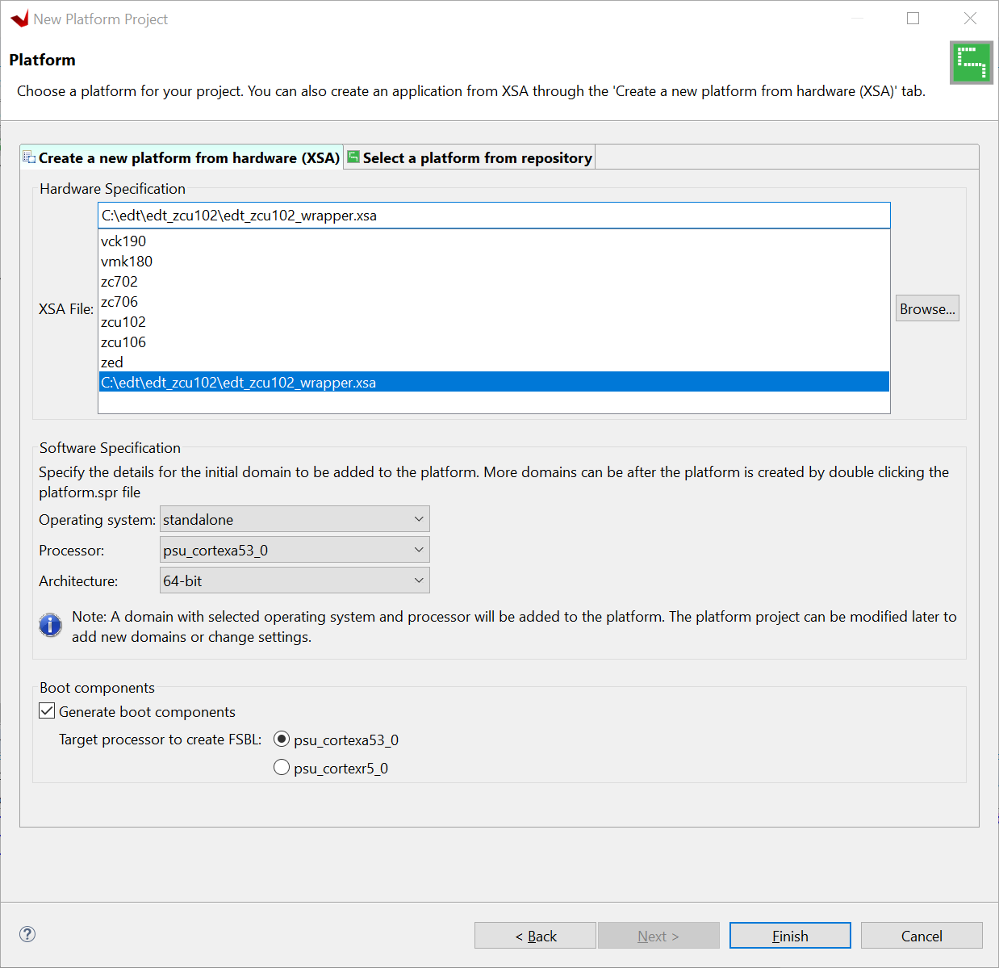

  | Screen                   | Property        |
  |---------------------------------|-----------------|
  | Operating System                | Standalone      |
  | Processor                       | psu_cortexa53_0 |
  | Architecture                    | 64-bit          |
  | Generate Boot Components        | Keep it checked |
  | Target processor to create FSBL | psu_cortexa53_0 |

8.  Click **Finish**.

9.  In a few minutes, the Vitis IDE generates the platform. The files
     that are generated are displayed in the explorer window as shown
     in the following figure.

    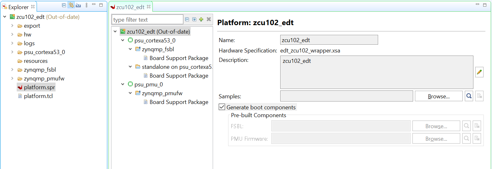

       - There is a standalone domain in the platform under psu_cortexa53_0 processor. New applications for Cortex-A53 can link against it.
       - Default domains for FSBL and PMU firmware come with the platform project when **Generate Boot Components** is selected during application or platform project creation.
       - You are free to add and remove domains in the platform project.
       - You can customize the domain configurations.

10.  Build the hardware by right-clicking the platform, then
     selecting **Build Project**.

     

     The platform project is ready. You can create applications using this platform and test on zcu102 hardware.

     **Note** The project build process builds the standalone BSP, FSBL, and PMUFW. FSBL and PMUFW have their own BSP. The build process takes some time.

## Example 3: Running the "Hello World" Application from Arm Cortex-A53

 In this example, you will learn how to manage the board settings, make
 cable connections, connect to the board through your PC, and run a
 simple "Hello World" software application from Arm Cortex-A53 in JTAG
 mode using the System Debugger in the Vitis IDE.

### Input and Output Files

- Input: standalone BSP libraries in the platform created in the previous example
- Output: ``hello.elf`` for Arm Cortex-A53

### Board Setup


1. Connect the power cable to the board.

2. Connect a USB micro cable between the Windows host machine and J2 **USB JTAG** connector on the target board.

3. Connect a USB micro cable to connector J83 on the target board with the Windows host machine. This is used for USB to serial transfer.

4. Ensure that the SW6 Switch on the bottom right is set to **JTAG boot mode** as shown in the following figure.

   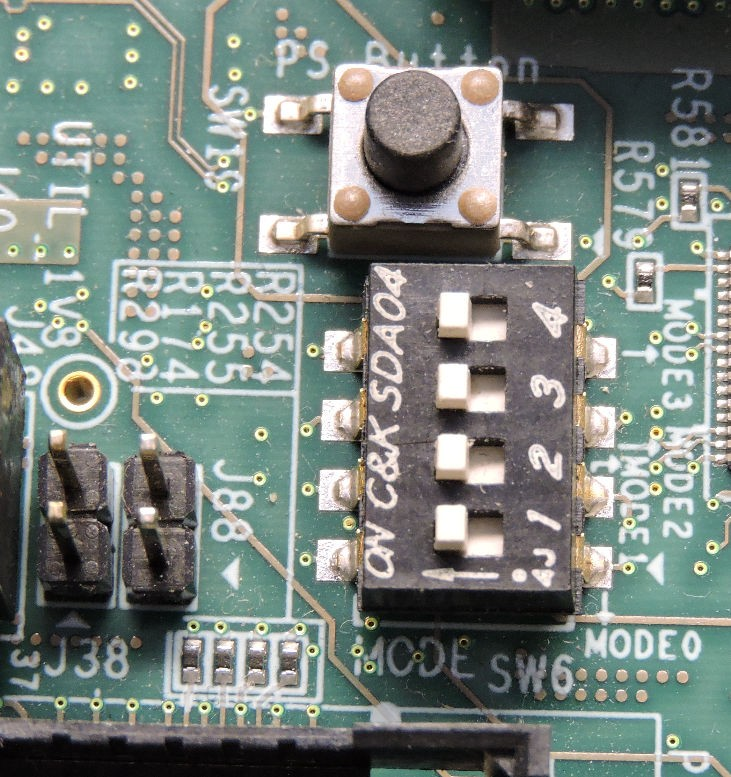

5. Power on the ZCU102 board.

### Connecting the Serial Port

1. Open your preferred serial communication utility for the COM port.

   **Note**: You can use any serial communication utility in your system. The Vitis IDE provides a serial terminal utility. We will use it throughout the tutorial; select **Window → Show View → Vitis Serial Terminal** in Vitis IDE to open it.

   **Note**: In Linux, root privilege is required to use UART.

2.  Click the **+** button to set the serial configuration.

    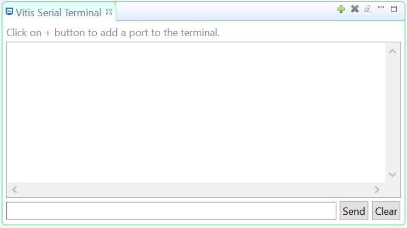

3. To find the correct COM port in Windows, verify the port details in the **Device Manager**. In Linux, check the COM port in `/dev`.

    MPSoC UART-0 corresponds to the COM port with Interface-0. Windows Device Manager provides mapping between Interface-x and COM-x.

    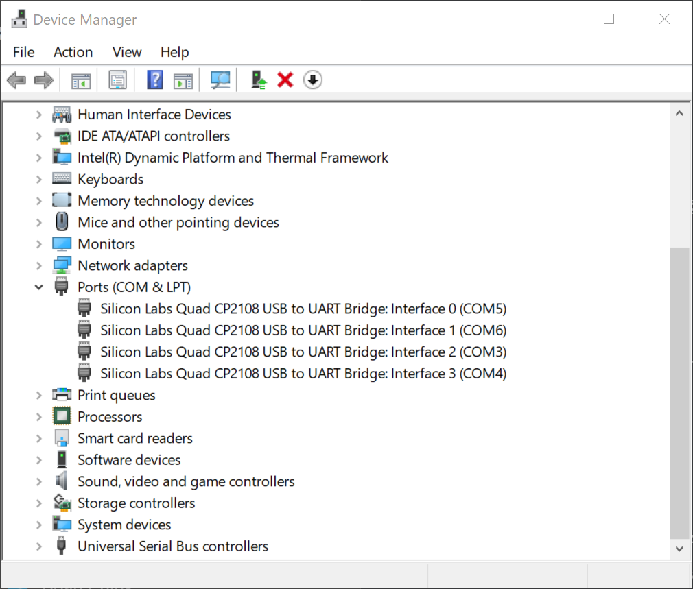

    In the above example, use **COM5** for Interface-0 and baud rate **115200**.

4. From the **Port** dropdown menu, select the port number for Interface-0 (**COM5** in this example).

   

5. Keep the other settings as-is and click **OK** to connect. The connection status is shown in the Vitis Serial Terminal window.

   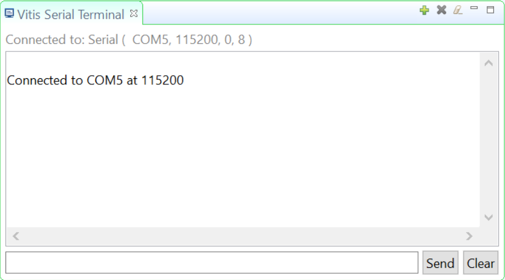

### Creating a Hello World Application on Arm Cortex-A53

To send the "Hello World" string to the UART0 peripheral, follow these steps:

1. Select **File → New → Application Project**. The Create New Application Project wizard opens.

2. Click **Next**.

3. Use the information in the table below to make your selections in
     the wizard screens.

     | Screen               | System Properties               | Settings                      |
     |-----------------------------|---------------------------------|-------------------------------|
     | Platform                    | Select platform from repository | zcu102_edt            |
     | Application project details | Application project name        | hello_a53                      |
     |                             | System project name             | hello_system               |
     |                             | Target processor                | psu_cortexa53_0               |
     | Domain                      | Domain                          | standalone on psu_cortexa53_0 |
     | Templates                   | Available templates             | Hello World                   |

    The Vitis IDE creates the **hello_a53_system** project in the Explorer view. **hello_a53** sits inside **hello_a53_system**.

### Running Hello World on the Board

1. Right-click the **hello_a53 application project** and select **Build** to build the application.

2. Right-click **hello_a53** and select **Run as → Run Configurations**.

3. Right-click **Xilinx Application Debugger** and click **New Configuration**.

    The Vitis IDE creates the new run configuration, named ``Debugger_hello_a53-Default``.

    The configurations associated with the application are pre-populated
    in the Main page of the launch configurations.

4.  Click the **Target Setup** page to review the settings.

    >**Note:** The board should be in JTAG boot mode before power cycling.

5. Power cycle the board.

6. Click **Run**.

    Hello World appears on the serial communication utility in Terminal 1,
    as shown in the following figure.

    

    >**Note:** No bitstream download is required for the above
    software application to be executed on the Zynq UltraScale+ evaluation
    board. The Arm Cortex-A53 quad-core is already present in the
    processing system. Basic initialization of this system to run a simple
    application is accomplised by the device initialization Tcl script.

7. Power cycle the board and retain the same connections and board settings
     for the next section.

#### What Just Happened?

 The application software sent the "Hello World" string to the UART0
 peripheral of the PS section.

 From UART0, the "Hello World" string goes byte-by-byte to the serial
 terminal application running on the host machine, which displays it as
 a string.

#### One Step Further

Could you create a "Hello World" application for Arm Cortex-R5F and launch it though JTAG?

**Hints**:

1. In the platform project, you will need to create a domain for the Arm Cortex-R5 processor.
2. In the New Project Wizard, remember to select the proper target processor.

The full workflow is explained in the next example.

## Additional Information

See below for a definitions of some of the terms used in this chapter.

### Domain

A domain can refer to the settings and files of a standalone BSP, a
Linux OS, a third-party OS/BSP such as FreeRTOS, or a component such as the
device tree generator.

You can create multiple applications to run on the domain. A domain is tied to a single processor or a cluster of isomorphic processors (for example: A53_0 or A53) in the platform.

### Board Support Package

The board support package (BSP) is the support code for a given hardware platform or board that helps in basic initialization at power-up and helps software applications to be run on top of it. It can be specific to some operating systems with boot loader and device drivers.

>**Tip:** To reset the BSP source, double-click **platform.prj**,
select a BSP in a domain, and click **Reset BSP Source**. This action
only resets the source files while settings are not touched. To change the target domain after
application project creation, double-click the **project.prj** file in Explorer view. In the Application Project Settings, select **Domain → Domain change option → Drop-down Domain**, then select the
available domains for this application.

### Standalone BSP

 Standalone is a simple, low-level software layer. It provides access
 to basic processor features such as caches, interrupts, and
 exceptions, as well as the basic processor features of a hosted
 environment. These basic features include standard input/output,
 profiling, abort, and exit. It is a single-threaded semi-hosted
 environment.

## Example 4: Running the "Hello World" Application from Arm Cortex-R5

In this example, you will learn how to run a simple "Hello World" software application for the Arm Cortex-R5F processor in the JTAG mode using System Debugger in the Vitis IDE.

The application for Cortex-R5F needs a domain for cortexr5_0. You will create it in the zcu102_edt platform and reuse it for the new application. You will create the Cortex-R5F application with the updated zcu102_edt platform.

The hardware setup and serial console connection is the same as in Example 2.  

### Input and Output Files

- Input:  zcu102_edt platform with standalone domain on Arm Cortex-A53
- Output: zcu102_edt platform with standalone domain on Arm Cortex-A53 and Cortex-R5F processors


### Creating a Standalone BSP Domain for cortexr5_0

In this step, you will prepare for the next example design: running a "Hello World" application on Arm Cortex-R5. The first step is to create a standalone BSP domain for cortexr5_0 by performing the following steps:

1. Double-click `platform.spr`. The platform opens in the Explorer view.

2. Click in the top-right corner to add a domain .

3. Create a domain with the following settings:

   |  System Properties                |  Setting or Command to Use      |
   |-----------------------------------|---------------------------------|
   | Name                              | standalone_r5                  |
   | Display name                      | standalone_r5                  |
   | OS                                | Standalone                      |
   | Version                           | Standalone (7.3)                |
   | Processor                         | psu_cortexr5_0                  |
   | Supported Runtime                 | C/C++                           |
   | Architecture                      | 32-bit                          |

4.  The Vitis IDE creates a new domain and **standalone_r5** appears under
     the **zcu102_edt** platform.

#### What Just Happened?

The edt_zcu102_wrapper platform is, by default, assigned the default domain for psu_cortexa53_0. You created a new domain for cortexr5_0 in this platform..


### Creating a "Hello World" Application on Arm Cortex-R5F

1. Select **File → New → Application Project**. The Create New Application Project wizard welcome screen opens.

2. Click **Next**.

3. Use the information in the table below to make your selections in the wizard screens.

     | Screen               | System Properties               | Settings                      |
     |-----------------------------|---------------------------------|-------------------------------|
     | Platform                    | Select platform from repository | zcu102_edt            |
     | Application project details | Application project name        | hello_r5                      |
     |                             | System project name             | hello_system               |
     |                             | Target processor                | psu_cortexr5_0               |
     | Domain                      | Domain                          | standalone_r5 |
     | Templates                   | Available templates             | Hello World                   |

    The Vitis IDE creates the **hello_r5_system** project in the Explorer view. **hello_r5** sits inside **hello_r5_system**.

5. Select **hello_r5_system** and click the hammer icon in the toolbar to build the system project.

### Running the "Hello World" Application on Arm Cortex-R5F

1.  Right-click **hello_r5** and select **Run as → Run Configurations**.

2.  Right-click **Xilinx Application Debugger** and click **New Configuration**.

    The Vitis IDE creates the new run configuration, named
    Debugger_hello_r5-Default. The configurations associated with
    the application are pre-populated in the Main page of the launch
    configurations.

3.  Click the **Target Setup** page and review the settings.

    This file is exported when you create the platform using the Vitis
    IDE; it contains the initialization information for the processing
    system.

4.  Click **Run**.

    

    "Hello World" appears on the serial communication utility in Terminal 1, as shown in the following figure.

    >**Note:** No bitstream download is required for the above
    software application to be executed on the Zynq UltraScale+ evaluation
    board. The Arm Cortex-R5F dual core is already present on the board.
    Basic initialization of this system to run a simple application is
    accomplised by the device initialization Tcl script.

## Example 5: Create a Bare-Metal System Application Project in the Vitis IDE

The Vitis IDE can organize application projects that need to run at the same time in one system project. This can come in useful in project organization and makes debugging easier when the Arm Cortex-A53 and Arm Cortex-R5F need to run simultaneously.

In this example, you will update the hello_system project created in Example 3:

- Modify the "Hello World" application source code
- Import prepared source codes for Arm Cortex-R5F
- Adjust the linker script

### Input and Output Files

- Input:
  - Platform: zcu102_edt with standalone domains for Arm Cortex-A53 and Arm Cortex-R5F
  - Source code for ARM Cortex-R5F: [ref_files/example5/testapp_r5.c](./ref_files/example5/testapp_r5.c)
- Output:
  - System project hello_system that includes hello_a53 and testapp_r5 applications

### Modifying the hello_a53 Application Source Code

1. Open the **helloworld.c** source file for the **hello_a53** application.

   - In the Explorer view, double-click **helloworld.c** in **hello_a53 → src**.

2. Modify the arguments in the print command, as shown below.

    `Print("Hello World from APU\n\r");`

    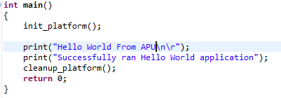

3. Save the changes:

   - Press **Ctrl + S**, or click the save icon on the toolbar.

4. Build the hello_a53 application:

   - Right-click the **hello_a53** application and select **Build Project**.
   - Alternatively, it can be done by clicking the save button on the toolbar.

5. Verify that the application is compiled and linked successfully:

   - The console window report looks like the following:

   ```
     'Invoking: ARM v8 Print Size'
     aarch64-none-elf-size hello_a53.elf  |tee "hello_a53.elf.size"
     text	   data	    bss	    dec	    hex	filename
     30212	   2048	  20676	  52936	   cec8	hello_a53.elf
    'Finished building: hello_a53.elf.size'
   ```

   - The **hello_a53.elf** file is generated in the **hello_a53 → Debug** folder.

### Creating a Custom Bare-Metal Application for an Arm Cortex-R5 Based RPU

You will now create a bare-metal application for Arm Cortex-R5F. The application source files are provided in the ``ref_files/example5`` directory. They will be imported in the next steps.

1. Create an empty bare-metal application for Cortex-R5F Core 0 in the hello_system system project:

   - In the Explorer View, select **hello_system**, right-click it, and select **New Application Project** to open the New Project wizard.

   - Use the information in the following table to make your selections in the wizard.

     | Screen               | System Properties               | Settings           |
     |-----------------------------|---------------------------------|--------------------|
     | Application project details | Application project name        | testapp_r5         |
     |                             | System project name             | hello_system  |
     |                             | Show all processors in hardware specification | check |
     |                             | Target processor                | psu_cortexr5_0     |
     | Domain                      | Domain                          | standalone_r5     |
     | Templates                   | Available templates             | Empty application  |

   - Click **Finish**. The New Project wizard closes and the Vitis IDE creates the testapp_r5
    application project in the hello_system system project.

2. Import the prepared source code for **testapp_r5**:

   - In the Explorer view, expand the **hello_system** project to find the **testapp_r5** project.

   - Right-click the **testapp_r5** and select **Import Sources** to open the Import view.

   - In the **From directory** field, select **Browse** and navigate to the design files folder ([ref_files/example5](ref_files/example5)).

   - Click **OK**.

   - Select the **testapp.c file**.

   - Click **Finish**.

   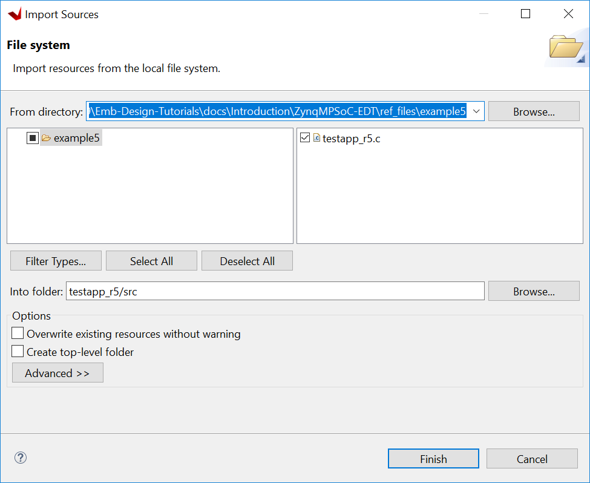


3.  Open **testapp_r5.c** in to review the source code for this application:

   - Double-click **testapp_r5.c**.
   - The application configures the UART interrupt and sets the processor to WFI mode.

### Modifying the Linker Script for testapp_r5

1. In the Explorer view, expand the **testapp_r5 project**.

2. In the ``src`` directory, double-click **lscript.ld** to open the linker
     script for this project.

3. In the linker script, in Available Memory Regions, modify the following attributes for **psu_r5_ddr_0_MEM_0**:

    - Base Address: 0x70000000

    - Size: 0x10000000

    The linker script modification is shown in following figure. The
    following figure is for representation only. Actual memory regions might
    vary in the case of isolation settings.

    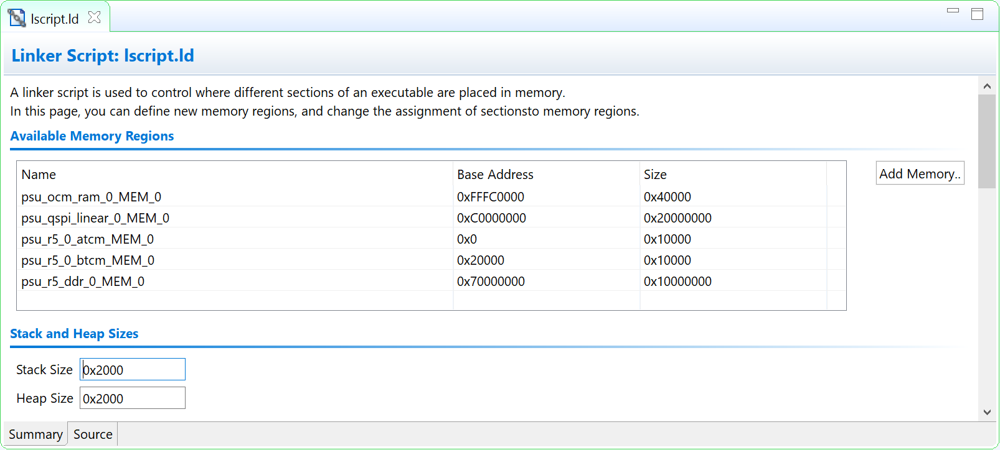

    This modification in the linker script ensures that the RPU bare-metal
    application resides above 0x70000000 base address in the DDR, and
    occupies no more than 256 MB of size.

4. Press **Ctrl + S** to save the changes.

5. Right-click the **testapp_r5** project and select **Build Project**.

6. Verify that the application is compiled and linked successfully, and that the `testapp_r5.elf` file has been generated in the ``testapp_r5/Debug`` folder.

### Modifying the Board Support Package for testapp_r5

 The ZCU102 Evaluation kit has a USB-TO-QUAD-UART Bridge IC from
 Silicon Labs (CP2108). This enables you to select a different UART
 port for applications running on Cortex-A53 and Cortex-R5F cores. For
 this example, let Cortex-A53 use the UART 0 by default, and send and
 receive RPU serial data over UART 1. This requires a small
 modification in the ``r5_bsp`` file.

1. Open the platform details tab by double-clicking **zcu102_edt → platform.spr**.

2. Open the standalone domain BSP setting details for Cortex-R5F:

   - Navigate to **psu_cortexr5 → standalone_r5 → Board Support Package**.
   - Click **Modify BSP Settings**.

3. Change the UART settings for standalone_r5:

   - Select the **Standalone** tab.
   - Change **stdin** to **psu_uart_1**.
   - Change **stdout** to **psu_uart_1**.

    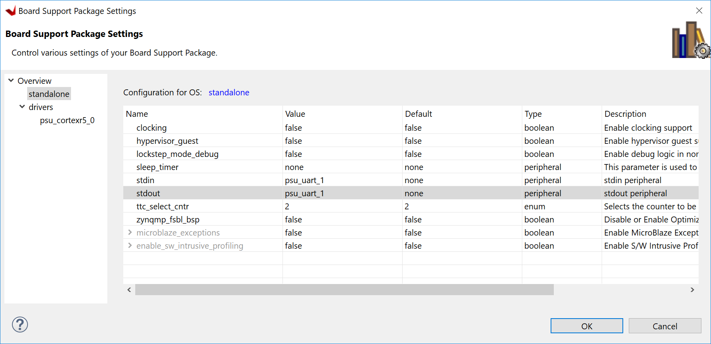

   - Click **OK**.

4. Build the psu_cortexr5_0 domain and the testapp_r5 application.

5. Verify that the application is compiled and linked successfully and that the `testapp_r5.elf` has been generated in the `testapp_r5/Debug` folder.

### Running the hello_system System Project on Hardware

1. Set up the board as in Example Project 1:

   - Connect the power and USB cables for UART and JTAG.
   - Set the boot mode to JTAG boot mode.
   - Power on.

2. Connect the serial console for UART-0 and UART-1:

   - Use the [MobaXterm](https://mobaxterm.mobatek.net/) utility to connect multiple UART ports.
   - Open USB UART Interface-0 for UART-0 for APU.
   - Open USB UART Interface-1 for UART-1 for RPU.

2. Run hello_system on hardware:

   - Right-click **hello_system** in the Explorer window, and select **Run As → Launch Hardware**.
   - The message from MobaXterm shows prints from the APU and RPU.

   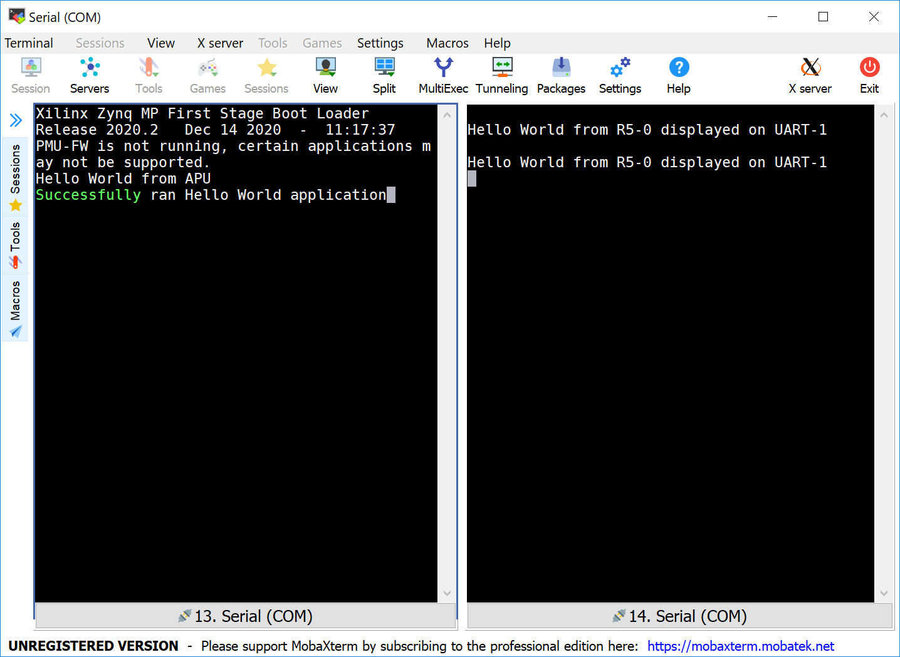

### What Just Happened?

The Vitis tool uses JTAG to control the board, and performed the following tasks:

- Used FSBL to initialize the MPSoC.
- Reset the system.
- Enabled the RPU in split mode.
- Downloaded the ELF file to Cortex-A53_0 and Cortex-R5F_0. Put processors in suspend mode.
- Ran applications on both processors.
- The application on APU printed on UART-0 and the application on RPU printed on UART-1.

You can view the detailed steps by right-clicking **hello_system**, selecting **Run As → Run Configurations**, and viewing the Target Setup tab.

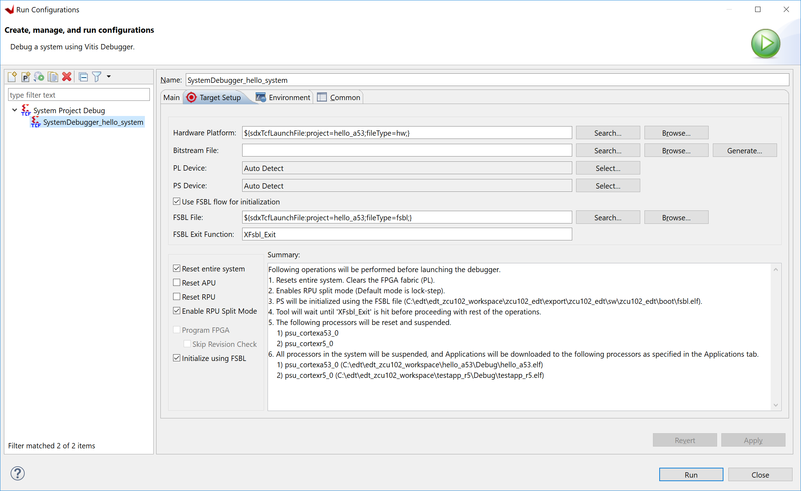

## Reviewing Bootloader Projects in the Platform

### Reviewing FSBL in the Platform

To review the FSBL in the platform, follow these steps:

1. In the Explorer view, navigate to zynqmp_fsbl by expanding the **zcu102_edt** platform to see the FSBL source code. You can edit this source for customizations. Build the platform after code modification.

2. The platform-generated FSBL is involved in PS initialization while launching standalone applications using JTAG.

3. This FSBL is created for the psu_cortexa53_0, but you can also re-target the FSBL to psu_cortexr5_0 using the re-target to psu_cortexr5_0 option in the zynqmp_fsbl domain settings.

4. The zynqmp_fsbl domain is created automatically if bootloader creation is enabled during platform creation.

### Reviewing the PMU Firmware in the Platform

To review the PMU firmware in the platform, follow these steps:

1. In the Explorer view, navigate to zynqmp_pmufw by expanding the **zcu102_edt** platform to see the PMUFW source code.

2. The zynqmp_pmufw software project contains the source code of the PMU firmware for psu_pmu_0. Compile and run the firmware on psu_pmu_0.

3. The psu_pmu_0 processor domain is created automatically for the zynqmp_pmufw software project if bootloader creation is enabled during platform creation.

 In the [next chapter](./5-debugging-with-vitis-debugger.md), you will learn about debugging standalone applications with the Vitis Debugger.


© Copyright 2017-2021 Xilinx, Inc.

Licensed under the Apache License, Version 2.0 (the "License"); you may not use this file except in compliance with the License. You may obtain a copy of the License at

http://www.apache.org/licenses/LICENSE-2.0

Unless required by applicable law or agreed to in writing, software distributed under the License is distributed on an "AS IS" BASIS, WITHOUT WARRANTIES OR CONDITIONS OF ANY KIND, either express or implied. See the License for the specific language governing permissions and limitations under the License.