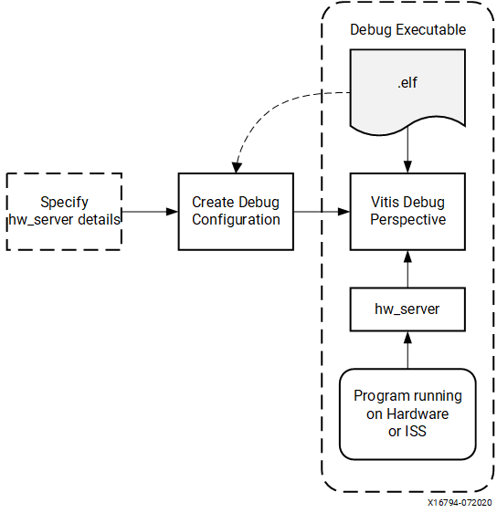
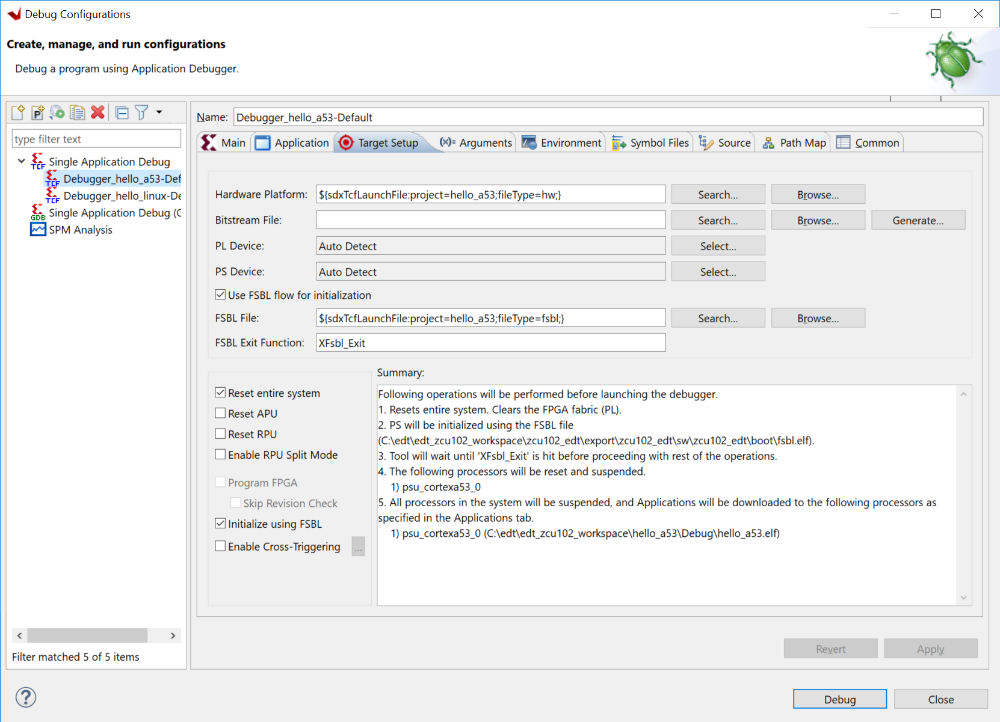
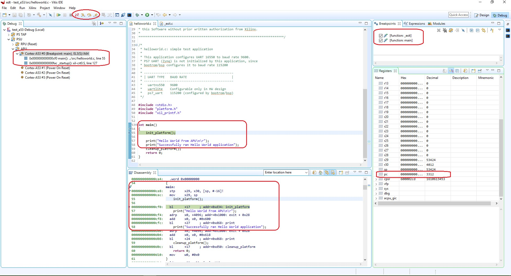
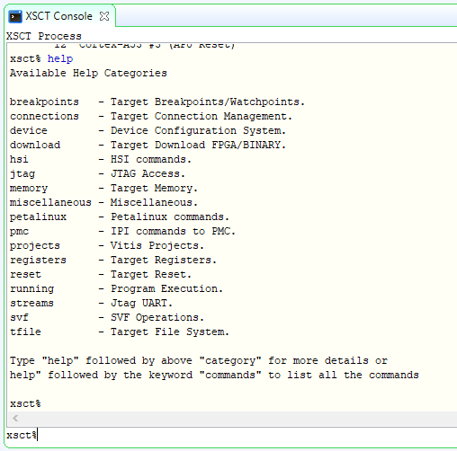

<th width="100%" colspan="6"><h1>Zynq UltraScale+ MPSoC Embedded Design Tutorial 2020.2 (UG1209)</h1>
</th>

  </tr>

</table>

# Debugging Standalone Applications with the Vitis Debugger

This chapter describes debug possibilities with the design flow you
have already been working with. The first option is debugging with
software using the Vitis&trade; debugger.

The Vitis debugger provides the following debug capabilities:

- Debugging of programs on Arm&reg; Cortex&trade;-A53, Arm&reg;
    Cortex&trade;-R5F, and MicroBlaze&trade; processor architectures
    (heterogeneous multi-processor hardware system debugging)

- Debugging of programs on hardware boards

- Debugging on remote hardware systems

- A feature-rich IDE to debug programs

- A Tool Command Language (Tcl) interface for running test
    scripts and automation

 The Vitis debugger enables you to see what is happening to a program
 while it executes. You can set breakpoints or watchpoints to stop the
 processor, step through program execution, view the program variables
 and stack, and view the contents of the memory in the system.

 The Vitis debugger supports debugging through Xilinx&reg; System Debugger.

## Xilinx System Debugger

 The Xilinx System Debugger uses the Xilinx hardware server as the
 underlying debug engine. The Vitis IDE translates each user interface
 action into a sequence of Target Communication Framework (TCF)
 commands. It then processes the output from System Debugger to display
 the current state of the program being debugged. It communicates to
 the processor on the hardware using Xilinx hardware server.

 The debug workflow is described in the following figure.

 

 The workflow is made up of the following components:

- **Executable ELF File:** To debug your application, you must use an
     executable and linkable format (ELF) file compiled for debugging.
     The debug ELF file contains additional debug information for the
     debugger to make direct associations between the source code and
     the binaries generated from that original source. To manage the
     build configurations, right-click the software application and
     select **Build Configurations → Manage**.

- **Debug Configuration:** To launch the debug session, you must
     create a debug configuration in the Vitis debugger. This
     configuration captures the options required to start a debug session,
     including the executable name, processor target to debug, and
     other information. To create a debug configuration, right-click
     your software application and select **Debug As → Debug
     Configurations**.

- **Vitis Debug Perspective:** Using the Debug perspective, you can
     manage the debugging or running of a program in the workbench. You
     can control the execution of your program by setting breakpoints,
     suspending launched programs, stepping through your code, and
     examining the contents of variables. To view the Debug
     Perspective, select **Window → Open Perspective → Debug**.

 You can repeat the cycle of modifying the code, building the
 executable, and debugging the program in the Vitis debugger.

 >**Note:** If you edit the source after compiling, the line numbering
 will be out of step because the debug information is tied directly to
 the source. Similarly, debugging optimized binaries can also cause
 unexpected jumps in the execution trace.

## Example 6: Debugging Software Using the Vitis Debugger

 In this example, you will walk through debugging a "Hello World"
 application.

 >**Note:** If you did not create a "Hello World" application on the APU or
 RPU, follow the steps in [Create Custom Bare-Metal Application for Arm Cortex-A53 based APU](4-build-sw-for-ps-subsystems.md#create-custom-bare-metal-application-for-arm-cortex-a53-based-apu)
 to create a new "Hello World" application.

 After you create the "Hello World" application, work through the
 following example to debug the software using the Vitis debugger.

1. Connect the JTAG cable, set the boot mode to JTAG, and power on the board. Refer to the steps in [Example Project: Running the "Hello World" Application from Arm Cortex-A53](4-build-sw-for-ps-subsystems.md#example-project-running-the-hello-world-application-from-arm-cortex-a53).

2. In the C/C++ Perspective, right-click the **hello_a53 Project** and select **Debug As→ Launch on Hardware → Single Application Debug**.

    >**Note:** The above step launches the Application Debugger in the
    Debug perspective based on the project settings. Alternatively, you
    can create a debug configuration which looks like the following
    figure.

    

    >**Note:** The contents of Debug Configurations are identical to those in Run Configurations. The difference between run and debug is that debug stops at the ``main()`` function by default.

    If the Confirm Perspective Switch popup window appears, click **Yes**.
    The Debug perspective opens.

    >**Note:** If the Debug perspective window does not open automatically, select **Window→ Perspective → Open Perspective → Other**, then select **Debug** in the Open Perspective wizard. You can quickly switch between Design Perspective and Debug Perspective with buttons on upper right corner.

    

    The Debug Perspective looks like this:

    

    >**Note:** The addresses shown on this page might slightly differ
    from the addresses shown on your system.

    The processor is currently sitting at the beginning of `main()` with
    program execution suspended at line `0000000000000cf0`. You can confirm
    this information in the Disassembly view, which shows the
    assembly-level program execution also suspended at `0000000000000cf0`.

    >**Note:** If the Disassembly view is not visible, select **Window→ Show View→ Disassembly**.

3. The helloworld.c window also shows execution suspended at the first
     executable line of C code. Select the **Registers** view to
     confirm that the program counter, pc register, contains
     `0000000000000cf0`.

    ***Note*:** If the Registers window is not visible, select **Window → Show View → Registers**.

4. Double-click in the margin of the **helloworld.c** window next to the
     line of code that reads print ("`Hello World\n\r`");. This sets a
     breakpoint at the ``printf`` command. To confirm the breakpoint,
     review the Breakpoints window.

    >**Note:** If the Breakpoints window is not visible, select **Window → Show View → Breakpoints**.

5. Select **Run → Step Into (F5)** to step into the `init_platform()` routine.

    Program execution suspends at location `0000000000000d3c`. The call
    stack is now two levels deep.

6. Select **Run → Resume (F8)** to continue running the program to the
     breakpoint.

    Program execution stops at the line of code that includes the ``printf``
    command. The Disassembly and Debug windows both show program execution
    stopped at `0000000000001520`.

    >**Note:** The execution address in your debugging window might
    differ if you modified the "Hello World" source code in any way.

7. Select **Run → Resume (F8)** to run the program to conclusion.

 When the program completes, the Debug window shows that the program is
 suspended in a routine called ``exit``. This happens when you are running
 under control of the debugger.

8. Rerun your code several times. Experiment with single-stepping, examining memory, breakpoints,
     modifying code, and adding print statements. Try adding and moving
     views.

    >**Tip:** You can use the Vitis debugger debugging shortcuts for
    step-into (F5), step-return (F7), step-over (F6), and resume (F8).*

## Example 7: Debugging Using XSCT

 You can use the previous steps to debug bare-metal applications
 running on RPU and PMU using the Vitis application debugger GUI.

 Additionally, you can debug in command line mode using XSDB, which
 is encapsulated as a part of XSCT. In this example, you will debug the
 bare-metal application testapp_r5 using XSCT.

 The following steps indicate how to load a bare-metal application on R5
 using XSCT. This example demonstrates the command line
 debugging capability of XSDB/XSCT. Based on your requirements, you
 can choose to debug the code using either the System Debugger
 GUI or the command line debugger in XSCT. All XSCT
 commands are scriptable, and this also applies to the commands covered in
 this example.

### Setting Up the Target

1. Open the XSCT console:

    - Click the **XSCT Console** button  in the toolbar.
    - Alternatively, you can open the XSCT console from **Xilinx → XSCT Console**.

2. Connect to the target over JTAG:

    - In the XSCT console, run `xsct% connect`.

    The ``connect`` command returns the channel ID of the connection.

3. Command Targets lists the available targets and allows you to select
     a target through its ID. The targets are assigned IDs as they are
     discovered on the JTAG chain, so the target IDs can change from
     session to session.

    For non-interactive usage such as scripting, the ``-filter`` option can be
    used to select a target instead of selecting the target through its
    ID:

    `xsct% targets`

    The targets are listed as shown in the following figure.

    

4. Select the PSU target. The Arm APU and RPU clusters are grouped under PSU. Select Cortex-A53\#0 as the target using the following command:

    `xsct% targets -set -filter {name =\~ \"Cortex-A53 \#0\"}`

    The command ``targets`` now lists the targets and also shows the selected
    target highlighted with an asterisk (\*) mark. You can also use the target
    number to select a target, as shown in the following figure.

    

5.  The processor is now held in reset. To clear the processor reset,
     use the following command:

    `rst -processor`

6. Load the FSBL on Cortex-A53 \#0. FSBL initializes the Zynq UltraScale+ processing
     system.

    ``` tcl
    xsct% dow {C:\edt\fsbl_a53\Debug\fsbl_a53.elf}
    xsct% con
    xsct% stop
    ```

 >**Note:** The {} used in the above command are required on Windows
 machines to enable backward slashes (\) in file paths. These brackets can be
 avoided by using forward \"/\" in paths. For Linux paths, use
 forward slashes; the paths in XSCT in Linux can work as-is, without any brackets.

### Loading the Application Using XSCT

1. Check and select the RPU Cortex-R5F Core 0 target ID.

    ```
    xsct% targets
    xsct% targets -set -filter {name =~ "Cortex-R5 #0"}
    xsct% rst -processor
    ```

    The command `rst -processor` clears the reset on an individual processor
    core.

    This step is important, because when the Zynq MPSoC boots up JTAG boot
    mode, all the Cortex-A53 and Cortex-R5F cores are held in reset. You
    must clear the resets on each core before debugging on these cores.
    The ``rst`` command in XSDB can be used to clear the resets.

 >**Note:** The command ``rst -cores`` clears resets on all the processor
 cores in the group (such as APU or RPU), of which the current target
 is a child. For example, when A53 \#0 is the current target, ``rst -
 cores`` clears resets on all the Cortex-A53 cores in the APU.

 2. Download the testapp_r5 application on Arm Cortex-R5F Core 0.

    - Run `xsct% dow {C:\edt\testapp_r5\Debug\testapp_r5.elf}` or
    `xsct% dow {C:/edt/testapp_r5/Debug/testapp_r5.elf}`.

    At this point, you can see the sections from the ELF file downloaded
    sequentially. The XSCT prompt can be seen after successful download. Now, configure a serial terminal (Tera Term, Minicom, or the serial terminal interface for a UART-1 USB-serial connection).

### Serial Terminal Configuration

1. Start a terminal session using Tera Term or Minicom depending on the host machine being used. Set the
     COM port and baud rate as shown in following figure.

    

2. For port settings, verify the COM port in the device manager. There
     are four USB UART interfaces exposed by the ZCU102 board. Select
     the COM port associated with the interface with the lowest number.
     In this case, for UART-0, select the COM port with interface-0.

3. Similarly, for UART-1, select the COM port with interface-1. Remember
     that the R5 BSP has been configured to use UART-1, so R5
     application messages will appear on the COM port with the UART-1
     terminal.

### Running and Debugging the Application Using XSCT

1. Before you run the application, set a breakpoint at ``main()``:

    `xsct% bpadd -addr &main`

    This command returns the breakpoint ID. You can verify the breakpoints
    planted using the command ``bplist``. For more details on breakpoints in XSCT,
    type ``help breakpoint`` in the XSCT console.

2. Resume the processor core:

    `xsct% con`

    The following informative messages will be displayed when the core
    hits the breakpoint.

    `xsct% Info: Cortex-R5 \#0 (target 7) Stopped at 0x10021C (Breakpoint)`

3. At this point, you can view registers when the core is stopped:

    `xsct% rrd`

4. View local variables:

    `xsct% locals`

5. Step over a line of the source code and view the stack trace:

    ```
    xsct% nxt
    Info: Cortex-R5 #0 (target 6) Stopped at 0x100490 (Step)
    xsct% bt
    ```
    You can use the ``help`` command to find other options:

    

    You can use the ``help running`` command to get a list of possible options
    for running or debugging an application using XSCT.

    

6. You can now run the code:

    `xsct% con`

    At this point, you can see the Cortex-R5F application print a message on the
    UART-1 terminal.


    The [next chapter](./6-build-linux-sw-for-ps.md) shows how to build and debug Linux applications.


 © Copyright 2017-2020 Xilinx, Inc.

 Licensed under the Apache License, Version 2.0 (the "License"); you may not use this file except in compliance with the License. You may obtain a copy of the License at

http://www.apache.org/licenses/LICENSE-2.0

Unless required by applicable law or agreed to in writing, software distributed under the License is distributed on an "AS IS" BASIS, WITHOUT WARRANTIES OR CONDITIONS OF ANY KIND, either express or implied. See the License for the specific language governing permissions and limitations under the License.
