<th width="100%" colspan="6"><h1>Zynq UltraScale+ MPSoC Embedded Design Tutorial 2020.2 (UG1209)</h1>
</th>

  </tr>

</table>

# Boot and Configuration

This chapter shows how to integrate the software and hardware components generated in the previous steps to create a Zynq&reg; UltraScale+&trade; boot image. After reading this chapter, you will understand how to integrate and load boot loaders, bare-metal applications (for APU/RPU), and the Linux OS for a Zynq UltraScale+ system in different boot requirements: QSPI, SD card, JTAG, and so on.

The following key points are covered in this chapter:

- System software: FSBL, PMU firmware, U-Boot, Arm&reg; trusted firmware (ATF)
- Application processing unit (APU): configuring SMP Linux for APU
- Real-time processing unit (RPU): configuring bare-metal for RPU in lockstep
- Creating a boot image for the following boot sequence:
    1. APU
    2. RPU lockstep
-  Creating and loading a secure boot image

 >**Note:** For more information on RPU lockstep, see the _Zynq UltraScale+ Device Technical Reference Manual_ ([UG1085](https://www.xilinx.com/cgi-bin/docs/ndoc?t=user_guides;d=ug1085-zynq-ultrascale-trm.pdf)).

 While previous sections focused only on creating software blocks for each processing unit in
 the PS, this chapter explains how these blocks can be loaded as a part of a bigger system.

 To create a boot image, you can either use the Create Boot Image wizard in the Vitis IDE, or the Bootgen
 command line tool (the Create Boot Image wizard calls the Bootgen tool as well). The principle function of the Create Boot Image wizard or Bootgen is to integrate the partitions (hardware-bitstream
 and software) in the proper format. It allows you to specify security options. It can also create cryptographic keys.

 Functionally, Bootgen uses a BIF (Bootgen image format) file as an input, and generates a single file image in binary BIN or MCS format. It can be used to program non-volatile memories such as QSPI and SD cards. The Bootgen GUI facilitates the creation of the BIF input file.

 This chapter makes use of a processing system block. [Design Example 1: Using GPIOs, Timers, and Interrupts](./7-design1-using-gpio-timer-interrupts.md) covers the boot image which will include the PS partitions used in this chapter and a bitstream targeted for the PL fabric.

## System Software

 The following system software blocks cover most of the boot and configuration for this chapter. For detailed boot flow and various boot sequences, refer to the _System Boot and Configuration_ chapter
 in the _Zynq UltraScale+ MPSoC: Software Developers Guide_ ([UG1137](https://www.xilinx.com/cgi-bin/docs/rdoc?v=latest;d=ug1137-zynq-ultrascale-mpsoc-swdev.pdf)).

### First Stage Boot Loader

 In non-secure boot mode, the platform management unit (PMU) releases the reset of the configuration security unit, and enters the PMU server mode to monitor power. At this stage, the configuration security
 unit loads the first stage boot loader (FSBL) into on-chip memory (OCM). The FSBL can be run from either APU A53_0, RPU R5_0, or RPU R5_lockstep. In this example, the FSBL is targeted for APU Cortex&trade;-A53
 Core 0. The last 512 bytes of this region are used by FSBL to share the hand-off parameters corresponding to the applications handed off by the ATF.

 The first stage boot loader initializes important blocks in the processing subsystem. This includes clearing the reset of the processors and initializing clocks, memory, UART, and so on before handing over the control of the next partition in DDR, to either the RPU or APU. In this example, the FSBL loads a bare-metal application in DDR and hands off to the RPU Cortex-R5F in lockstep mode, and then loads
 U-Boot to be executed by the APU Cortex-A53 Core-0. For more information, see the _Zynq UltraScale+ MPSoC: Software Developers Guide_ ([UG1137](https://www.xilinx.com/cgi-bin/docs/rdoc?v=latest;d=ug1137-zynq-ultrascale-mpsoc-swdev.pdf)).

 For this chapter, you can use the FSBL executable that you created in [Building Software for PS Subsystems](4-build-sw-for-ps-subsystems.md). In the FSBL application, the ``xfsbl_translation_table.S`` differs from the ``translation_table.S`` of the Cortex-A53 in only one aspect, to mark the DDR region as reserved. This is to avoid speculative access to DDR before it is initialized. When the DDR initialization is completed in FSBL, the memory attributes for the DDR region are changed to "memory" so that they are cacheable.

### Platform Management Unit Firmware (PMUFW)

 The platform management unit (PMU) and the configuration security unit
 manage and perform the multi-staged booting process. The PMU primarily
 controls the pre-configuration stage that executes the PMU ROM to set up
 the system. The PMU handles all of the processes related to reset and
 wake-up. The Vitis IDE provides PMU firmware that can be built to run
 on the PMU. For more details on the platform management and PMU
 firmware, see the _Zynq UltraScale+ MPSoC: Software Developers Guide_ ([UG1137](https://www.xilinx.com/cgi-bin/docs/rdoc?v=latest;d=ug1137-zynq-ultrascale-mpsoc-swdev.pdf)).

The PMU firmware can be loaded in the following ways:

  - Using BootROM as described in [Boot Sequence for SD-Boot](#boot-sequence-for-sd-boot).
  - Using FSBL as described in [Boot Sequence for QSPI Boot Mode](#boot-sequence-for-qspi-boot-mode).
  - Using JTAG boot mode as described in [Boot Sequence for QSPI-Boot Mode Using JTAG](#boot-sequence-for-qspi-boot-mode-using-jtag).

 For more information, see the [PMU Firmware Xilinx Wiki](https://xilinx-wiki.atlassian.net/wiki/spaces/A/pages/18841724/PMU+Firmware).

### U-Boot

 The U-Boot acts as a secondary boot loader. After the FSBL handoff,
 the U-Boot loads Linux on the Arm&reg; Cortex-A53 APU. After FSBL, the U-Boot
 configures the rest of the peripherals in the processing system based
 on board configuration. U-Boot can fetch images from different memory
 sources such as eMMC, SATA, TFTP, SD, and QSPI. For this example, U-Boot
 and all other images are loaded from the SD card. Therefore, for this
 example, the board will be set to SD-boot mode.

 U-Boot can be configured and built using the PetaLinux tool flow. For
 this example, you can use the U-Boot image that you created in
 [Building Linux Software for PS Subsystems](./6-build-linux-sw-for-ps.md).

### Arm Trusted Firmware (ATF)

 The ATF is a transparent bare-metal application layer executed in Exception Level 3 (EL3) on the APU. The ATF includes a Secure Monitor layer for switching between the secure and non-secure world. The Secure Monitor and the implementation of Trusted Board Boot Requirements (TBBR) make the ATF layer a mandatory requirement to load Linux on an APU on Zynq UltraScale+.

 FSBL loads the ATF to be executed by the APU, which keeps running in EL3 awaiting a service request. The ATF starts at 0xFFFEA000. FSBL also loads U-Boot in DDR to be executed by the APU, which loads the Linux OS in SMP mode on the APU. It is important to note that the PL bitstream should be loaded before the ATF is loaded. This is because FSBL uses the OCM region, which is reserved by the ATF as a temporary buffer for when the bitstream is present in the BIN file. Because of this, if the bitstream is loaded after the ATF, FSBL overwrites the ATF image with its temporary buffer, corrupting the ATF image. The bitstream should therefore be positioned the in BIF before the ATF and preferably immediately after FSBL
 and PMU firmware.

 The ATF (`bl31.elf`) is built by default in PetaLinux and can be found in the PetaLinux project images directory.

 For more details on ATF, refer to the _Arm Trusted Firmware_ section in the _Security_ chapter of the _Zynq UltraScale+ MPSoC: Software Developers Guide_ ([UG1137](https://www.xilinx.com/cgi-bin/docs/rdoc?v=latest;d=ug1137-zynq-ultrascale-mpsoc-swdev.pdf)).

### Linux on APU

You already created the PetaLinux images in [Building Software for PS Subsystems](./4-build-sw-for-ps-subsystems.md). In this example, the PetaLinux is configured to build images for SD-boot with an ``initramfs`` root file system. This is the default boot setting in PetaLinux.

The images can be found in the `$<PetaLinux_Project>/images/linux/` directory. For loading Linux on the APU, the following images are used from PetaLinux:

- ATF: `bl31.elf`
- U-Boot: `u-boot.elf`
-  Linux images: `image.ub`, which contains:
    - Kernel image: `Image`
    - Device tree blob: `system.dtb`
    - Root file system: `rootfs.cpio.gz.u-boot`

### Bare Metal on the RPU

In addition to Linux on APU, this example also loads a bare-metal application on RPU Cortex-R5F in lockstep mode.

For this example, refer to the testapp_r5 application that you created in [Create Custom Bare-Metal Application for Arm Cortex-R5 based RPU](4-build-sw-for-ps-subsystems.md#creating-a-custom-bare-metal-application-for-an-arm-cortex-r5-based-rpu).

## Boot Sequence for SD-Boot

 Now that all the individual images are ready, create the boot image to load all of these components on the Zynq UltraScale+ device. This can be done using the Create Boot Image wizard in the Vitis IDE by performing the following steps.

1. Launch the Create Boot Image wizard in the Vitis IDE:

   - In the Vitis IDE, select **Xilinx → Create Boot Image**.

2. Select all the partitions referred to in earlier sections in this chapter, and set them as shown in the following figure.

    

3. Add the FSBL partition:

   1. In the Create Boot Image wizard, click **Add** to open the Add Partition view.
   2. In the Add Partition view, click **Browse** to select the FSBL executable.
   3. For FSBL, ensure that the partition type is selected as boot loader and the correct destination CPU is selected by the tool. The tool is configured to make this selection based on the FSBL executable.

    >    **Note:** Ignore the Exception Level drop down, because FSBL is set to
        EL3 by default. Also, leave the TrustZone setting unselected for this
        example.


    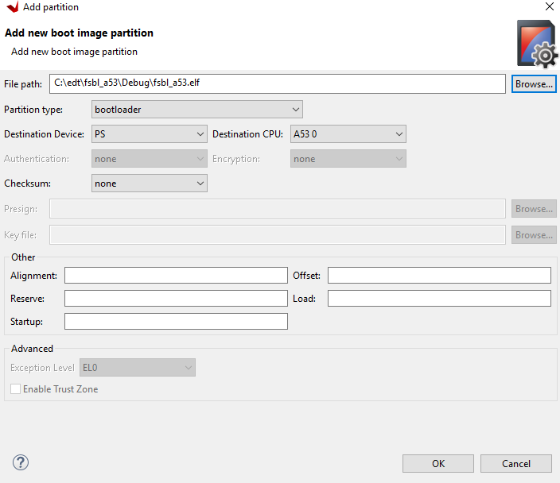


    4. Click **OK** to select FSBL and go back to Create Boot Image wizard.

5. Add the PMU and ATF firmware partitions:

    1. Click **Add** to open the Add Partition view, shown in the following figure.

        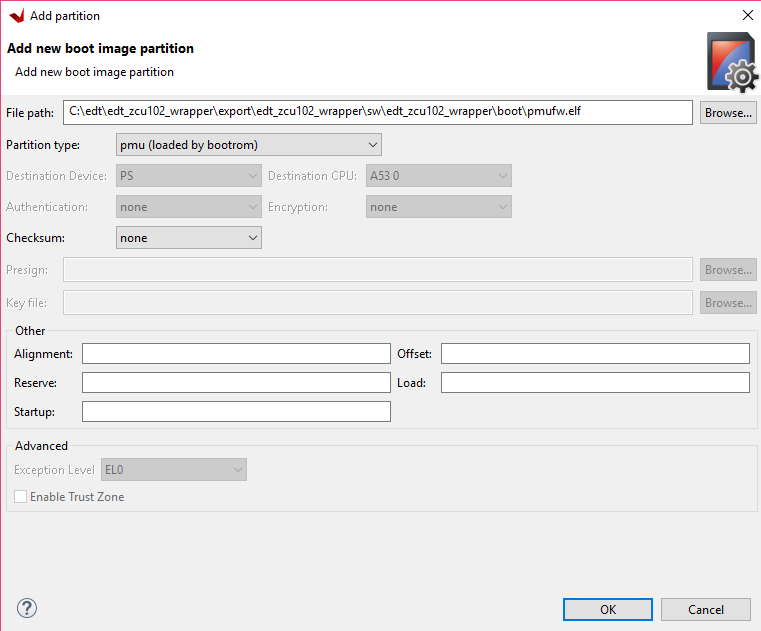


    2. Add the PMU firmware partition.
    3. Browse to and select the **PMU Firmware executable**.
    4. For this partition, select **pmu** as the partition type.
    5. Leave the Exception Level and TrustZone settings unselected.
    6. Click **OK**.
    7. Click **Add** to open the Add Partition view.
    8. Add the ATF firmware `bl31.elf` partition.

        > **Note:** ATF Firmware (`bl31.elf`) can be found in `<PetaLinux
            Project>/image/linux/`.

        1. For this partition, select **datafile** as the partition type.
        2. Set the Destination Device as **PS**.
        3. Set the Destination CPU as **A53 0**.
        4. Set the Exception Level to EL3 and select **Enable TrustZone**.

        

    7. Click **OK**.

3. Add the R5 executable and enable it in lockstep mode.

    1. Click **Add** to add the Cortex-R5F bare-metal executable.

        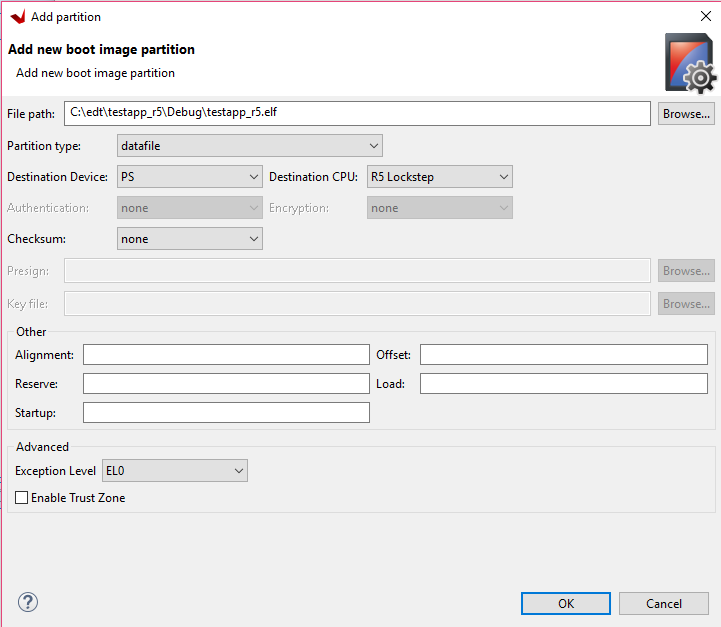

    2. Set the Destination Device as **PS**.

    3. Set the Destination CPU as **R5 Lockstep**. This sets the RPU R5 cores to run in lockstep mode.

    4. Leave Exception Level and TrustZone unselected.

    5. Click **OK**.

4. Now, add the U-Boot partition. You can find `u-boot.elf` for sd_boot mode in `<PetaLinux_project>/images/linux/sd_boot`.

    1. Click **Add** to add the u-boot.elf partition.

    2. For U-Boot, select the Destination Device as **PS**.

    3. Select the Destination CPU as **A53 0**.

    4. Set the Exception Level to **EL2**.

        

    5. Click **OK** to return to the Create Boot Image wizard.

    6. Click **Create Image** to close the wizard and create the boot
        image.

 You can also create `BOOT.bin` images using the BIF attributes and the Bootgen command. For this configuration, the BIF file contains the following attributes:

 ```
 //arch = zynqmp; split = false; format = BIN
 the_ROM_image:
 {
 [bootloader, destination_cpu = a53-0]C:\edt\fsbl_a53\Debug\fsbl_a53.elf
 [pmufw_image]C:\edt\edt_zcu102_wrapper\export\edt_zcu102_wrapper\sw\edt_zcu102_wrapper\boot\pmufw.elf
 [destination_cpu = a53-0, exception_level = el-3, trustzone]C:\edt\sd_boot\bl31.elf
 [destination_cpu = r5-lockstep]C:\edt\testapp_r5\Debug\testapp_r5.elf
 [destination_cpu = a53-0, exception_level = el-2]C:\edt\sd_boot\u-boot.elf
 }
 ```

 The Vitis IDE calls the following Bootgen command to generate the
 BOOT.bin image for this configuration:

 `bootgen -image sd_boot.bif -arch zynqmp -o C:\edt\sd_boot\BOOT.bi`n

### Running the Image on the ZCU102 Board

1. Copy the `BOOT.bin`, `image.ub`, and `boot.scr` to the SD card. Here `boot.scr` is read by U-Boot to load the kernel and the root file system.

2. Load the SD card into the ZCU102 board, in the J100 connector.

3. Connect a micro USB cable from the ZCU102 board USB UART port (J83) to the USB port on the host machine.

4. Configure the board to boot in SD-boot mode by setting switch SW6 to 1-ON, 2-OFF, 3- OFF, and 4-OFF, as shown in following figure.

    

5. Connect 12V Power to the ZCU102 6-Pin Molex connector.

6. Start a terminal session, using Tera Term or Minicom depending on the host machine being used, as well as the COM port and baud rate for your system, as shown in following figure.

    

7. For port settings, verify the COM port in device manager. There are four USB-UART interfaces exposed by the ZCU102 board.

8. Select the COM port associated with the interface with the lowest number. In this case, for UART-0, select the COM port with interface-0.

9. Similarly, for UART-1, select COM port with interface-1. Remember that the R5 BSP has been configured to use UART-1, and so R5 application messages appear on the COM port with the UART-1 terminal.

10. Turn on the ZCU102 Board using SW1, and wait until Linux loads on the board. At this point, you can see the initial boot sequence messages on your terminal screen representing UART-0.

You can see that the terminal screen configured for UART-1 also prints a message. This is the print message from the R5 bare-metal application running on the RPU, configured to use the UART-1 interface. This application is loaded by the FSBL onto the RPU.

The bare-metal application has been modified to include the UART interrupt example. This application now is now in a waiting for interrupt (WFI) state until user input is detected from the keyboard at the UART-1 terminal.


Meanwhile, the boot sequence continues on the APU and the images loaded can be understood from the messages appearing on the UART-0 terminal. The messages are highlighted in the following figure.

The U-Boot then loads the Linux kernel and other images on the Arm Cortex-A53 APU in SMP mode. The terminal messages indicate when the U-Boot loads the kernel image. When the kernel starts up, a user interface prompt is shown in the target Linux OS. The kernel loading and starting sequence can be seen in the following figure.


## Boot Sequence for QSPI Boot Mode

 The ZCU102 board also comes with dual parallel QSPI flashes adding up to 128 MB in size. In this example, you will create a boot image and load the images on the Zynq UltraScale+ device in QSPI boot mode. The images can be configured using the Create Boot Image wizard in the Vitis IDE. This can be done by performing the following steps.

### Creating Linux Images Using PetaLinux for QSPI Flash

 The earlier example highlighted creation of the Linux Images and Boot
 images to boot from an SD card. This section explains the
 configuration of PetaLinux to generate Linux images for QSPI flash.
 For more information about the dependencies for PetaLinux 2020.2, see
 the _PetaLinux Tools Documentation: Reference Guide_ ([UG1144](https://www.xilinx.com/cgi-bin/docs/rdoc?v=latest;d=ug1144-petalinux-tools-reference-guide.pdf)).

1. Before starting this example, create a backup of the boot images created for SD card setup using the following commands:

    ``` shell
    $ cd <Petalinux-project-path>/xilinx-zcu102-2020.2/images/linux/
    $ mkdir sd_boot
    $ cp image.ub sd_boot/
    $ cp u-boot.elf sd_boot/
    $ cp BOOT.BIN sd_boot/
    ```

2. Change the directory to the PetaLinux project root directory:

    `$ cd \<Petalinux-project-path\/xilinx-zcu102-2020.2`

3. Launch the top-level system configuration menu:

    `$ petalinux-config`

    The Configuration wizard opens.

4. Select **Subsystem AUTO Hardware Settings**.

5. Under the advanced bootable images storage settings, do the following:

    - Select **boot image settings**.
    - Select **image storage media**.
    - Select **primary flash** as the boot device.

6. Under the advanced bootable images storage settings submenu, do the
     following:

    - Select **kernel image settings**.
    - Select **image storage media**.
    - Select **primary flash** as the storage device.

7. One level above (under Subsystem AUTO Hardware Settings) do the following:

    - Select **Flash Settings** and notice the entries listed in the
         partition table.

    >**Note:** Some memory (0x1E00000 + 0x40000) is set aside for initial boot partitions and U-Boot settings. These values can be modified on need basis.

    - Based on this, the offset for Linux images is calculated as 0x1E40000 in the QSPI Flash device. This will be used while creating the boot image for QSPI Boot-mode.

    The following steps set the Linux system memory size to about 1.79 GB.

8. Under Subsystem AUTO Hardware Settings, do the following:

    - Select **Memory Settings**.
    - Set **System Memory Size** to `0x6FFFFFFF`.

9. Save the configuration settings and exit the Configuration wizard.

10. Rebuild using the `petalinux-build` command.

11. Take a backup of u-boot.elf and the other images. These will be used when creating boot images.

 **Note:** For more information, refer to the _PetaLinux Tools
 Documentation: Reference Guide_ ([UG1144](https://www.xilinx.com/cgi-bin/docs/rdoc?v=latest;d=ug1144-petalinux-tools-reference-guide.pdf)).

### Boot Image Setup in Vitis

1. If the Vitis IDE is not already running, start it and set the workspace as indicated in [Build Software for PS Subsystems](4-build-sw-for-ps-subsystems.md).

2. Select **Xilinx → Create Boot Image**.

3. Select **Zynq MP** as the Architecture.

4. Select the **Create new BIF** file option.

5. Ensure that the Output format is set to BIN.

6. In the Basic page, browse to and select the **Output BIF** file path and output path.

     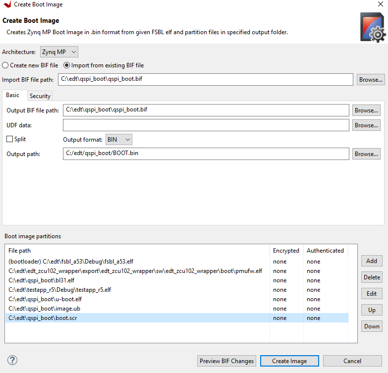

7. Next, add boot partitions using the following steps:

    1. Click **Add** to open the Add Partition view.

    2. In the Add Partition view, click the **Browse** button to select
         the **FSBL executable**.

        1. For FSBL, ensure that the Partition type is selected as boot loader and the correct destination CPU is selected by the tool. The tool is configured to make this selection based on the FSBL executable.

             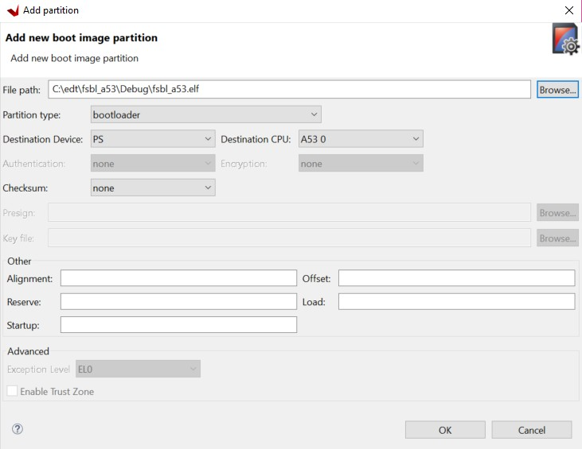

        2. Ignore the Exception Level, as FSBL is set to EL3 by default. Also, leave the TrustZone setting unselected for this example.

        3. Click **OK** to select the FSBL and go back to the Create Boot Image wizard.

    3. Click **Add** to open the Add Partition window to add the next partition.

    4. The next partition is the PMU firmware for the Platform Management Unit.

        1.  Select the Partition type as **datafile** and the Destination Device as **PS**.

        2. Select **PMU** for Destination CPU.

        3. Click **OK**.

            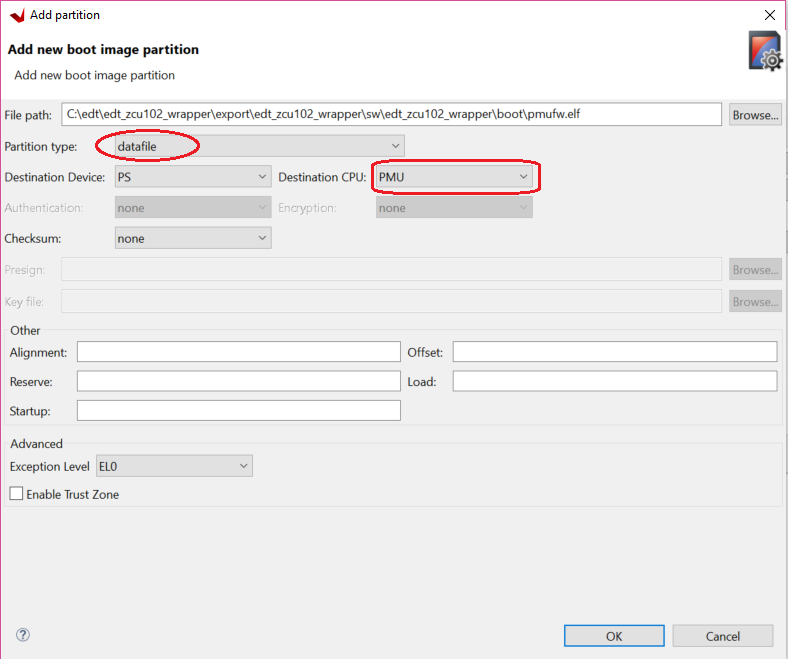

    5. The next partition to be added is the ATF firmware. For this, set the Partition type to datafile.

       1.  The ATF executable bl31.elf can be found in the PetaLinux images folder `<PetaLinux_project\/images/linux/`.

       2. Select the Destination Device as **PS** and the Destination CPU as A53 0.

       3. Set the Exception Level to EL3 and select Enable TrustZone.

           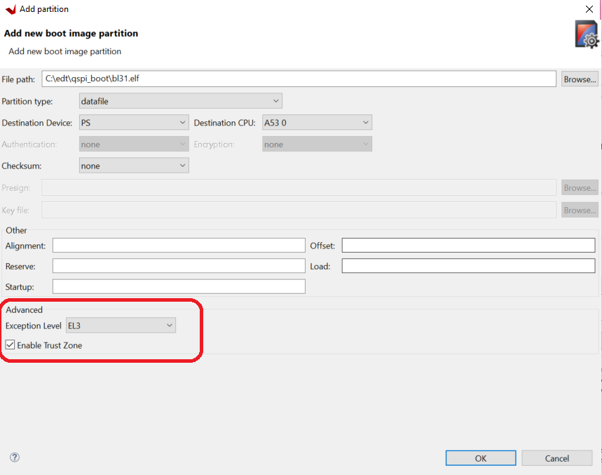

       4. Click **OK**.

    6. Click **Add** to add the R5 bare-metal executable.

        1. Add the R5 executable and enable it in lockstep mode, as shown
            in the following image.

        2. Click **OK**.

            

    7. Click **Add** to add the U-Boot partition. u-boot.elf can be found in `<PetaLinux_Project>/images/linux/`.

        1. For U-Boot, make the following selections:

            - Set the Partition Type to **datafile**.

            - Set the Destination Device to **PS**.

            - Set the Destination CPU to **A53 0**.

            - Set the Exception Level to **EL2**.

            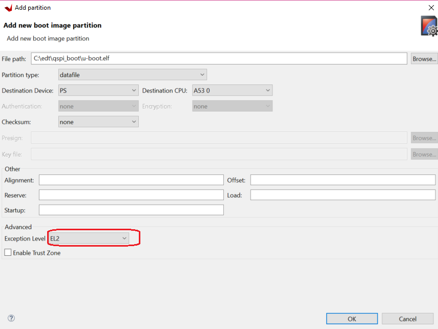

        2. Click **OK**.

    8. Click **Add** to add the image.ub Linux image file.

        1.  The image.ub image file can be found in PetaLinux project in the
            `images/Linux` directory.

        2. For image.ub, make the following selections:

           - Set Partition Type to **datafile**.

           - Set the Destination Device to **PS**.

           - Set the Destination CPU to **A53 0**.

        3. Enter `0xF00000` as the offset.

        4. Leave Exception Level and TrustZone unselected.

        **Note:** See [Creating Linux Images Using PetaLinux for QSPI Flash](4-build-sw-for-ps-subsystems.md#creating-linux-images-using-petalinux-for-qspi-flash), to
        understand the offset value.

   9. Click **Add** to add the `boot.scr` script file.

        1. The `boot.scr` file is located in the ``images/linux`` directory of the PetaLinux project.

        2. For `boot.scr`, select the following:

            - Set the partition type to **datafile**.

            - Set the Destination Device to **PS**.

            - Set the Destination CPU to **A53 0**.

        3. Enter 0x3e80000 as the offset.

        4. Leave Exception Level and TrustZone unselected.

        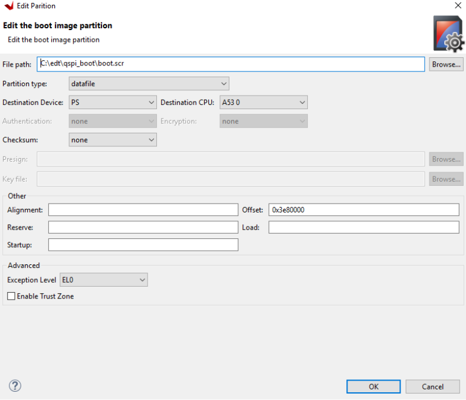

8. Click **OK** to go back to the Create Boot Image wizard.

9. Click **Create Image** to create the `qspi_BOOT.bin` image.

 You can also create qspi_BOOT.bin images using the BIF attributes and the Bootgen command. You can view the BIF attributes for this configuration by clicking **Preview BIF Changes**. For this configuration, the BIF file contains the following attributes:

 ```
 //arch = zynqmp; split = false; format = BIN
 the_ROM_image:
 {
 [bootloader, destination_cpu = a53-0]C:\edt\fsbl_a53\Debug\fsbl_a53.elf
 [destination_cpu = pmu]C:\edt\edt_zcu102_wrapper\export\edt_zcu102_wrapper\sw\edt_zcu102_wrapper\boot\pmufw.elf
 [destination_cpu = a53-0, exception_level = el-3, trustzone]C:\edt\qspi_boot\bl31.elf
 [destination_cpu = r5-lockstep]C:\edt\testapp_r5\Debug\testapp_r5.elf
 [destination_cpu = a53-0, exception_level = el-2]C:\edt\qspi_boot\u-boot.elf
 [offset = 0xF00000, destination_cpu = a53-0]C:\edt\qspi_boot\image.ub
 [offset = 0x3e80000, destination_cpu = a53-0]C:\edt\qspi_boot\boot.scr
 }
 ```

 The Vitis IDE calls the following Bootgen command to generate the qspi_BOOT.bin image for this configuration.

 `bootgen -image qspi_boot.bif -arch zynqmp -o C:\edt\qspi_BOOT.bin`

 >**Note:** In this boot sequence, the First Stage Boot Loader (FSBL) loads PMU firmware. This is because the PMU firmware was added as a datafile partition type. Ideally, the boot ROM code can load the PMU firmware for PMU as seen in the earlier section. For more details on PMU firmware, refer to the "Platform Management" chapter in the _Zynq UltraScale+ MPSoC: Software Developers Guide_ ([UG1137](https://www.xilinx.com/cgi-bin/docs/rdoc?v=latest;d=ug1137-zynq-ultrascale-mpsoc-swdev.pdf)).

### Running the Image in QSPI Boot Mode on ZCU102 Board

 To test the image in this example, load the boot image (``qspi_BOOT.bin``) onto QSPI on the ZCU102 board using the program flash utility in the Vitis IDE. Alternatively, you can use the XSDB debugger.

1. In the Vitis IDE, select **Xilinx → Program Flash**.

2. In the Program Flash wizard, browse to and select the `qspi_BOOT.bin` image file that was created as a part of this example.

3. Select **qspi-x8-dual_parallel** as the Flash type.

4. Set the Offset as **0** and select the **FSBL ELF file (fsbl_a53.elf)**

5. Ensure that a USB cable is connected between the USB-JTAG connector on ZCU102 target and the USB port on the host machine using the following steps.

    1. Set the SW6 boot mode switch as shown in the following figure.

    2. Turn on the board.

     

6. Click **Program** to start the process of programming the QSPI flash with the ``qspi_BOOT.bin``.

    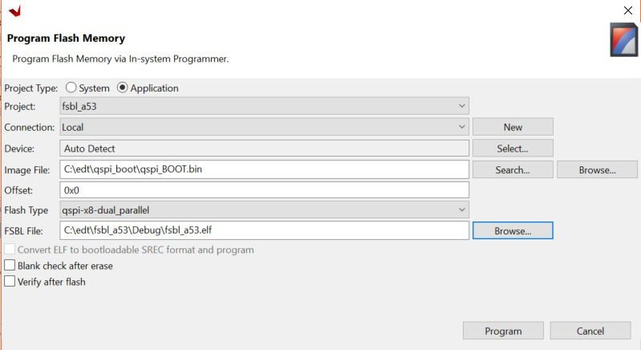

    Wait until you see the message "Flash Operation Successful" in the console, as shown in the following image.

    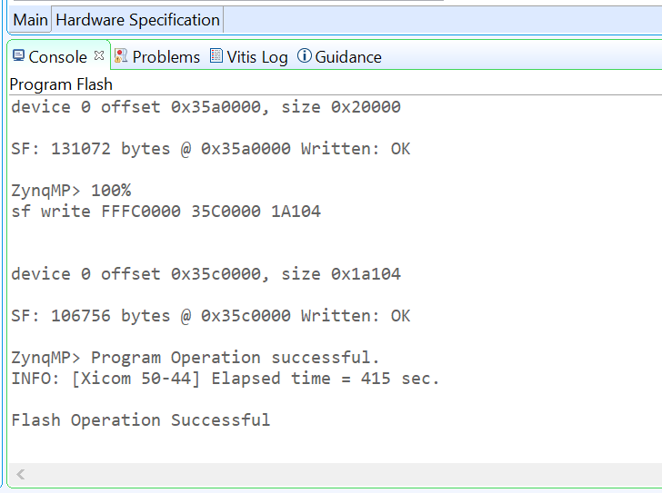

#### Setting Up the ZCU102 Board

1. Connect the USB-UART on the board to the host machine. Connect the micro USB cable to micro USB port J83 on the ZCU102 board, and connect the other end to an open USB port on the host machine.

2. Configure the board to boot in QSPI boot mode by switching SW6 as shown in the following figure.

    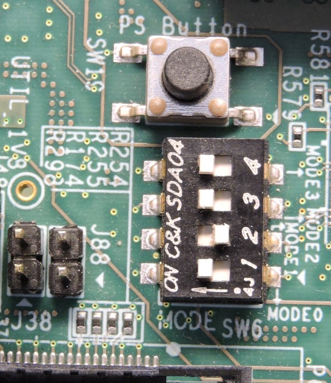

3. Connect 12V power to the ZCU102 6-Pin Molex connector.

4. Start a terminal session, using Tera Term or Minicom depending on the host machine being used, and the COM port and baud rate as shown in the following figure.

5. For port settings, verify the COM port in the device manager. There are four USB UART interfaces exposed by the ZCU102.

6. Select the COM port associated with the interface with the lowest number. In this case, for UART-0, select the COM port with interface-0.

7. Similarly, for UART-1, select COM port with interface-1.

    Remember, R5 BSP has been configured to use UART-1, so R5 application messages will appear on the COM port with the UART-1 terminal.

    

8. Turn on the ZCU102 board using SW1.

    At this point, you will see initial boot sequence messages on your terminal screen representing UART-0.

    You can see that the terminal screen configured for UART-1 also prints a message. This is the print message from the R5 bare-metal application running on the RPU, configured to use the UART-1 interface. This application is loaded by the FSBL onto the RPU.

    The bare-metal application has been modified to include the UART interrupt example. This application now waits in a WFI state until user input is detected from the keyboard at the UART-1 terminal.

    

    Meanwhile, the boot sequence continues on the APU and the images loaded can be understood from the messages appearing on the UART-0 terminal. The messages are highlighted in the following figure.

    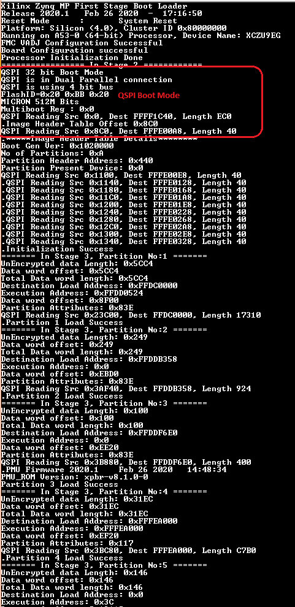

    The U-Boot then loads the Linux kernel and other images on the Arm Cortex-A53 APU in SMP mode. The terminal messages indicate when the U-Boot loads the kernel image. When the kernel starts up, a user interface prompt is shown in the Linux kernel. The kernel loading and starting sequence can
    be seen in the following figure.

    

## Boot Sequence for QSPI-Boot Mode Using JTAG

 The Zynq UltraScale+ MPSoC supports many methods of loading the boot image. One method is to use the JTAG interface. This example XSCT session demonstrates how to download a boot image file (`qspi_BOOT.bin`) in QSPI using the XSDB debugger. After the QSPI is loaded, the `qspi_BOOT.bin` image executes in the same way as QSPI boot mode in Zynq UltraScale+ MPSoC. You can use the same XSCT session or the System Debugger for debugging similar boot flows.

 The following sections demonstrate the basic steps involved in this boot mode.

### Setting Up the Target

1. Connect a USB cable between the USB-JTAG J2 connector on the target and the USB port on the host machine.

2. Set the board to JTAG boot mode by setting the SW6 switch, as shown in the following figure.

	 

3. Power on the board using switch SW1. Open the XSCT console in the Vitis IDE by clicking the XSCT button. Alternatively, you can also open the XSCT console by selecting **Xilinx → XSCT Console**.

4. In the XSCT console, connect to the target over JTAG using the ``connect`` command:

    `xsct% connect`

    The ``connect`` command returns the channel ID of the connection.

5. The ``targets`` command lists the available targets and allows you to select a target using its ID. The targets are assigned IDs as they are discovered on the JTAG chain, so the IDs can change from session to session.

    >**Note:** For non-interactive usage such as scripting, you can use the ``-filter`` option to select a target instead of selecting the target using its ID.

    `xsct% targets`

    The targets are listed as shown in the following figure.

    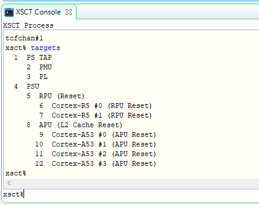

### Loading U-Boot Using XSCT/XSDB

1. Download the U-Boot application on Cortex-A53 \#0 using the following commands.

    1. By default, JTAG security gates are enabled. Disable the security gates for DAP, PL TAP, and PMU (this makes the PMU MB target visible to the debugger).

    ```
    xsct% targets -set -filter {name =~ "PSU"}
    xsct% mwr 0xffca0038 0x1ff
    xsct% targets
    ```

    2. Verify if the PMU MB target is listed under the PMU device. Now, load and run the PMU firmware.

    3. Reset APU Cortex-A53 Core 0 to load and run FSBL.

    ```
    xsct% targets -set -filter {name =~ "Cortex-A53 #0"}
    xsct% rst -processor
    ```

    >**Note:** `rst -processor` clears the reset on an individual processor
    core.

    This step is important, because when the Zynq UltraScale+ MPSoC boots up in JTAG boot mode, all the APU and RPU cores are held in reset. You must clear the resets on each core before performing debugging on these cores. You can use the ``rst`` command in XSCT to clear the resets.

    >**Note:** The `rst -cores` command clears the resets on all the processor cores in the
    group (that is, the APU or RPU) of which the current target is a child. For example, when A53 #0 is the current target, `rst -cores` clears resets on all the Cortex-A53 cores in the APU.

    4. Load and run FSBL.

    ```
    xsct% dow {C:\edt\fsbl_a53\Debug\fsbl_a53.elf}
    xsct% con
    ```

    5. Verify the FSBL messages on the Serial Terminal and stop FSBL after a couple of
    seconds.

    `xsct% stop`

    6. Load and run the ATF.

    ```
    xsct% dow {C:\edt\qspi_boot\bl31.elf}
    xsct% con
    xsct% stop
    ```

2. Configure a Serial Terminal (Tera Term, Minicom, or the Serial Terminal interface for a UART-0 USB-serial connection).

3. For Serial Terminal settings, see the following figure.

	 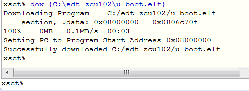

4. Load and run U-Boot.

    `xsct% dow {C:\edt\qspi_boot\u-boot.elf}`

5. Run U-Boot, using the ``con`` command in XSDB.

    `xsct% con`

6. In the target Serial Terminal, press any key to stop the U-Boot auto boot.

7. Stop the core using the ``stop`` command in XSDB.

    `xsct% stop`

### Load boot.bin in DDR Using XSDB

1. Download the ``boot.bin`` binary into DDR on ZCU102. Use the same ``boot.bin`` created for QSPI boot mode.

    `xsct% dow -data {C:\edt\qspi_boot\qspi_BOOT.bin} 0x2000000`

2. Continue the U-Boot again, using the ``con`` command in XSDB.

    `xsct% con`

### Loading the boot.bin Image in QSPI Using U-Boot

1. Execute the following commands in the U-Boot console on the target terminal. These commands erase QSPI and then write the ``boot.bin`` image from DDR to QSPI.

    ```
    ZynqMP> sf probe 0 0 0
    ZynqMP> sf erase 0 0x4000000
    ZynqMP> sf write 0x2000000 0 0x4000000
    ```

2. After successfully writing the image to QSPI, turn off the board and set up the ZCU102 board as described in [Setting Up the ZCU102 Board](#setting-up-the-zcu102-board). You can see Linux loading on the UART-0 terminal and the R5 application executing in the UART-1 terminal.

## Boot Sequence for USB Boot Mode

 Zynq UltraScale+ MPSoC also supports USB slave boot mode using the device firmware upgrade (DFU) for the device class specification of USB. Using a standard update utility such as [OpenMoko\'s DFU-Util](http://dfu-util.sourceforge.net/releases/), you will be able to load the newly created image on the Zynq UltraScale+ MPSoC using the USB port. The following steps list the required configuration steps to load boot images using this boot mode. The DFU utility is also shipped with the Vitis unified software platform and PetaLinux.

### Configuring FSBL to Enable USB Boot Mode

 A few changes are required in FSBL to enable USB boot mode. USB boot mode support increases the footprint of FSBL by approximately 10 KB. Because it is mostly intended to be used during the initial development phase, its support is disabled by default to conserve OCM space. In this section, you will modify the FSBL to enable USB boot mode. Considering the FSBL project is used extensively throughout this tutorial, do _not_ modify the existing FSBL project. Instead, this section makes use of a new FSBL project.

#### Create First Stage Boot Loader for USB Boot

1. In the Vitis IDE, select **File → New → Application Project** to open the New Project wizard.

2. Use the information in the table below to make your selections in
     the wizard.

   |  Screen       |    System Properties   |  Settings       |
   |----------------------|------------------------|----------------------|
   |  Platform            |  Select platform from repository      |  edt_zcu102_wrapper |
   |  Application project details        |  Application project name       |  fsbl_usb_boot      |
   |                      |  System project name    |  fsbl_usb_boot_system                    |
   |                      |  Target processor   |  psu_cortexa53_0    |
   |  Domain             |  Domain             |  standalone on psu_cortexa53_0     |
   |  Templates          |  Available templates         |  Zynq MP FSBL       |

3. Click **Finish**.

4. In the Explorer view, expand the **fsbl_usb_boot** project and open **xfsbl_config.h** from **fsbl_usb_boot→ src→xfsbl_config.h**.

5. In `xfsbl_config.h` change or set following settings:

    ```
    #define FSBL_QSPI_EXCLUDE_VAL (1U)
    #define FSBL_SD_EXCLUDE_VAL (1U)
    #define FSBL_USB_EXCLUDE_VAL (0U)
    ```

6. Press **Ctrl+S** to save these changes.

7. Build FSBL (``fsbl_usb_boot``).

### Creating Boot Images for USB Boot

 In this section, you will create the boot images to be loaded through a USB using the DFU utility. Device firmware upgrade (DFU) is intended to download and upload firmware to/from devices connected over USB. In this boot mode, the boot loader (FSBL) and the PMU firmware which are loaded by bootROM are copied to Zynq UltraScale+ on-chip memory (OCM) from the host machine USB port using the DFU utility. The size of the OCM (256 KB) limits the size of the boot image downloaded by bootROM in USB boot mode. Considering this, and subject to the size requirement being met, only FSBL and PMU firmware are stitched into the first ``boot.bin``, which is copied to the OCM. The remaining boot partitions will be stitched in another boot image and copied to DDR to be loaded by the FSBL which is already loaded and running at this stage. Follow these steps to create boot images for this boot mode.

1. In the Vitis IDE, select **Xilinx → Create Boot Image**.

2. Select `fsbl_usb_boot.elf` and `pmufw.elf` partitions and set them as shown in the following
     figure.

     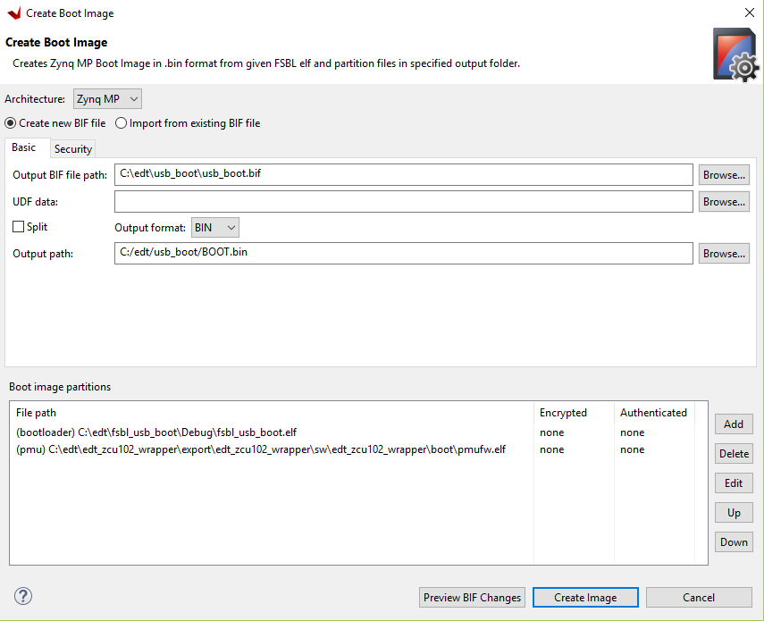

3. Ensure that the PMU partition is set to be loaded by bootROM.

4. Click **Create Image** to generate ``BOOT.bin``.

#### Modifying PetaLinux U-Boot

 Modify PetaLinux U-Boot so that it can load the ``image.ub`` image. The device tree needs to be modified to set the USB in peripheral mode. The default PetaLinux configuration is set for the USB in host mode. Follow these steps to modify `system-user.dtsi` in the PetaLinux project:

 `<PetaLinux-project>/project-spec/meta-user/recipes-bsp/device-tree/
 files/system-user.dtsi`.

1. Add the following to the ``system-user.dtsi`` file so that it looks like this:

    ```
    /include/ "system-conf.dtsi"
    / {
    gpio-keys { sw19 {
    status = "disabled";
    };
    };
    };
    &uart1
    {
    status = "disabled";
    };
    &dwc3_0 {
    dr_mode = "peripheral"; maximum-speed = "super-speed";
    };
    ```

    The modified ``system-user.dtsi`` file can be found in [ref_files/usb_boot](./ref_files/usb_boot/system-user.dtsi) released with this tutorial.

2. Build PetaLinux with the following changes:

    `$ petalinux-build`

The following steps describe how to create a `usb_boot.bin` comprising rest of the partitions.

>**Note:** Copy the newly generated U-Boot to `C:\edt\usb_boot\`.

1. In the Vitis IDE, select **Xilinx → Create Boot Image**.

2. Select **FSBL** and rest of the partitions and set them as shown in the following figure. You can also choose to import the BIF file from the SD boot sequence.

     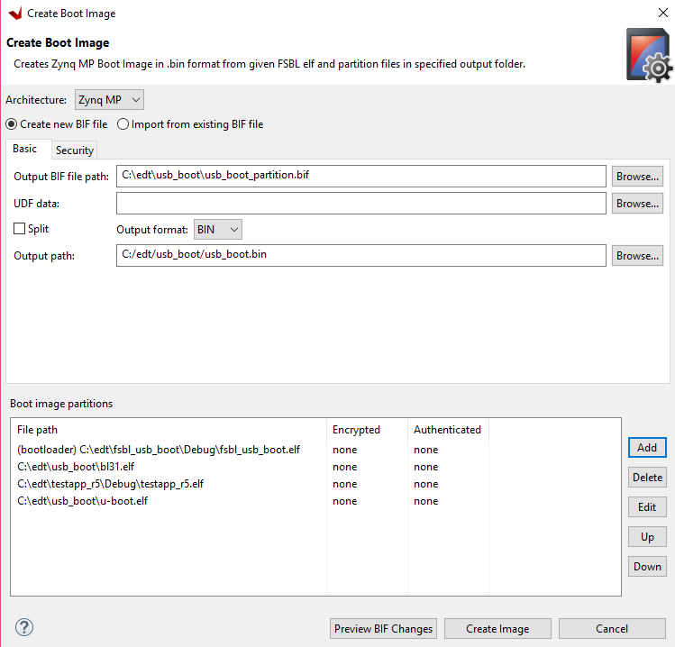

    >**Note:** Ensure that you have set the correct exception levels for the ATF (EL-3, TrustZone) and U-Boot (EL-2) partitions. These settings can be ignored for other partitions.

     The PMU firmware partition is not required in this image because it will be loaded by the bootROM before this image (`usb_boot.bin`) is loaded.

3. Click on **Create Image** to generate `usb_boot.bin`.

    >**Note:** In addition to `BOOT.bin` and `usb_boot.bin`, a Linux image such as ``image.ub`` is required to boot Linux. This `image.ub` is loaded by the DFU utility separately.

### Boot Using USB Boot

 In this section you will load the boot images on the ZCU102 target using the DFU utility. Before you start, set the board connections as shown below:

1. Set ZCU102 for USB boot mode by setting SW6 (1-OFF, 2-OFF, 3-OFF, and 4-ON), as shown below:

    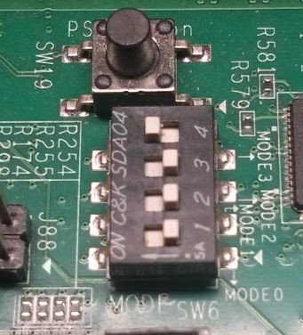

2. Connect a USB 3.0 cable to a J96 USB 3 ULPI connector. Connect other end of the cable to a USB port on the host machine.

3. Connect a USB micro cable between the USB-UART port on the board (J83) and the host machine.

4. Start a terminal session, using Tera Term or Minicom depending on the host machine being used, as well as the COM port and baud rate for your system.

5. Power on the board.

 The following steps load the boot images via USB using the DFU utility, which can be found at `Vitis\2020.2\tps\lnx64\dfu-util-0.9`.

 Alternatively, you can install the DFU utility on Linux using the Package Manager supported by Linux Distribution.

#### Boot Commands for Linux Host Machine

1. Check if the DFU can detect the USB target.

    `$ sudo dfu-util -l`

    The USB device should be enumerated with the vendor and product ID (`03fd:0050`). You should see something like the following message:

    ```
    Found DFU: [03fd:0050] ver=0100, devnum=30, cfg=1, intf=0, alt=0,
    name="Xilinx DFU Downloader", serial="2A49876D9CC1AA4"
    ```

    >**Note:** If you do not see the "Found DFU" message, verify the
    connection and retry.

2. Download the BOOT.bin that was created in [Creating Boot Images for USB Boot](#creating-boot-images-for-usb-boot).

    ```
    $ sudo dfu-util -d 03fd:0050 -D <USB_Boot_Image_Path>/Boot.bin
    ```

    Verify from the Serial Terminal if FSBL has loaded successfully.

3. Download the ``usb_boot.bin``. Before this, start another terminal session for the UART-1 serial console.

    ```
    $ sudo dfu-util -d 03fd:0050 -D <USB_Boot_Image_Path>/usb_boot.bin
    ```

    Check the UART 0 terminal and wait until U-Boot loads.

4. On the U-Boot prompt, press **Enter** to terminate autoboot. Verify from the UART1 console that the R5 application has also loaded successfully.

5. Run the following commands to set up the DFU environment in the U-Boot command line:

    ```
    $ setenv loadaddr 0x10000000
    $ setenv kernel_addr 0x10000000
    $ setenv kernel_size 0x1e00000
    $ setenv dfu_ram_info "setenv dfu_alt_info image.ub ram $kernel_addr
    $kernel_size"
    ```

6. In the U-Boot console, start DFU_RAM to enable downloading Linux images:

    ```
    U-boot\ run dfu_ram
    ```

7. Download the Linux image (``image.ub``) using the following command from the host machine terminal:

    ```
    $ sudo dfu-util -d 03fd:0300 -D <PetaLinux_project>/images/linux/image.ub -a 0
    ```

8. Execute **Ctrl+C** on the U-Boot console to stop dfu_ram.

9. Run the ``bootm`` command from the U-Boot console.

    `U-boot\ bootm`

10. Verify that Linux loads successfully on the target.

 >**Note:** In this example, ``image.ub`` is copied to the DDR location based on the \#define DFU_ALT_INFO_RAM settings in U-Boot configuration. These settings can be modified to copy other image files to the DDR location. Then, if required, these images can be copied to QSPI using U-Boot commands listed in [Boot Sequence for QSPI-Boot Mode Using JTAG](#boot-sequence-for-qspi-boot-mode-using-jtag).

#### Boot Commands for Windows Host Machine

1. In the Vitis IDE, select **Xilinx → Launch Shell**.

2. In the shell, verify if the DFU can detect the USB target:

    `> dfu-util.exe -l`

    >**Note:** `dfu-util.exe` can be found in `<VITIS_Installation_path>\VITIS\2020.2\tps\Win64\dfu-util-0.9\dfu-util.exe`.

3. The USB device should be enumerated with the vendor and product ID (`03fd:0050`).

    >**Note:** If you do not see the message starting with "Found DFU...", download and install the [Zadig](https://zadig.akeo.ie/) software. Open the software and click **Options** and select **List all devices**. Select device **Xilinx Dfu Downloader** and click **Install driver**.

4. Download the **boot.bin** that was created in [Creating Boot Images for USB Boot](#creating-boot-images-for-usb-boot).

    `$ dfu-util.exe -d 03fd:0050 -D BOOT.bin`

5. Verify from the Serial Terminal (UART 0) that FSBL is loaded successfully.

6. Download the ``usb_boot.bin``. Before this, start another terminal session for the UART-1 serial console.

    `$ dfu-util.exe -d 03fd:0050 -D usb_boot.bin`

7. On the U-Boot prompt, press **Enter** to terminate auto-boot. Verify from the UART1 console that the R5 application has also loaded successfully.

    >**Note:** At this point, use the Zadig utility to install drivers for the "USB download gadget" with device ID 03fd:0300. Without this, the Zadig software does not show "Xilinx DFU Downloader" after booting U-Boot on the target.

8. Run the following commands to set up the DFU environment in the U-Boot command line:

    ```
    $ setenv loadaddr 0x10000000
    $ setenv kernel_addr 0x10000000
    $ setenv kernel_size 0x1e00000
    $ setenv dfu_ram_info "setenv dfu_alt_info image.ub ram $kernel_addr $kernel_size"
    ```

9. In the U-Boot console, start DFU_RAM to enable downloading Linux images:

    `U-boot\ run dfu_ram`

10. Download the Linux image ``image.ub`` using the following command from the host machine terminal:

    `$ dfu-util.exe -d 03fd:0300 -D image.ub -a 0`

11. Run the ``bootm`` command from the U-Boot console.

    `U-boot\ bootm`

12. Verify that Linux loads successfully on the target.


© Copyright 2017-2021 Xilinx, Inc.

Licensed under the Apache License, Version 2.0 (the "License"); you may not use this file except in compliance with the License. You may obtain a copy of the License at

http://www.apache.org/licenses/LICENSE-2.0

Unless required by applicable law or agreed to in writing, software distributed under the License is distributed on an "AS IS" BASIS, WITHOUT WARRANTIES OR CONDITIONS OF ANY KIND, either express or implied. See the License for the specific language governing permissions and limitations under the License.