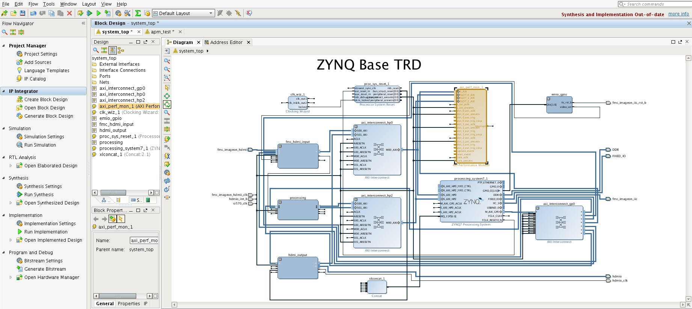
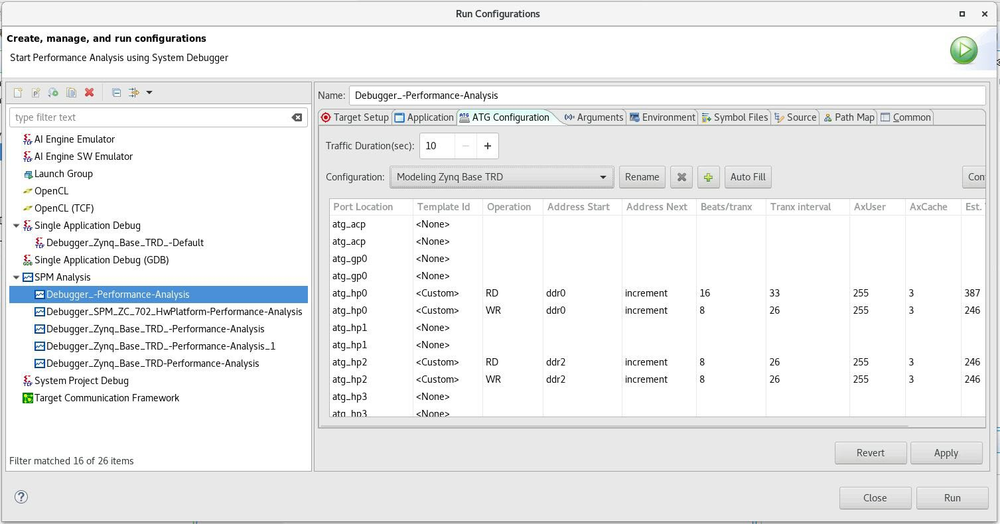
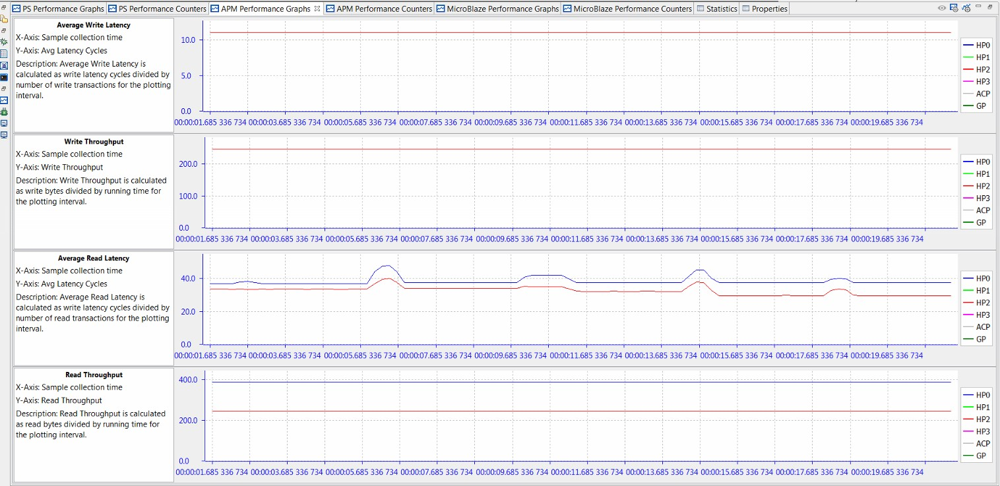
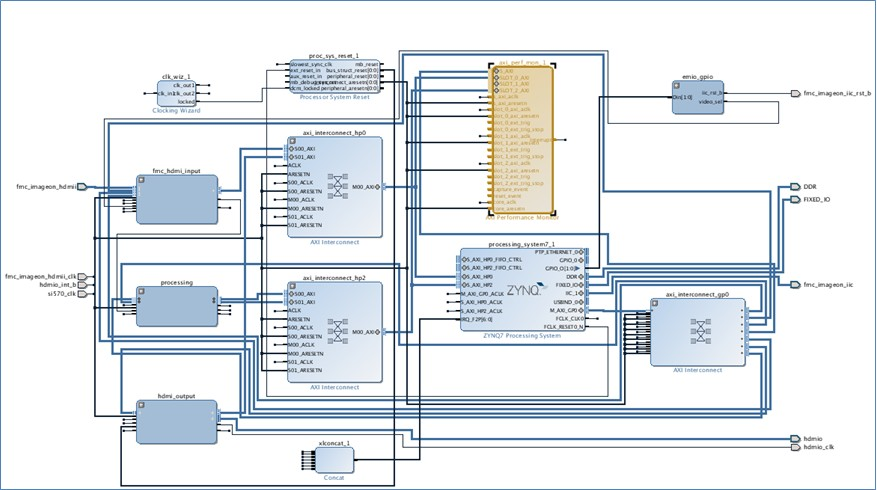
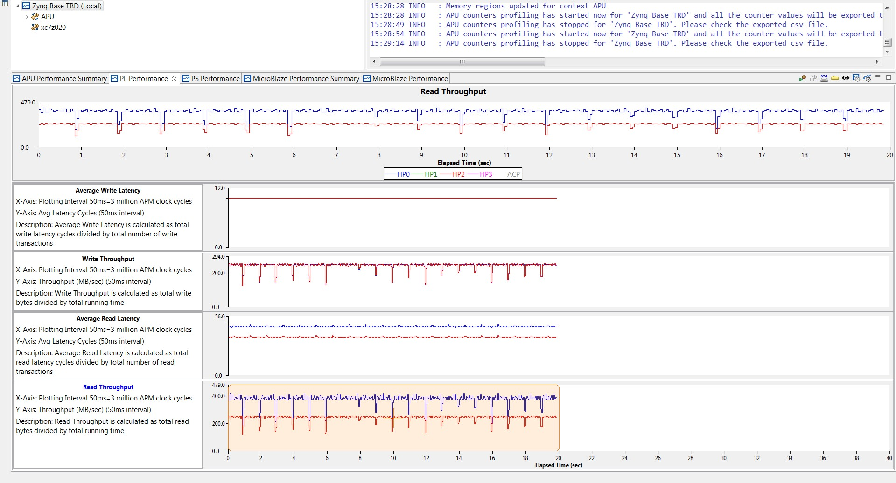
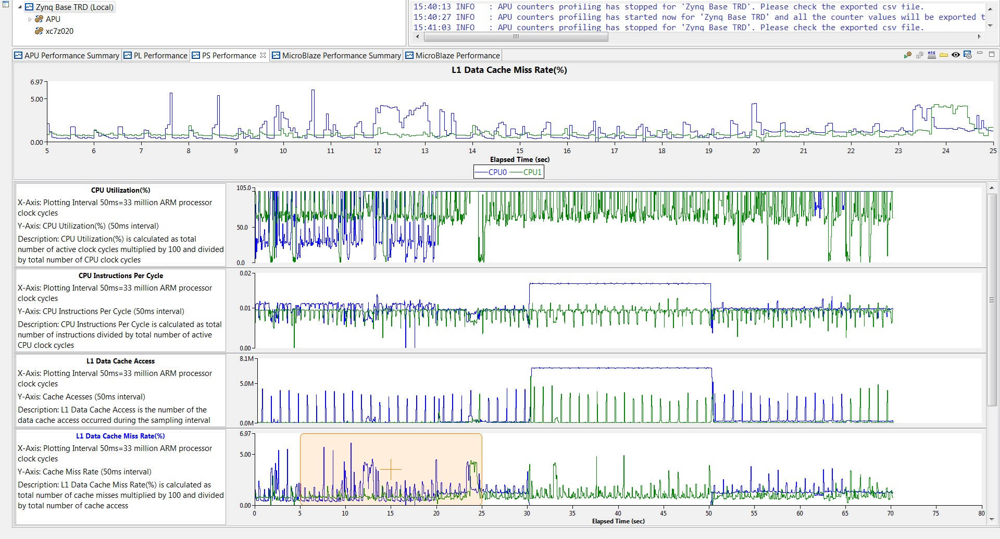
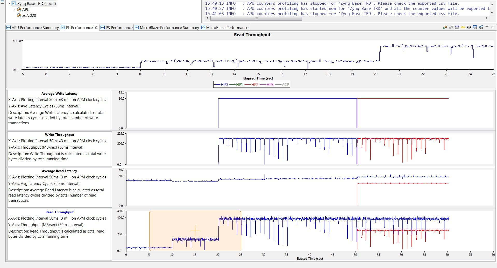

# End-To-End Performance Analysis

 The Vitis™ IDE enables you to perform an end-to-end performance
 analysis flow (shown in [Figure 47: ATG Configuration to Model Traffic of Zynq-7000 SoC Base TRD](#figure-47-atg-configuration-to-model-traffic-of-zynq-7000-soc-base-trd)).
 This flow allows you to model the traffic of your estimated design and
 then validate the performance using your actual design. To better
 define this end-to-end flow, this chapter describes these steps for an
 example design. The design chosen is the Zynq®-7000 SoC Base Targeted
 Reference Design (TRD), described in detail in the *Zynq-7000 SoC
 ZC702 Base Targeted Reference Design User Guide for Vivado Design
 Suite 2015.4*
 ([UG925](https://www.xilinx.com/cgi-bin/docs/bkdoc?k=zc702_zvik%3Bv%3D2015.4%3Bd%3Dug925-zynq-zc702-base-trd.pdf)).

## Assess Requirements

 The following figure shows the block diagram of this TRD involving
 HDMI video input and output and processing using a Sobel filter. There
 are multiple video frames stored in DDR memory, creating multiple
 channels of high-bandwidth write and read traffic.

 *Figure 46:* Zynq-7000 SoC Base TRD Hardware Block Diagram

 Assume for now that this design is in the planning stages and not
 completed yet. How would you model this design using SPM? The first
 step is to assess the bandwidth requirements of the system. This
 involves calculating the expected bandwidth of all of the
 communication channels in the design, and then deciding on the PS-PL
 interfaces to use. Since this is AXI traffic, the beats per
 transaction as well as data locality is also important.

 To calculate bandwidth, you need to know the type of data that is
 being inputted, processed, and then output to a display. As shown in
 the previous figure, the input data for the TRD is an HDMI source
 delivering 1080p/60 video with a data format of YCbCr 4:2:2, or 16
 bits/pixel. This design also has the requirement of overlaying
 multiple layers of video on the output display to show the filtered
 video plus a GUI layer for controls and graphs. The GUI layer will be
 1920 x 300 and in RGB 4:4:4 format, while all others are full frame in
 YCbCr 4:2:2 format. So while the clock frequencies may not be known
 yet, the system can still be modeled using the required bandwidths of
 the data traffic.

 The following table shows a summary of the bandwidth assessment for
 the Zynq-7000 SoC Base TRD. The calculated bandwidth of each video
 channel is listed along with the percentage of DDR bandwidth. The
 design specification utilizes HP0 and HP2 as they use different ports
 on the DDR controller. Other connectivity could also be modeled.

 *Table 9:* **Assessment of Bandwidth in Zynq-7000 SoC Base TRD**

|   Description | Video Format   |   Port      |      Type   |  Bandwidth  |    DDR Bandwidth (%) |  
|----------|----------|----------|----------|----------|----------|
| HDMI Video Input   | YCbCr 4:2:2   | HP0      | Write    |  248.8  |  5.8    |
| Processing Input   | YCbCr 4:2:2   | HP2      | Read     |  248.8  |  5.8    |
| Processing Output      | YCbCr 4:2:2   | HP2      | Write    |  248.8  |  5.8    |
| Multi-layer Video Output (Layer 1:1920 x 300 GUI) | RGB 4:4:4     | HP0      | Read     |  138.3  |  3.3    |
| Multi-layer Video Output (Layer 2:1920 x 1080)    | YCbCr 4:2:2   | HP0      | Read     |  248.8  |  5.8    |
| Total Traffic   | N/A      | HP0/HP2  | Write/Read       |  1133.4 |  26.5   |

## Model Design

 Now that the bandwidth requirements of the design have been
 identified, modeling can be performed using the SPM design. While not
 a necessity, a software application is recommended to model Processing
 System (PS) traffic. The memory stride software application was used
 to model high activity in the PS. While this is not the software that
 will be run in the actual design, it does provide a worst-case test
 scenario in terms of activity and memory bandwidth.

 The following figure shows one way the traffic of the TRD could be
 modeled using System Performance Modeling (SPM). Assuming the video
 frames are stored in different parts of memory, the Address Start
 values were set to ddr0 and ddr2. Furthermore, video data is typically
 stored as successive lines of data, so the Address Next values were
 set to increment. Beats/tranx values of 8 and 16 were chosen to model
 the video DMA to/from the Sobel filter and the multi-layer video
 output, respectively. The intervals were specified to match the
 desired throughputs for each port and type, as summarized in [Table 9: Assessment of Bandwidth in Zynq-7000 SoC Base TRD](#_bookmark57).

 *Figure 47:* ATG Configuration to Model Traffic of Zynq-7000 SoC Base TRD

 The ATGs were configured with the specified traffic and a run was
 performed on a ZC702 board. The following figure shows the summary
 table of results after this run was performed. Both HP0 and HP2 were
 capable of achieving the desired write and read bandwidth for this
 design. While the CPU performance results are for the memory stride
 benchmarks and not the eventual TRD application, it is still important
 to note the activity.

 *Figure 48:* Summary of Performance Results for Model of Zynq-7000 SoC Base TRD

 The following figure shows the write and read performance graphs from
 the Vitis IDE, confirming the details of the achieved performance. The
 average write latency and write throughput remain consistent during
 the entire test. The average read latency is noticeably affected by
 the memory stride benchmarks. This is due to contention at the DDR
 controller. However, the read throughput remains consistent throughout
 the test.

 *Figure 49:* Write and Read Performance for Model of Zynq-7000 SoC Base TRD

 As mentioned in the [Chapter 1: Introduction](#_bookmark1), there are
 a number of reasons for performing this modeling, especially when the
 design is in its planning stages. Specific to this design, this
 includes the following:

- **De-risk for success :** The SPM model proved that the desired
     latencies and throughputs can be achieved. This provides a much
     stronger assurance that the Zynq-7000 SoC Base TRD will be able to
     achieve the same desired performance.

- **Design Improvements:** [Figure 48: Summary of Performance Results for Model of Zynq-7000 SoC Base TRD](#figure-48-summary-of-performance-results-for-model-of-zynq-7000-soc-base-trd)
     shows average read latencies of the model to be 40.13 and 32.41
     for HP0 and HP2, respectively. For a video design such as this one
     with definitive frame rate constraints, a display controller could
     be designed to work within these metrics.

- **What-If Scenarios:** The TRD could consider adding more video
     layers to the output display. Instead of iterating within the real
     system, it could be done using SPM. Other options to consider
     might include: adding a second video pipeline and upgrading to 4K
     video resolution. All of these scenarios could be modeled and
     analyzed before the design phase begins.

## Performance Validation

 The performance of the SPM model can be validated with the actual
 design. Analyze the performance of the Zynq-7000 SoC Base TRD using a
 properly instrumented design which include an APM (see [Instrumenting Hardware](#instrumenting-hardware)). For the TRD delivered with 2015.1, this was already the case.

 The following figure shows the TRD defined as a block diagram in
 Vivado Design Suite IP integrator with the APM instance highlighted.
 The APM was properly configured in Profile mode to ensure that
 performance results would be reported correctly in the Vitis IDE. HP0
 was connected to slot 0 on the APM while HP2 was connected to slot 2.
 Slot 1 was left open (because HP1 was not used), and the Number of
 Monitor interfaces was set to 3.

 *Figure 50:* Vivado IP Integrator Block Diagram of Zynq-7000 SoC Base TRD

 The following figure shows the connection diagram to the ZC702 board
 in order to run the demonstration. The board was connected as shown,
 and the design was booted from the SD card.

 *Figure 51:* Connection Diagram of Zynq-7000 SoC Base TRD Using the ZC702 Board

 The summary table of results is shown in the following figure while
 the corresponding graphs can be seen in [Figure 53: Write and Read Performance of Zynq-7000 SoC Base TRD](#figure-53-write-and-read-performance-of-zynq-7000-soc-base-trd).
 The Programmable Logic (PL) performance results can be compared
 directly with those gathered from the SPM model in [Figure 48: Summary of Performance Results for Model of Zynq-7000 SoC Base TRD](#figure-48-summary-of-performance-results-for-model-of-zynq-7000-soc-base-trd).
 The write and read throughputs from the model are all within 2.0% of
 the actual results.

 The write latencies are within a cycle of the actual design, while the
 average read latencies of the model are within 16.0% of the actual
 design. While the actual design appears to be more bursty in nature
 than the SPM model, the average performance values were accurate
 enough to provide assurance that the TRD would meet its performance
 goals.

 *Figure 52:* Summary of Performance Results for Actual Zynq-7000 SoC Base TRD

 *Figure 53:* Write and Read Performance of Zynq-7000 SoC Base TRD

## In-Depth Analysis

 A second run of the TRD was performed to investigate the performance
 impacts of various run- time settings of the TRD. The following table
 lists all of these settings, as well as a summary of their
 corresponding performance results captured in the Vitis IDE. The time
 window is approximately when those settings were used during the test
 run.

 *Table 10:* **Summary of Performance Metrics from Actual Zynq-7000 SoC Base TRD**

<table>
<thead>
<tr>
<th rowspan="2">Description</th>
<th rowspan="2">Time Window (s,approx.)</th>
<th colspan="2">L1 Data Cache Accesses (x103)</th>
<th colspan="2">Write Throughputs (MB/s)</th>
<th colspan="2">Read Throughputs (MB/s)</th>
</tr>
<tr >
<th>CPU0</th>
<th>CPU1</th>
<th>HP0</th>
<th>HP2</th>
<th>HP0</th>
<th>HP2</th>
</thead>
<tbody>
</tr>
<tr>
<td>GUI only – minimized</td>
<td>

0-10

</td>
<td>

100

</td>
<td>

100

</td>
<td>

0

</td>
<td>

0

</td>
<td>

37

</td>
<td>

0

</td>
</tr>
<tr >
<td>GUI only – maximized</td>
<td>

10-20

</td>
<td>

100

</td>
<td>

100

</td>
<td>

0

</td>
<td>

0

</td>
<td>

140

</td>
<td>

0

</td>
</tr>
<tr>
<td>Video Enabled</td>
<td>

20-30

</td>
<td>

100

</td>
<td>

100

</td>
<td>

246

</td>
<td>

0

</td>
<td>

382

</td>
<td>

0

</td>
</tr>
<tr >
<td>Sobel filter on – SW mode</td>
<td>

30-50

</td>
<td>2800</td>
<td>

7000

</td>
<td>

246

</td>
<td>

0

</td>
<td>

382

</td>
<td>

0

</td>
</tr>
<tr>
<td>Sobel filter on – HW mode</td>
<td>

50-70

</td>
<td>

100

</td>
<td>

200

</td>
<td>

246

</td>
<td>

246

</td>
<td>

382

</td>
<td>

246

</td>
</tr>
</tbody>
</table>

 As listed in this table, the performance impacts can be directly
 measured in the Vitis IDE. The GUI video output layer actually has two
 modes in the TRD: a minimized mode (size: 1920 x 80) and a maximized
 mode (size: 1920 x 300). Between 0-20 seconds, only that portion of
 the video frame was output by the hardware and sent to the video
 display, as confirmed by the read throughput results on HP0. After the
 output video was enabled, the total HP0 read bandwidth included the
 full video frame plus the GUI layer. The input 4:2:2 video was also
 written to DDR on HP0.

 Turning on the Sobel filtering produced noticeable changes in
 performance. There was clearly much higher CPU activity when the
 software (SW) mode was used, including notably L1 data cache accesses.
 Also, using the Sobel filter in hardware (HW) mode visibly affected
 the write and read traffic on HP2.

 The performance results of the Zynq-7000 SoC Base TRD become
 especially evident in the graphs shown in [Figure 54: PS Performance Graphs of Zynq-7000 SoC Base TRD Figure](#figure-54-ps-performance-graphs-of-zynq-7000-soc-base-trd), and
 [Figure 55: PL Performance Graphs of Zynq-7000 SoC Base TRD](#figure-55-pl-performance-graphs-of-zynq-7000-soc-base-trd). For
 the PS performance results in [Figure 54: PS Performance Graphs of Zynq-7000 SoC Base TRD](#figure-54-ps-performance-graphs-of-zynq-7000-soc-base-trd), most
 activity occurs between approximately 30-50 seconds, when the Sobel SW
 filter mode is used. This period involves consistently high CPU
 utilization and notably higher values for IPC and L1 data cache
 accesses, among others.

 For the PL performance results in [Figure 55: PL Performance Graphs of Zynq-7000 SoC Base TRD](#figure-55-pl-performance-graphs-of-zynq-7000-soc-base-trd),
 all time periods have very distinct characteristics. However, most
 activity occurs between approximately 50-70 seconds, when the Sobel HW
 filter mode is used. The write throughputs on HP0 and HP2 and the read
 throughput on HP2 all correspond to expected values for 4:2:2 video
 streams. The read throughput on HP0 is higher in value as it includes
 the 4:2:2 full-frame video plus the partial-frame GUI layer.

 In summary, instrumenting the Zynq-7000 SoC Base TRD provided two
 benefits:

- Validating the performance results originally modeled by the SPM

- Providing a deeper analysis into various design settings

 *Figure 54:* PS Performance Graphs of Zynq-7000 SoC Base TRD

 *Figure 55:* PL Performance Graphs of Zynq-7000 SoC Base TRD

