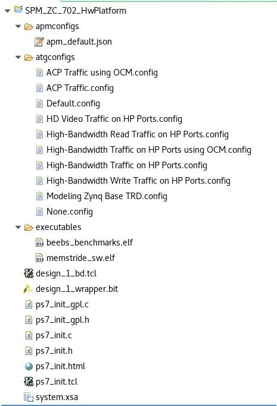
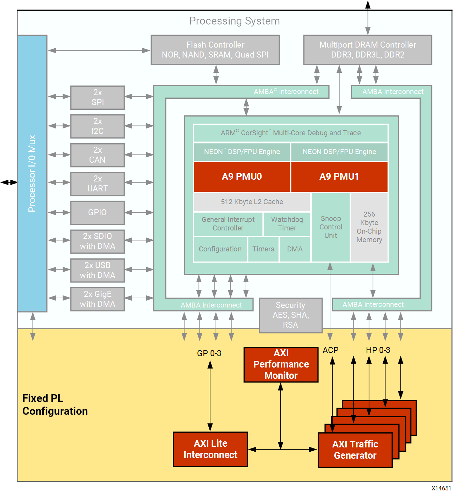

# System Performance Modeling Project

 The Vitis™ IDE is delivered with a predefined project that enables System Performance Modeling (SPM) and helps enable performance analysis at an early design stage. The SPM project contains both software executable and a post-bitstream, configurable hardware system. The SPM serves multiple purposes, including the following:

- **Target Evaluation:** Gain a better understanding of the target platform with minimal hardware design knowledge or experience. A complex SoC such as the Zynq®-7000 SoC can be characterized and evaluated, enabling critical partitioning trade-offs between the Arm® Cortex-A9s and the programmable logic. Most importantly, this evaluation can be done independently of the progression or completion of a design. You can always decide to gain a better understanding of your target platform.

- **Perform Stress Tests:** Identify and exercise the various points of contention in the system. An excellent way of understanding a target platform is to evaluate the limits of its capabilities.

- **Performance Evaluation:** Model the traffic of a design. Once the target platform is understood, specifics of a design can be entered as traffic scenarios, and SPM can be used to evaluate architectural options.

- **Performance Validation:** Instrument the final design and confirm results with the initial model. The same monitoring used in the SPM design can also be added to your design (see [Instrumenting Hardware](#instrumenting-hardware)), providing a validation of the modeled performance results.

*Figure 5:* **SPM Project Files in the Vitis IDE**

The previous figure lists the files contained in the predefined SPM project. It contains predefined traffic configurations (atgconfigs), performance monitor configurations (apmconfigs), pre-compiled software executables (executables), and multiple system definition files. The system definition files include Processing System initialization files, the bitstream for predefined PL design and the tcl file that can recreate the design.

# SPM Software

The SPM project contains two pre-compiled software executables:

- A collection of benchmarks called the Bristol/Embecosm Embedded Energy Benchmark Suite (BEEBS)

- Memory stride benchmarks designed specifically to test memory bandwidth and latency

> ***Note*:** ZCU102 SPM project only includes BEEBS benchmark.

### BEEBS Benchmarks

The BEEBS program comprises a sequence of eight diverse benchmarks. As shown in the following table, this suite contains algorithms originally contained as part of various well-known benchmark suites such as MiBench, WCET, and DSPstone. These benchmarks were chosen to test embedded systems and be portable to standalone or bare-metal targets. For more information about the BEEBS benchmark suite, refer to [BEEBS: Open Benchmarks for Energy Measurements on Embedded Platforms](http://dblp.uni-trier.de/db/journals/corr/corr1308.html#PallisterHB13).

 *Table 1:* **BEEBS Benchmarks Provided in Pre-Compiled Program**

|  Benchmark               |  Suite      |  Description             |
|--------------------------|-------------|--------------------------|
| Blowfish encoder         | MiBench     | Block cipher             |
| Secure Hash Algorithm (SHA)   | MiBench     | NIST cryptographic hash function |
| Dijkstra's algorithm    | MiBench     | Graph search algorithm   |
| Discrete Cosine Transform (DCT)          | WCET        | Transform used in MP3, JPEG    |
| 2-D FIR filter           | DSPstone    | Common in image filtering          |
| Floating-point matrix multiplication   | WCET        | Multiplication of two square matrices   |
| Integer matrix multiplication          | WCET        | Multiplication of two square matrices   |

 The BEEBS benchmark suite was modified in four important ways:

- **Single executable:** A single executable was created to run all benchmarks within a single program. The previous table lists the benchmarks in the order that they are called in the pre- compiled program contained in the SPM project.

- **Sleep between benchmarks:** A sleep time of 1 second was inserted between each benchmark. In order to differentiate the execution of the benchmarks, this is an interrupt-based sleep where the CPU usage is 0%.

    > ***Note*:** The pre-compiled BEEBS application in ZCU102 SPM project waits for 1 second between each test but it didn't use the interrupt based sleep. The utilization is still 100% during sleep. This issue will be fixed in the future.

- **Different data array sizes:** The benchmarks were modified to allow for a variety of data array sizes. The three array sizes used in the pre-compiled benchmark program are:

    - 4 KB (2-D array: 32 x 32) -- fits into the 32 KB L1 data cache

    - 64 KB (2-D array: 128 x 128) -- fits into the 512 KB L2 data cache

    - 1024 KB (2-D array: 512 x 512) -- fits into the DDR SDRAM

- **Instrumented:** Run-times of these benchmarks were calculated based on instrumentation added to the code before and after every benchmark. See [Instrumenting Hardware](#instrumenting-hardware) for more details. Note that the run-times are reported in the transcript delivered over the UART (Terminal 1 panel in the Vitis IDE) and read manually.

#### Memory Stride Benchmarks

The memory stride benchmarks differ from the BEEBS benchmarks in that they do minimal computation and are specifically designed to test memory bandwidth and latency. The various tests included in the software are listed in the following table. The five different types of tests include:

- **Linear Bandwidth:** Memory bandwidth tests with constant linear stride accesses. For the pre- compiled application that comes with the SPM project, the stride length is equal to a 32-byte cache line.

- **Random Bandwidth (Pre-Computed):** Memory bandwidth tests of random stride accesses. The random addresses used in these tests are pre-computed.

- **Random Bandwidth (Real-Time):** Memory bandwidth tests of random stride accesses. The random addresses used in these tests are computed in real time using a random number generator.

- **Linear Latency:** Memory latency tests with constant linear stride accesses.

- **Random Latency (Pre-Computed):** Memory latency tests of random stride accesses. The random addresses used in these tests are pre-computed.

Similar to BEEBS, the memory stride benchmarks are contained in a single executable with a one second sleep in between benchmarks. The following table shows the order of benchmarks in the program. Each benchmark operates on the same three array sizes listed above for BEEBS.

The memory stride program is also instrumented; however, the transcript reports the achieved throughput and latencies of each test.

*Table 2:* **Memory Stride Provided in Pre-Compiled Program** 

|  Test Type           |  Pattern Type          |  Operation Type |
|----------------------|----------------------|---------------------|
|  Bandwidth           |  Linear             |  Read               |
|                      |                      |  Write              |
|                      |                      |  Copy               |
|                      |                      |  Read/Write         |
|                      |  Random (Pre-Computed)            |  Read               |
|                      |                      |  Write              |
|                      |                      |  Copy               |
|                      |  Random (Real-Time) |  Read               |
|                      |                      |  Write              |
|                      |                      |  Copy               |
|  Latency            |  Linear             |  Read               |
|                      |  Random (Pre-Computed)             |  Read               |

> ***Note*:** ZCU102 SPM project doesn't include this memory stride benchmark executable.

## SPM Hardware

The SPM project contains a predefined hardware design that can be used for early performance exploration. This design is delivered in the project as a fixed bitstream to configure the Zynq-7000 SoC PL.

*Figure 6:* **Pre-Defined SPM Design in Zynq-7000 SoC**

The previous figure shows a block diagram of this predefined SPM design targeting the

Zynq-7000 SoC. It is a highly-configurable design involving five AXI traffic generator (ATGs) and one AXI performance monitor (APM). One ATG is connected to each of the four high- performance (HP) ports as well as one to the ACP. The configuration of these cores is performed via the general purpose (GP) port 0 master. CPU performance metrics are obtained using the Performance Monitor Units (PMUs).

### AXI Traffic Generator

The ATG is an intelligent traffic generator configured to exhibit specific AXI traffic behavior. The command queue for each ATG is filled during initialization, and these commands are executed upon the application of a start bit. Separate queues with depth of 256 commands are included for write and read traffic. The ATG also has a loop mode where the traffic in the command queue is continuous, iterating over the traffic in the queue until a stop bit has been applied. In the Vitis IDE, this has been simplified to a Traffic Duration (sec) value. The traffic specification for the ATGs is described in [Chapter 4: Getting Started with SPM](4-getting-started-with-SPM.md).

### AXI Performance Monitor

The APM is a core designed to measure the real-time performance of every connected AXI interface. In the SPM design, these interfaces include the outputs of the five ATGs. The APM is configured in Profile mode, providing an event count module that includes six profile counters per ATG. These six counters are designed to monitor average throughput and latency for all write and read channels on the connected AXI interfaces. See [Chapter 3: Monitor Framework](3-monitor-framework.md) to understand how these metrics are calculated.

### Performance Monitor Units

Each Arm Cortex-A9 CPU contains a Performance Monitor Unit (PMU). These PMUs are configured to monitor a number of different performance metrics, including CPU utilization and Instructions Per Cycle (IPC). The PMUs are accessed as part of the performance monitor framework used by the Vitis IDE. See [Chapter 3: Monitor Framework](3-monitor-framework.md) to understand how these PMU counters are used.
