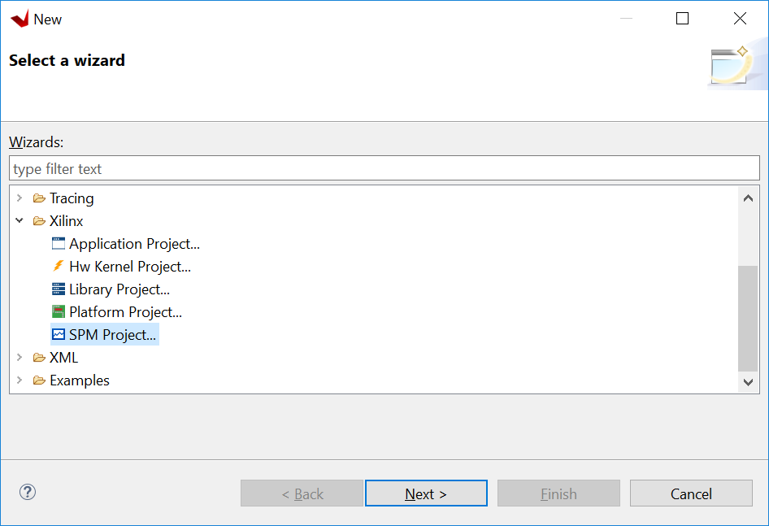
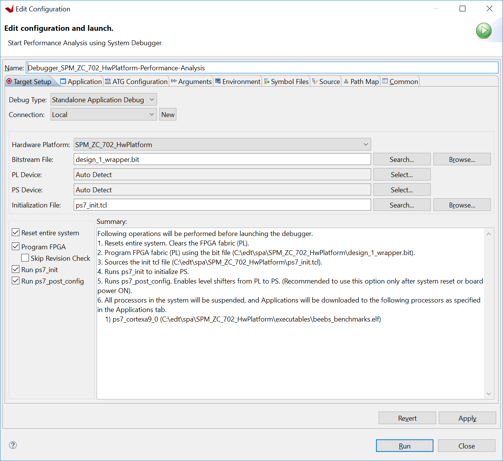
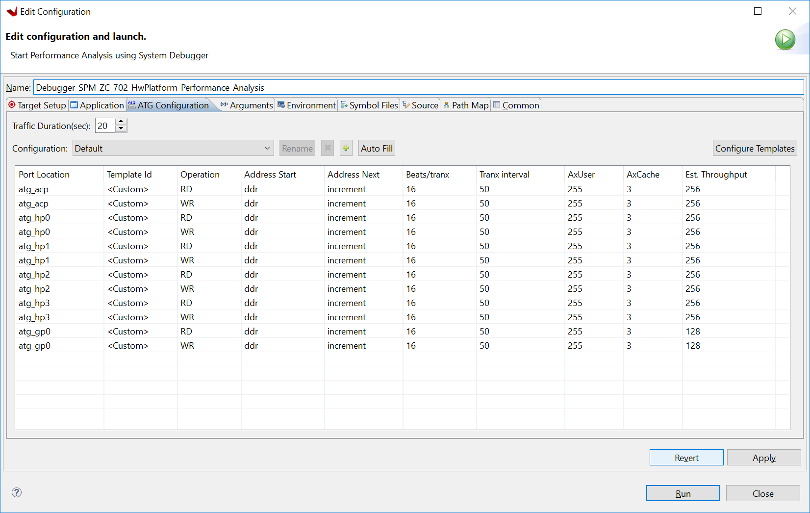
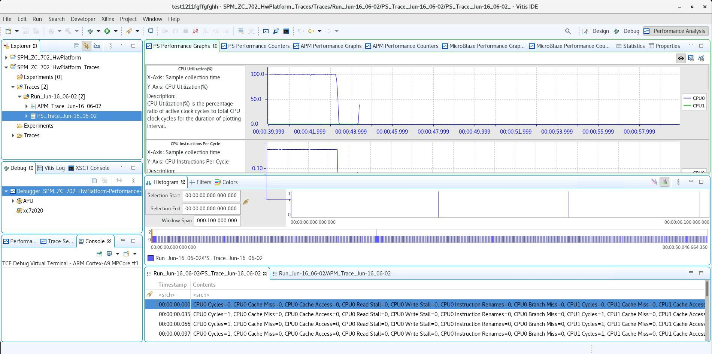
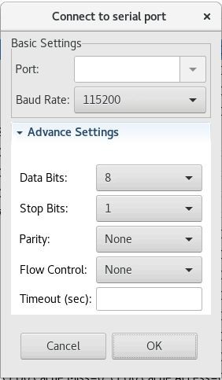

# Getting Started with SPM

The predefined SPM project can be automatically loaded into the workspace with the following steps

1. Select **File → New → Other** in the Vitis™ IDE.
2. Select **Xilinx → SPM Project** in the popup menu.

     

3. When prompted, select the SPM target.

    The SPM project name is defined based on the specified target. For example, selecting a target supported by the ZC702 board will automatically assign SPM_ZC_702_HwPlatform as the name of the SPM project.

     

     > ***Note*:** This tutorial uses the ZC702 workflow example. Differences with ZCU102, if any, are highlighted.

     > ***Note*:** Even if your board is not listed in the pre-built project list, you can use most of the SPA features with a custom target. See [Using SPA with a Custom Target](9-using-spa-with-custom-target.md) for more information.

4. Click **Finish**.

    The SPM project is created. You can now edit the configuration for your test, including the target setup, software application, and traffic to use for the  ATGs. The target setup includes board connection information, bitstream selection, and Processing System 7 (PS7) initialization. The bitstream is specified by default to be the SPM bitstream, while the PS7 settings are defined in the SPM system definition files. If you do not have a local or direct connection to a target board from your host machine, refer to the *Vivado Design Suite User Guide: Embedded Processor Hardware Design* ([UG898](https://www.xilinx.com/cgi-bin/docs/rdoc?=latest;d=ug898-vivado-embedded-design.pdf)) for help in setting up your board connection.

The following figure shows the software application setup for the SPM.

*Figure 9:* **Application Setup in the Vitis IDE Configuration Wizard**

By default, the software run in this configuration is the executable `beebs_benchmarks.elf`, an excellent starting application because it contains significant amounts of data processing and memory accesses
(see [System Performance Modeling Project](2-system-performance-modeling-project.md)).

This default application was chosen to prepare your design for evaluating software performance, which is described in the next chapter. Later in this guide, this setting will be modified and memory stride, which is the other application that is supplied with the SPM project, will be used.

## ATG Configuration

The Vitis IDE enables you to specify traffic scenarios for configuring the ATGs. The following figure shows the ATG Configuration tab, where this traffic can be specified.

 *Figure 10:* **ATG Configuration Setup in the Vitis IDE Configuration Wizard**

In the fixed bitstream of SPM (see [SPM Software](2-system-performance-modeling-project.md#spm-software) for more details), one ATG is attached to every High Performance (HP) port and the Accelerator Coherency Port (ACP) -- all interfaces between the PL and the PS. Memory access patterns are modeled by the ATGs issuing AXI transactions with various lengths, frequencies, and memory addresses onto each port. Different combinations of read/write traffic patterns across all four HP and the ACP ports can be specified. This ATG Configuration table includes the following:

- **Port Location:** The ATG that is being configured (in SPM, the names are self-explanatory).

- **Template ID:** Disable/enable the traffic defined on that row. When set to **None** no traffic is generated.

- **Operation:** The type of AXI transactions to issue on the AXI port. Valid values include **RD** for memory read transactions (via the AXI read port) and **WR** for memory write transactions (via the AXI write port).

- **Address Start:** The starting address of the AXI transactions. Valid values include the following preset addresses: `ddr` (an alias of ddr0), `ddr0`, `ddr1`, `ddr2`, `ddr3`, and `ocm`.

- **Address_Next:** The method by which every subsequent address is generated after Address_Start (that is, **incremental** or **random** within an address range).

- **Beats/tranx:** The burst length or number of beats per AXI transaction. Valid values are between 1 and 256.

- **Tranx Interval:** The number of PL clock cycles between the start of two consecutive AXI transactions. Valid values are between 5 and 1024.

- **Est. Throughput:** An estimated throughput (in MB/s) of the current traffic settings; the throughput is calculated using: `8 × (Lburst/(MAX(Linterval, Lburst))) × f`, where `Lburst` is the Beats/tranx, `Linterval` is the Tranx interval, and `f` is the PL clock frequency.

## Performance Analysis Perspective

After editing your configuration, you can start a performance analysis session by clicking **Debug** in the Edit Configuration dialog box. The Vitis IDE opens the Performance Analysis perspective.

 *Figure 11:* **Performance Analysis Perspective in the Vitis IDE**

The previous figure shows the Eclipse perspective, which provides a dashboard of performance results. There are five important panels to introduce:

- **PS Performance Graphs:** PS (Arm) metrics will be displayed using these graphs.

- **PS Performance Counters:** PS (Arm) metrics listed in a tabular format.

- **APM Performance Graphs:** Plots showing the APM performance metrics listed in [Table 3: Profile Counters per AXI Interface in AXI Performance Monitor](#_bookmark14) using these graphs.

- **APM Performance Counters:** Plots showing the APM performance metrics listed in [Table 3: Profile Counters per AXI Interface in AXI Performance Monitor](#_bookmark14) in a tabular format.

- **MicroBlaze™ Performance Graphs:** Various plots showing the MicroBlaze performance metrics on a shared timeline. This is not used by SPM and therefore not covered in this guide.

- **MicroBlaze Performance Counters:** A table summarizing MicroBlaze performance metrics. This is not used by SPM and therefore not covered in this guide.

 *Figure 12:* **Terminal Settings to View Transcript in the Vitis IDE**

This guide uses various results that are output by the target applications and viewed in the Terminal 1 panel in the Vitis IDE. These results include software run-times, achieved bandwidths, and average latencies. If you would like to re-create these results and/or run your own, you must connect a USB cable (Type-A to USB Mini-B) between the UART on the ZC702 board and a USB port on your host machine.

[Figure 12: Terminal Settings to View Transcript in the Vitis IDE](#figure-12-terminal-settings-to-view-transcript-in-the-vitis-ide) shows the terminal settings required to view this UART transcript in the Vitis IDE. To view this pop-up menu, click on the Connect button  as shown in the upper-right of [Figure 11: Performance Analysis Perspective in the Vitis IDE](#figure-11-performance-analysis-perspective-in-the-vitis-ide)

> ***Note*:** Your port may be different than COM5, but all other settings are valid.
