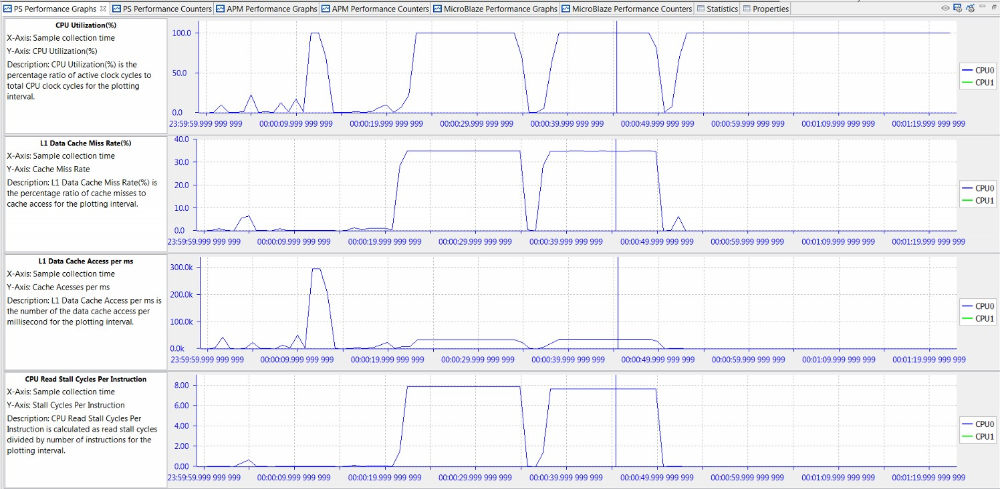
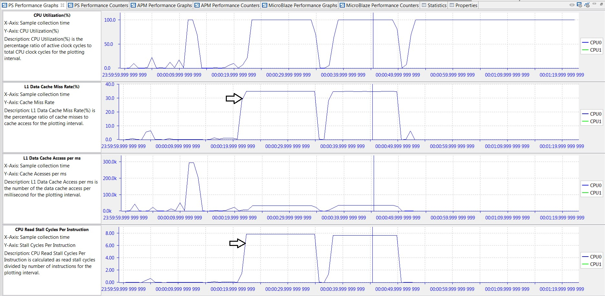
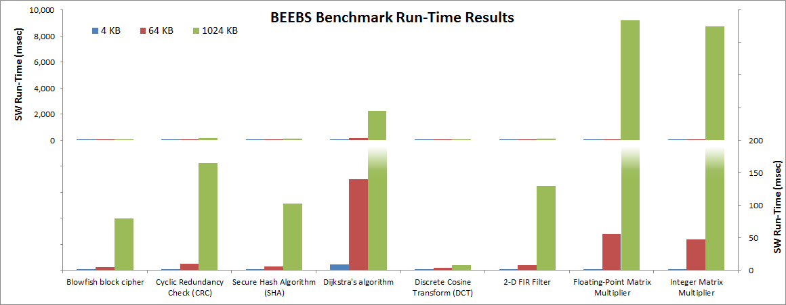
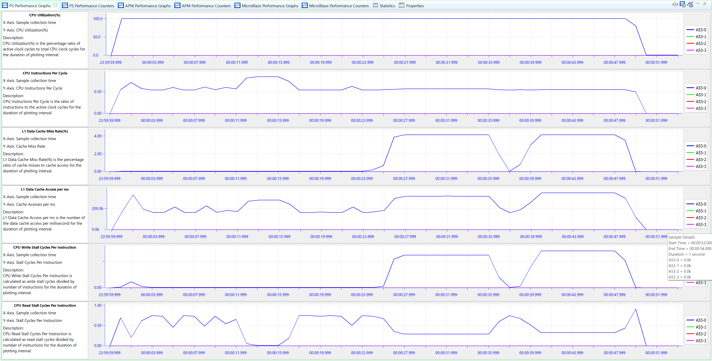
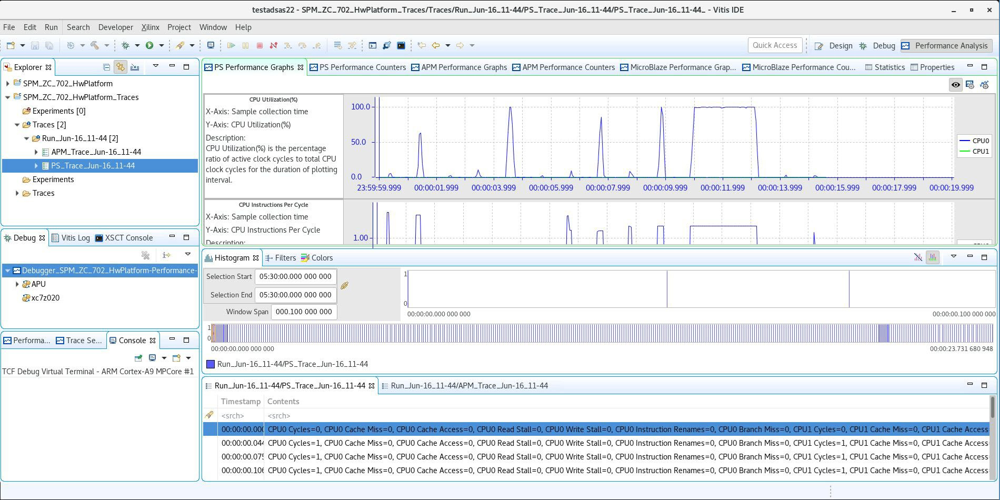

# Evaluating Software Performance

There are a number of monitoring capabilities that evaluate software performance on a Zynq®-7000 SoC. These capabilities can inform you about the efficiency of your application and provide visualizations for you to better understand and optimize your software.

## Software Performance Monitoring

To illustrate these performance monitoring capabilities, the BEEBS benchmark program (see [System Performance Modeling Project](2-system-performance-modeling-project.md)) was run on a ZC702 target board and performance results were captured in the Vitis™ IDE. There was no traffic driven from the PL, so this is a software only test. Note that if you would like to re-create these results, the software application selection is
shown in [Getting Started with SPM](4-getting-started-with-SPM.md), and the PL traffic is shown in [ATG Configuration](4-getting-started-with-SPM.md#atg-configuration). Although the results shown here are for the BEEBS benchmarks, these exact same metrics can also be obtained for a program provided to or compiled by the Vitis IDE.

There are 24 total tests performed -- each of the eight benchmarks listed in [Table 1: BEEBS Benchmarks Provided in ](#_bookmark9) is run on the three different data array sizes (that is, 4 KB, 64 KB, and 1024 KB). Because a sleep time of 1s was inserted between each test, the CPU utilization gives a clear view of when these benchmarks were run. The following figure helps orient the timeline for the results. The three data sizes were run from smallest to largest within each benchmark, which can be seen in the value and length of the utilization of CPU0. It took approximately 45s to run BEEBs benchmark without any traffic.

*Figure 13:* **CPU Utilization Labeled with BEEBS Benchmarks**


The following figure shows four different graphs displayed by the Vitis IDE in the PS Performance panel: CPU Utilization (%), CPU Instructions Per Cycle, L1 Data Cache Access, and L1 Data Cache Miss Rate (%).

*Figure 14:* **Performance Analysis of BEEBS Benchmarks - CPU Utilization, IPC, L1 Data Cache**



While CPU utilization helps determine when benchmarks were run, the most insightful analysis is achieved when multiple graphs are considered. For these particular tests, the significant analysis comes from the Instructions Per Cycle (IPC) and the L1 data cache graphs. IPC is a well-known metric to illustrate how software interacts with its environment, particularly the memory hierarchy. See Computer Organization & Design: The Hardware/Software Interface by David A. Patterson and John L. Hennessy. This fact becomes evident in the previous figure as the value of IPC follows very closely the L1 data cache accesses. Also, during the memory-intensive matrix multipliers, the lowest values of IPC correspond with the highest values of L1 data cache miss rates. If IPC is a measure of software efficiency, then it is clear from the previous figure that the lowest efficiency is during long periods of memory-intensive computation. While sometimes this is unavoidable, it is clear that IPC provides a good metric for this interaction with the memory hierarchy.

Taking this analysis one step further, the graphs in the following figure provide information on data locality; that is, where the processor retrieves and writes data as it performs the specified algorithms. A low L1 data cache miss rate means that a significant amount of data is stored and accessed from that respective cache. A high L1 miss rate coupled with high values in CPU write or read stall cycles per instruction means that much of the data is coming from DDR. As expected, an understanding of the software application aids in the analysis. For example, the two long periods of high L1 miss rate and CPU read stall cycles shown in the following figure are when the floating-point and integer matrix multiplier algorithms are operating on the 512 x 512 (256K words = 1024 KB) two-dimensional or 2-D data array.

*Figure 15:* **Performance Analysis of BEEBS Benchmarks - L1 Data Cache, Stall Cycles Per Instruction**



To refine the performance of an application, one option to consider using is to enable/disable the L2 data cache prefetch. This is specified with bit 28 of reg15_prefetch_ctrl (absolute address 0xF8F02F60). If this data prefetching is enabled, then the adjacent cache line will also be automatically fetched. While the results shown in [Figure 14: Performance Analysis of BEEBS Benchmarks - CPU Utilization, IPC, L1 Data Cache](#figure-14-performance-analysis-of-beebs-benchmarks---cpu-utilization-ipc-l1-data-cache) and [Figure 15: Performance Analysis of BEEBS Benchmarks - L1 Data Cache, Stall Cycles Per ](#figure-15-performance-analysis-of-beebs-benchmarks---l1-data-cache-stall-cycles-per-instruction) were generated with prefetch enabled, the BEEBS benchmarks were also run with prefetch disabled. The integer matrix multiplication saw the largest impact on software run-time with a decrease of 9.0%. While this prefetch option can improve the performance of some applications, it can lower the performance of others. It is recommended to verify run-times of your application with and without this prefetch option.

 *Figure 16:* **Run-Time Results of Software in BEEBS Benchmark Suite**



As mentioned above, a helpful measurement of overall software performance is the run-time of different portions of the application. The previous figure shows a summary of run times for the eight BEEBS benchmarks as run on the three different data array sizes (see [Instrumenting Hardware](10-end-to-end-performance-analysis.md#instrumenting-hardware) on how these run-times were calculated and captured). The Y-axis on the left side of the previous figure shows the full range of values, while the Y-axis on the right side zooms in on the lowest range for clarity. As expected, the run-times increase with larger array sizes. However, the amount of increase varies across the different benchmarks tested. This is because there are a number of different factors that can impact run-time, including the amount of data, data locality, and algorithmic dependencies on data size. As far as data locality, the 4 KB, 64 KB, and 1024 KB data arrays fit into the L1 data cache, L2 data cache, and DDR, respectively.

On the Zynq UltraScale+ MPSoC, the ZCU102 SPM project shows a similar result. The only difference difference is that the BEEBS benchmark does not use an interrupt between two tests, so the CPU utilization shows 100% all across the test time. However, you can see the same pattern of L1 data cache miss rate and CPU Read Stall Cycles per Instruction.



For more information on assessing the performance of the memory hierarchy, see [Evaluating Memory Hierarchy and the ACP](8-evaluating-memory-hierarchy-ACP.md).

## Visualizing Performance Improvements

As shown in [Figure 16: Run-Time Results of Software in BEEBS Benchmark Suite](#figure-16-run-time-results-of-software-in-beebs-benchmark-suite) the longest run- times are clearly the matrix multiplications,especially for the largest array size. What if these run- times need to be improved? How would the performance analysis features in the Vitis IDE help measure and visualize any code optimizations or improvements?

The sample code below shows two different C/C++ implementations for floating-point matrix multiplication. The original and traditional implementation is the `Multiply_Old()` function, whereas a newer implementation is contained in `Multiply_New()`. While the newer implementation appears to be more complicated, it takes advantage of the 32 byte cache lines. See [What Every Programmer Should Know About Memory](http://www.cs.bgu.ac.il/%7Eos142/wiki.files/drepper-2007.pdf) by Ulrich Drepper. The original and modified C/C++ software for floating-point matrix multiplication is as follows:

```C
#define CLS 32
#define SM	(CLS / sizeof (float))
/* Original method of calculating floating-point matrix multiplication */ 
void Multiply_Old(float **A, float **B, float **Res, long dim)
    {
        for (int i = 0; i < dim; i++)
        {
            for (int j = 0; j < dim; j++)
            {
                for (int Index = 0; Index < dim; Index++)
                {
                    Res[i][j] += A[i][Index] * B[Index][j];
                }
            }
        }
    }
/* Modified method of calculating floating-point matrix multiplication */ 
void Multiply_New(float **A, float **B, float **Res, long dim)
    {
        for (int i = 0; i < dim; i += SM)
        {
            for (int j = 0; j < dim; j += SM)
            {
                for (int k = 0; k < dim; k += SM)
                {
                    float *rres = &Res[i][j]; float *rmul1 = &A[i][k];
                    for (int i2 = 0; i2 < SM; ++i2, rres += dim, rmul1 += dim)
                    {
                        float *rmul2 = &B[k][j];
                        for (int k2 = 0; k2 < SM; ++k2, rmul2 += dim)
                        {
                            for (int j2 = 0; j2 < SM; ++j2)
                            {
                                rres[j2] += rmul1[k2] * rmul2[j2];
```

The BEEBS benchmark software was re-compiled and re-run using the new implementations for both floating-point and integer matrix multiplications. The following table lists a summary of the performance metrics reported for CPU0 in the APU Performance Summary panel in the Vitis IDE. Even though only two of the eight benchmarks were modified, there was a noticeable difference in the reported metrics. The average IPC value increased by 34.9%, while there was a substantial drop in L1 data cache miss rate. The read stall cycles also decreased dramatically, revealing the reduction in clock cycles when the CPU is waiting on a data cache refill.

*Table 5:* **CPU0 Performance Summary with Original and Modified Matrix Multipliers**

<table>
<thead>
<tr>
<th rowspan="2">Performance Metric</th>
<th colspan="3">CPU0 Performance Summary</th>
</tr>
<tr>
<th>Original</th>
<th>Modified</th>
<th>Changes</th>
</tr>
</thead>
<tbody>
<tr>
<td>CPU Utilization (%)</td>
<td>100.00</td>
<td>100.00</td>
<td><p>≈</p></td>
</tr>
<tr>
<td>CPU Instructions Per Cycle</td>
<td><p>0.43</p></td>
<td><p>0.58</p></td>
<td><p>↑</p>
</td>
</tr>
<tr>
<td>L1 Data Cache Miss Rate (%)</td>
<td><p>8.24</p></td>
<td><p>0.64</p></td>
<td><p>↓↓</p></td>
</tr>
<tr>
<td>L1 Data Cache Accesses</td>
<td><p>3484.33M</p></td>
<td>3653.48M</td><td>
<p>≈</p></td>
</tr>
<tr >
<td>CPU Write Stall Cycles Per Instruction</td>
<td><p>0.00</p></td>
<td><p>0.00</p></td>
<td><p>≈</p></td>
</tr>
<tr>
<td><p>CPU Read Stall Cycles Per Instruction</p></td>
<td><p>0.79</p></td>
<td><p>0.05</p></td>
<td><p>↓↓</p></td>
</tr>
</tbody>
</table>

The following figure shows the L1 data cache graphs and CPU stall cycles per instruction reported in the PS Performance panel. In contrast to [Figure 15: Performance Analysis of BEEBS Benchmarks - L1 Data Cache, Stall Cycles Per Instruction](#figure-15-performance-analysis-of-beebs-benchmarks---l1-data-cache-stall-cycles-per-instruction), it becomes clear that the bottlenecks of the code -- the floating-point and integer matrix multiplications -- have been dramatically improved. The long periods of low IPC, high L1 data cache miss rate, and high CPU read stall cycles toward the end of the capture have been shortened and improved considerably.

*Figure 17:* **Performance Analysis of BEEBS Benchmarks with Improved Matrix Multipliers**



This is confirmed with software run times. A summary of the measured run-times is also listed in the following table. The run-times of the floating-point and integer matrix multiplications were reduced to 22.8% and 17.0% of their original run-times, respectively.

*Table 6:* **Summary of Software Run-Times for Original and Modified Matrix Multipliers**

<table>
<thead>
<th rowspan="2">Benchmark</th>
<th colspan="2">Software Run-Times (ms)</th>
</tr>
<tr>
<th>Original</th>
<th>Modified</th>
</tr>
</thead>
<tbody>
<tr class="odd">
<td>Floating-point matrix multiplication</td>
<td>
<p>9201.70</p>
</td>
<td>
<p>2100.36</p>
</td>
</tr>
<tr class="even">
<td></td>
<td>
<p>100.0%</p>
</td>
<td>
<p>22.8%</p>
</td>
</tr>
<tr class="odd">
<td>Integer matrix multiplication</td>
<td>
<p>8726.67</p>
</td>
<td>
<p>1483.24</p>
</td>
</tr>
<tr class="even">
<td></td>
<td>
<p>100.0%</p>
</td>
<td>
<p>17.0%</p>
</td>
</tr>
</tbody>
</table>

