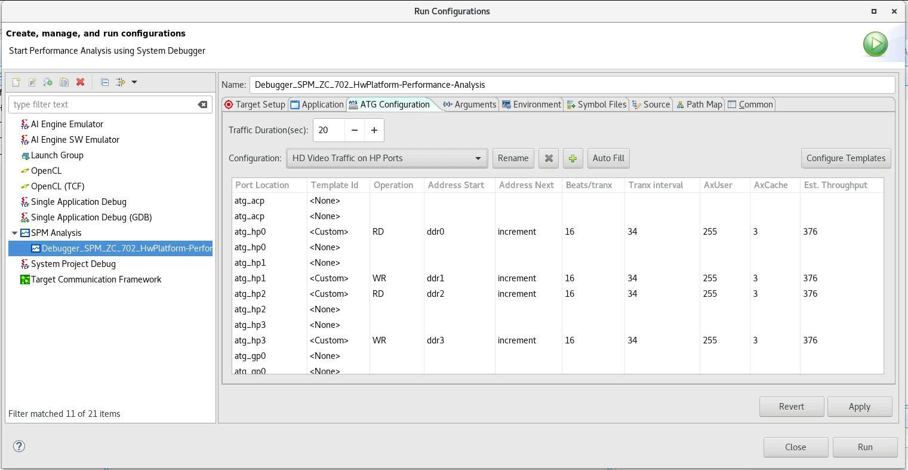
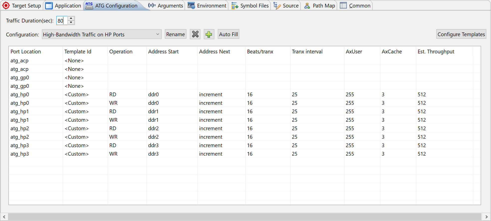
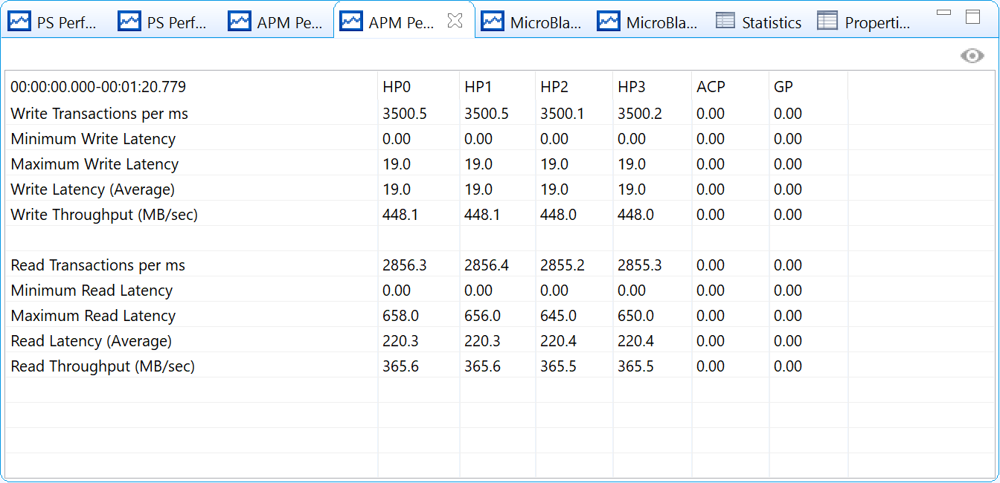
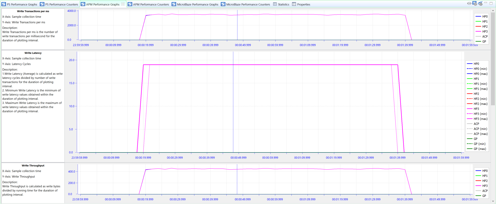
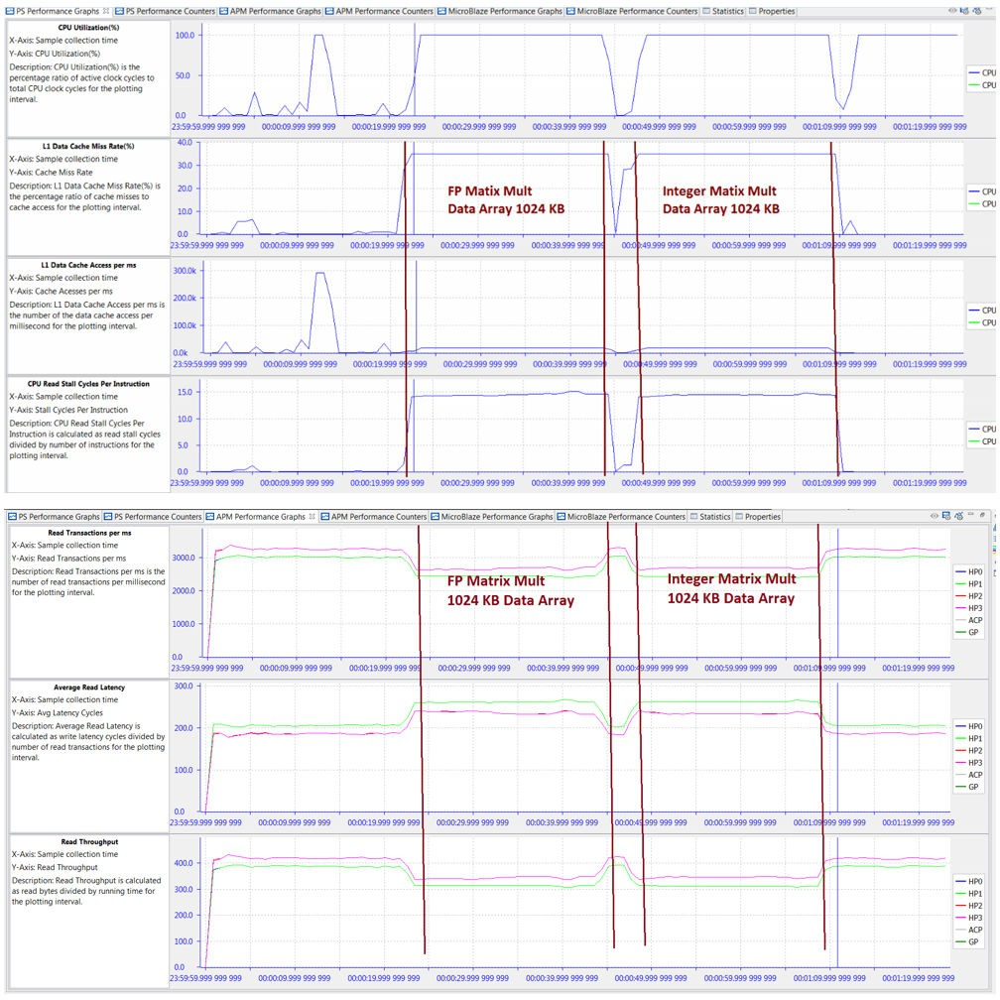
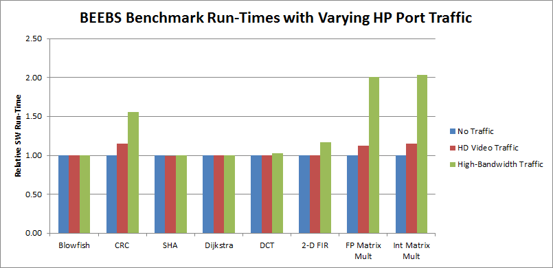
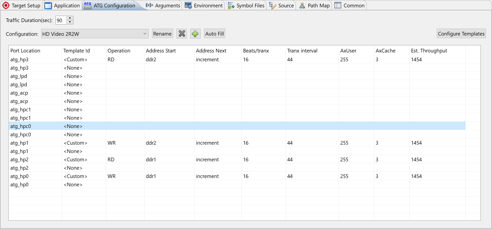
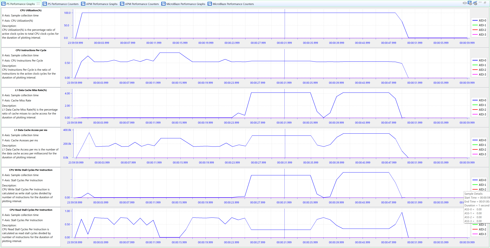
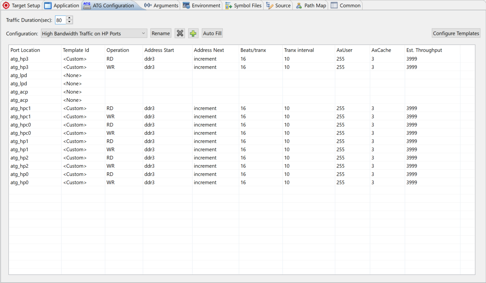
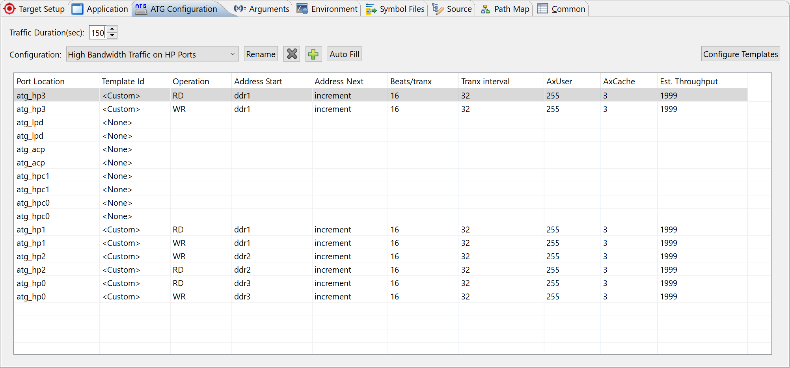

# Evaluating High-Performance Ports

A great benefit provided by System Performance Modeling (SPM) is to perform what if scenarios of Processing System (PS) and Programmable Logic (PL) activity and their interaction. This is a feature that enables you to explore performance before beginning the design phase, thus reducing the likelihood of finding performance issues late in the design. Although contention on the device is not directly visualized, its impact on system performance is displayed.

You can configure the SPM design to model specific traffic scenarios while running a software application in the PS. You can then use PL master performance metrics, such as throughput and latency, to verify that the desired system performance can be sustained in such an environment. This process can be repeated multiple times using different traffic scenarios.

One critical shared resource on the device is the DDR controller. This resource is shared by APUs, RPUs if they are on the MPSoC, the High-Performance (HP or HPM) ports, the Accelerator Coherency Port (ACP) ports, and other masters via the central interconnect (see [Evaluating DDR Controller Settings](./7-evaluating-DDR-controller-settings.md) for more details). Because of this sharing, it is important to understand the available DDR bandwidth.

You can calculate the total theoretical bandwidth of the DDR using the following equation:

```
DDR Data Rate x DDR Width (byte)
```

For example, Zynq-7000 devices:

```
1066M tranx/sec × (4 bytes)/tranx = 4264 MB/s
```

Zynq UltraScale+ MPSoC with 64-bit DDR4

```
2400M tranx/sec x 8 bytes/tranx = 19200 MB/s
```

While this is the maximum bandwidth achievable by this memory, the actual DDR utilization is based on many factors, including number of requesting masters and the types of memory accesses. As shown in this chapter, requesting bandwidth that approaches or exceeds this maximum will potentially impact the achieved throughput and latency of all requesting masters. The System Performance Analysis (SPA) toolbox in the Vitis™ IDE aids in this analysis.

## Example: HD Video Traffic on Zynq-7000

<!-- A general case -->

The software application used was the BEEBS benchmark program described in [SPM Software](./2-system-performance-modeling-project.md#spm-software). See [Figure 9: Application Setup in the Vitis IDE Configuration Wizard](#figure-9-application-setup-in-the-vitis-ide-configuration-wizard), which shows how this can be specified in the Vitis IDE. In this scenario, traffic on the four High Performance (HP) ports was injected into the system, and software and hardware performance metrics are measured in the Vitis IDE. This models a system that is performing complex algorithms in software while simultaneously processing HD video streams in the PL. Rather than design a system that implements this processing, you can instead model the performance using SPM. You can quickly verify that your desired performance is achieved before beginning your design.

The following figure shows the first traffic scenario used (see [Getting Started with SPM](./4-getting-started-with-SPM.md) for a description of this traffic specification). This scenario models four uncompressed 1080p/60 (that is, 1080 lines, progressive, and 60 frames/s) HD video streams. Two streams are being read from the DDR on ports HP0 and HP2, while two are being written on ports HP1 and HP3. For all of these modeled video streams, the Tranx Interval was chosen to request 376 MB/s, the estimated throughput of the uncompressed RGB 4:4:4 video.

 *Figure 18:* **ATG Traffic Configuration Modeling HD Video Streams on HP Ports**



This HD video traffic was run on a ZC702 board. As shown in the following figure, all four HP ports were able to sustain the requested throughput of 376 MB/s. The high throughput was even achieved while the BEEBS benchmarks were running on CPU0. The total bandwidth used by the four HP ports was 1510 MB/s, or 35% of the available bandwidth of the DDR. Thus, the Zynq-7000 SoC device was capable of achieving these throughput requirements. However, due to arbitration and scheduling in the DDR controller, some contention was introduced, impacting the performance of the software application (see [Figure 24: Relative Run-Times of BEEBS Benchmarks with Varying HP Port Traffic (Data Array Size: 1024 KB](#figure-24-relative-run-times-of-beebs-benchmarks-with-varying-hp-port-traffic-data-array-size-1024-kb) for a summary).

Most benchmarks had minimal impact on their run-time; however, the benchmarks that have a high number of memory accesses were impacted the most. The worst case was the integer matrix multiplication, which had a run-time increase of 14.0%.

 *Figure 19:* **Summary of Performance Results from Modeling HD Video Streams on HP Ports**


In this example, SPM helps to show whether the throughput requirement from PL can be achieved and whether it will impact software application performance.

## Example: High-Bandwidth Traffic on Zynq-7000

<!--Stress test case-->

The traffic modeling concept described in [HD Video Traffic](#example-hd-video-traffic-on-zynq-7000) can be extended. You can run the same BEEBS benchmarks but with a different traffic scenario on the HP ports.

The following figure shows traffic that executes a stress test to see how high-bandwidth traffic can affect performance. All four HP ports request 512 MB/s for both read and write traffic using incremental addressing to the DDR. The total duration was set to 80 seconds to ensure that the traffic duration coincided with the entire length of the BEEBS benchmark application. [Figure 13: CPU Utilization Labeled with BEEBS Benchmarks](#figure-13-cpu-utilization-labeled-with-beebs-benchmarks) helps orient the timeline for the results.

 *Figure 20:* **ATG Traffic Configuration Modeling High-Bandwidth Traffic on HP Ports**



The total throughput requested by HP masters is 8 x 512 = 4096 MB/s, or 95.9% of the theoretical maximum throughput of the DDR. Because the traffic contains both write and read requests, the DDR controller is further stressed because it needs to arbitrate between not just multiple requestors but also different types of requests. Therefore, consider this a stress test of the achievable DDR bandwidth. While this traffic represents a worst-case scenario, it is important to perform to visualize the backpressure that occurs when more bandwidth is requested than what the memory can provide.

 *Figure 21:* **Summary of Performance Results from Modeling High-Bandwidth Traffic on HP Ports**



Using the SPM design in the Vitis IDE, this type of stress test can be easily performed. The BEEBS benchmark application was run on CPU0 while the ATGs are configured by the Vitis IDE to run the requested traffic shown in [Figure 20: ATG Traffic Configuration Modeling High-Bandwidth Traffic on HP Ports](#figure-20-atg-traffic-configuration-modeling-high-bandwidth-traffic-on-hp-ports). A summary of the performance results from this traffic scenario is shown in [Figure 21: Summary of Performance Results from Modeling High-Bandwidth Traffic on HP Ports](#figure-21-summary-of-performance-results-from-modeling-high-bandwidth-traffic-on-hp-ports). As expected, the requested throughput of 512 MB/s per HP port is not achieved; however, a very high total throughput is indeed achieved. The total read/write bandwidth allocated to the HP ports can be calculated as follows:

 `Total bandwidth=448.1 + 448.1 + 448.0 + 448.0 + 365.6 + 365.0 + 365.5 + 365.5 = 3254.4 MB/s`

While this bandwidth is 76% of the theoretical maximum from , there is also the bandwidth allocated to CPU0 running the BEEBS benchmark suite. This stress test confirms the arbitration used by the DDR controller for write and read traffic across four HP ports. Note that exclusively write or read traffic could also be used, increasing the bandwidth performance of the DDR controller.

Because both write and read traffic is being specified, it is important to analyze the performance of both types of transactions. The following figure shows the performance of the write AXI transactions in the PL Performance panel. The three graphs shown include: Write Transactions, Average Write Latency, and Write Throughput. The write throughput and latency are relatively consistent on all four HP ports across the entire test run, with a slight drop in the average value and some variance introduced at about 3.2s.

 *Figure 22:* **Write Performance Results of High-Bandwidth Traffic on HP Ports with BEEBS Benchmarks Running**



The read throughput and latency of the HP ports show a more noticeable drop in performance during the matrix multiplications (see the following figure). During all other tests, the read bandwidths are about 420 MB/s, while during the memory-intensive matrix multipliers (using the 1024 KB data array) the throughput drops to about 340 MB/s. Hovering the mouse over the graph will confirm the fact. At an elapsed time of 64 sec, the read throughputs of the four HP ports are all about 338 MB/s. This decrease in throughput coincides with an increase in latency, both caused by saturation at the DDR controller.

 *Figure 23:* **Read Performance Results of High-Bandwidth Traffic on HP Ports with BEEBS Benchmarks Running**



You can also use the Trace Tooltip button to report performance metric values at a specific point in time. When the tooltip is shown, you can move it to any point in time on any graph, and it will display the specified metric values. This is very helpful in pinpointing the performance at precise points in time.

The impact of increased HP traffic can be seen in the software performance. A useful metric of this performance is run time. Using the instrumentation (see [Instrumenting Hardware](./10-end-to-end-performance-analysis.md#instrumenting-hardware)) that was added to the BEEBS software, the following figure shows the relative run times of the eight benchmarks using the 1024 KB data array size. The run time of each benchmark with no traffic was normalized to 1.0. Because this large array requires accesses to the DDR, any increase in software run time would be attributed to the DDR saturation. The matrix multiplications experience the largest increases in software run times. The Cyclic Redundancy Check (CRC) algorithm also has a noticeable impact on run time, most likely due to the increased memory reads of the data array as well as the CRC polynomial table. All other benchmarks see minimal impact on performance, even with the high-throughput traffic on all four HP ports.

 *Figure 24:* **Relative Run-Times of BEEBS Benchmarks with Varying HP Port Traffic (Data Array Size: 1024 KB)**



## Example: HD Video Traffic on Zynq-7000 Devices

Similar to Zynq-7000 tests, you can run HD Video Traffic test on Zynq UltraScale+ MPSoC. Since 4K Video is now a common requirement, you can upgrade the 1080P60 data rate requirement on ZC702 test case to 4KP60 data rate requirement on ZCU102.

The SPM project of ZCU102 does not come with the HD Video Traffic preset. You have to set it up as follows:

Setup ATG with two read channels and two write channels on HP ports. 4KP60 Video requires about 1424 MB/s data rate.

```
3840 pixels x 2160 pixels x 3 Bytes x 60 Frames/s =  1,492,992,000 Bytes/s
```



Make sure the software on APU is enabled. Do not set ATG to use DDR0 because the BEEBS software uses the same address range.

(On reading the ATG configuration window, you can see that the ATG cores run at 250 MHz in this SPM design.)

From the result, you can see that the target data rate is achieved. The BEEBS software run time is identical to when there is no PL traffic. It means Zynq UltraScale+ MPSoC can handle this level of pressure well.




## Example: High-Bandwidth Traffic on Zynq UltraScale+ MPSoC

Zynq UltraScale+ MPSoC upgrades the memory subsystem with higher external bandwidth, wider internal AXI interface and more channels of AXI interfaces. As previously calculated, it has 19200 MB/s DDR throughput in the best configuration. It also increased internal AXI width and AXI interface numbers. It makes internal AXI interface total throughput much larger than the DDR controller throughput.

You can design a stress test on the ZCU102, similar to the one on ZC702, to compare their memory subsystem performance. However, do not set all ATG of HP ports to their maximum performance because this will block data in the DDR controller.

To create an SPM project for ZCU102, set ATG configuration to **High Bandwidth Traffic on HP Ports**.



The default **High Bandwidth Traffic on HP Ports** settings send 12 channels x 4000 MB = 48000 MB in total to DDR controller, which is far more than the theoretical DDR interface throughput. You can update the configuration to a mild stress test using these steps:



- Update the **Trans Interval** to **32**. The estimated throughput of each channel will be updated to **1999 MB/s**.
    > ***Note*:** You can disable the read and write channels of **atg_hpc0** and **atg_hpc1** to make the theoretical AXI total throughput 2000 MB/s x 8 = 16000 MB/s, close to theoretical DDR throughput 19200 (83.3%).
- Set the test to 150 seconds because during the stress test, the software will run slower than baseline.


After the APM run is complete, you can see that the BEEBS benchmark completes in 88 seconds, which 76% longer than baseline.


The PL AXI read performance is similar to our configuration target, but the write performance is lower. That is because read channels have higher priority than write channels when DDR Controller has congestions. Throughput of HP1 and HP2 is lower than HP0 and HP3. It is because HP1 and HP2 shares one DDR input port.

In this example, a high performance target was set. The SPM test result shows that the system cannot achieve this target. It also shows the level to which the requirements can be satisfied. If this is the real design requirement, you will need to change the configuration and test the system to find the best way to achieve the requirement.