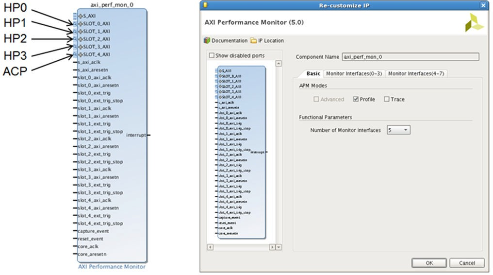
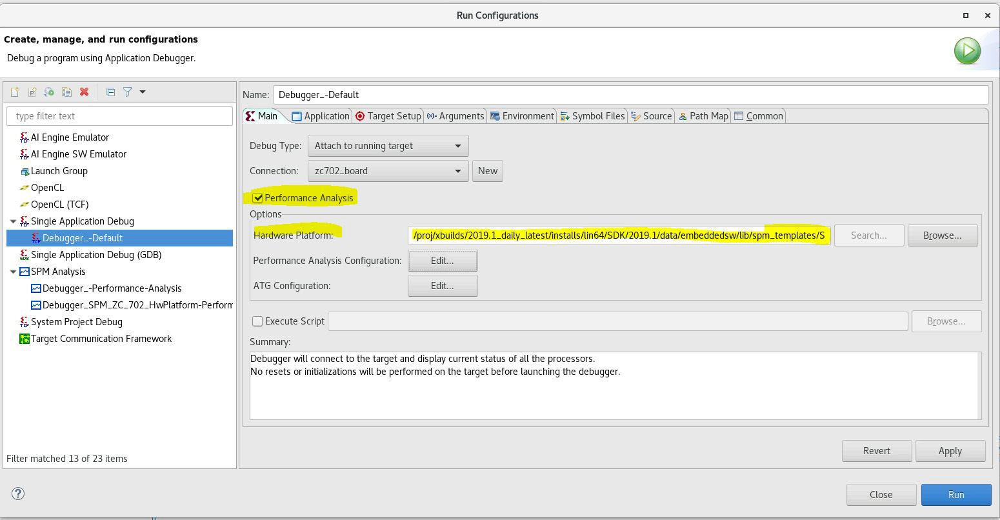

# Working with a Custom Target

 Working with a Custom Target

 To use the Vitis™ IDE system performance analysis toolbox with your
 design, there are three important items to be aware of: instrumenting
 your software, instrumenting your hardware, and monitoring a live,
 custom target within the Vitis IDE.

## Instrumenting Software

 Software run-times, bandwidth, and average latency can be calculated
 using straightforward instrumentation available in the standalone BSP
 defined in the xtime_l.h header. Before and after every benchmark, a
 call to XTime_GetTime() was inserted. The difference between these two
 XTime values was converted to seconds (or ms) using the
 COUNTS_PER_SECOND value provided in xtime_l.h. Since the amount of
 data sent during any given benchmark is known, you can also calculate
 the achieved bandwidth and average latency during that particular
 benchmark.

 Following is a sample instrumented C/C++ software code:

 ```
 #include <stdlib.h> 
 #include <stdio.h> 
 #include <unistd.h>
 #include "xtime_l.h"	// XTime_GetTime()

 // Macros
 #define TIMEDIFF(t1,t2)	(t2 - t1)
 #define MILLISECONDS(t) (1000.0 * t / COUNTS_PER_SECOND)

 // Globals
XTime start, end;

 // Start a test void startTest() 
{ 
    XTime_GetTime(&start);
}

 // End a test void endTest() 
{ 
    XTime_GetTime(&end);
    double time_curr = TIMEDIFF(start, end); double msec = MILLISECONDS(time_curr); printf("Run-time = %.2f msec...\n", msec);

    // Achieved Bandwidth = (total bytes transferred) / (msec)
    // Average Latency = (msec) / (total memory accesses)
}
 
 // Dummy test
 void runSomething(int time) 
{ 
    sleep(time);
}
 int main(void) 
{ 
    startTest(); runSomething(1); endTest();
    startTest(); runSomething(2); endTest();
    return 0;
}
 ```

## Instrumenting Hardware

 If you would like to use the performance analysis features in the
 Vitis IDE, you will need to include an AXI Performance Monitor (APM)
 in your programmable logic (PL) design. Note that an APM was already
 included in the System Performance Modeling (SPM) fixed bitstream
 design (see [SPM Software](#spm-software)).

 *Figure 44:* AXI Performance Monitor -- Instance and Customization



 The previous figure shows how an instance of an APM appears in a
 Vivado® Design Suite IP integrator block diagram, as well as its
 configuration panel. To add this in Vivado IP integrator, perform the
 following steps to instrument your PL design with an APM:

1. In the IP integrator block diagram, click the **Add IP** button.

2. Search for "AXI Performance Monitor" and double-click it.

3. Double-click the APM to open the Re-customize IP dialog box. In this
     dialog box, set the following:

    a.  Check **Profile** under **APM Mode**.

    b.  Set the **Number of Monitor interfaces** to **5**.

4. Connect the APM to your design by doing the following:

    a.  Connect S_AXI to either GP0 or GP1 on the Zynq®-7000 Processing
         System (via AXI interconnect).

    b.  Connect the SLOT_x\_AXI ports (where x=0...4) to HP0, HP1, HP2,
         HP3, and ACP. If any of those interfaces are not used in your
         design, then leave the corresponding slot unconnected.

    c.  Connect s_axi_aclk and s_axi_aresetn to the clock and reset
         associated with GP0/GP1.

    d.  Connect all inputs slot_x\_axi_aclk and slot_x\_axi_aresetn to
         the appropriate clocks and resets.

    e.  Connect core_aclk and core_aresetn to the clock/reset with the
         highest clock frequency.

5. Generate the bitstream for this design. In the Flow Navigator pane,
     click **Generate Bitstream**.

6. After the bitstream is generated, export the design using the **File → Export→ Export Hardware→ Fixed → Include bitstream**.

7. Select the name and path to save this XSA.

8. After exporting the design, launch the Vitis IDE by selecting **Tools → Launch Vitis IDE**.

## Monitoring a Custom Target

 The Vitis IDE provides the capability to monitor a running target,
 similar to what is described in [Chapter 10: End-To-End Performance Analysis](#chapter-10). There are two techniques and both are applicable regardless of the target operating system. The difference
 is whether a Hardware Platform Specification is imported into the
 Vitis IDE. This is a hardware design created by Vivado tools and then
 imported into the Vitis IDE as a project.

 If your design is defined in Vivado, then it is recommended to create
 a hardware platform specification based on that design. You can then
 do performance analysis based on that specification. The steps to use
 this path are as follows:

1. Select **Run → Debug Configurations**.

2. Double-click **Single Application Debug Configuration**.

3. Select Performance Analysis in the configuration as shown in the following figure.

4. Provide the XSA that was created using Vivado tools in the hardware platform tab.

5. Set the performance analysis and ATG configuration, if required.

6. Click **Run** to see the performance analysis

 *Figure 45:* Target Setup in Debug Configuration (Using Imported Hardware Platform Specification)



 The previous figure shows the target setup used in [Chapter 10: End-To-End Performance Analysis](#chapter-10) to
 connect to and monitor the Zynq-7000 SoC Base Targeted Reference
 Design (TRD). Note that all check boxes are unchecked. Because the TRD
 uses an SD card boot, the system is already reset and configured.

 If you cannot create a hardware platform specification, you can still
 do performance analysis in the Vitis IDE. The steps to use this path
 are as follows:

1. Select **Run → Debug Configurations** to create a performance analysis configuration.

2. Select **Single Application Debug Configuration**.

3. Set Debug Type to **Attach to running target**.

4. Select the Performance Analysis check box.

5. Set PS Processor Frequency (MHz) to the PS clock frequency used in your design.

6. If you have an APM in your design, do the following:

    a.  Select **Enable APM Counters**.

    b.  Set APM Frequency (MHz) to the frequency of the clock connected
         to s_axi_aclk on the APM core in your design.

    c.  Set APM Base Address to the base address of the APM in your
         design.

7. Click **Debug** to open the Performance Analysis perspective.