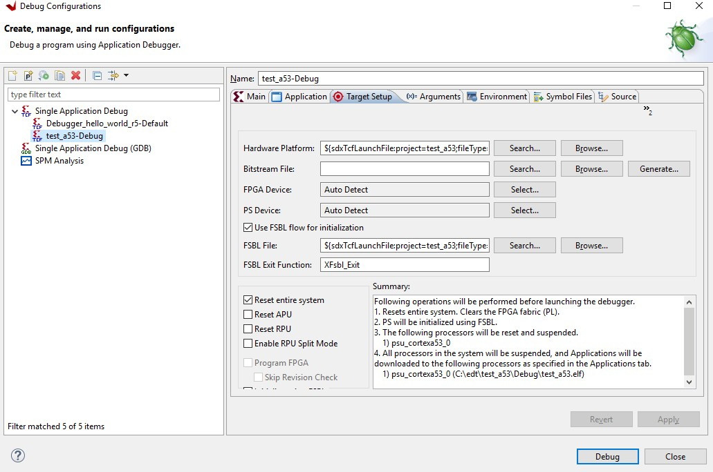
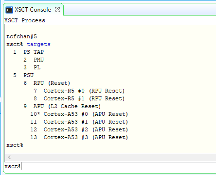
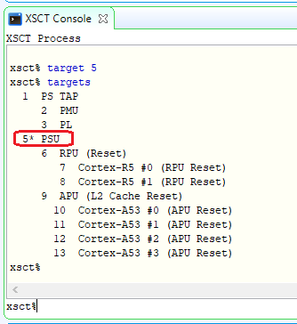
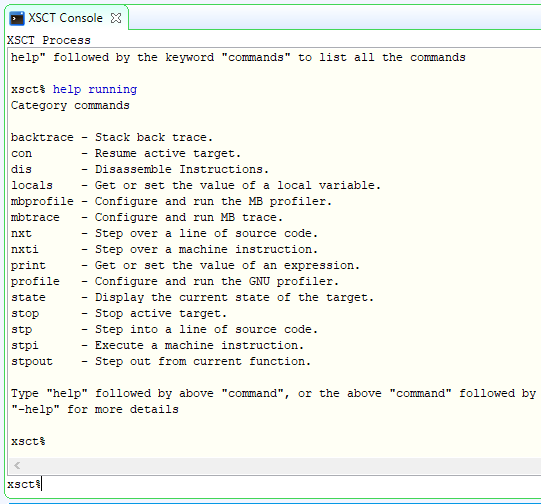

<p align="right">
            Read this page in other languages:<a href="../docs-jp/5-debugging-with-vitis-debugger.md">日本語</a>    <table style="width:100%"><table style="width:100%">
  <tr>

<th width="100%" colspan="6"><h1>Zync UltraScale+ MPSoC Embedded Design Tutorial 2020.2 (UG1209)</h1>
</th>

  </tr>
  <tr>
    <td width="17%" align="center"><a href="../README.md">1. Introduction</a></td>
    <td width="16%" align="center"><a href="2-getting-started.md">2. Getting Started</a></td>
    <td width="17%" align="center"><a href="3-system-configuration.md">3. Zynq UltraScale+ MPSoC System Configuration</a></td>
    <td width="17%" align="center"><a href="4-build-sw-for-ps-subsystems.md">4. Build Software for PS Subsystems</a></td>
</tr>
<tr>
    <td width="17%" align="center">5. Debugging with the Vitis Debugger</td>
    <td width="16%" align="center"><a href="6-boot-and-configuration.md">6. Boot and Configuration</a></td>
    <td width="17%" align="center"><a href="7-system-design-examples.md">7. System Design Examples</a></td>
    <td width="17%" align="center"><a href="8-debugging-problems-with-secure-boot.md">8. Debugging Problems with Secure Boot</a></td>    
  </tr>
</table>


# Debugging with the Vitis Debugger

This chapter describes debug possibilities with the design flow you
have already been working with. The first option is debugging with
software using the Vitis&trade; debugger.

The Vitis debugger provides the following debug capabilities:

- Supports debugging of programs on Arm&reg; Cortex&trade;-A53, Arm&reg;
    Cortex&trade;-R5F, and MicroBlaze&trade; processor architectures
    (heterogeneous multi-processor hardware system debugging)

- Supports debugging of programs on hardware boards

- Supports debugging on remote hardware systems

- Provides a feature-rich IDE to debug programs

- Provides a Tool Command Language (Tcl) interface for running test
    scripts and automation

 The Vitis debugger enables you to see what is happening to a program
 while it executes. You can set breakpoints or watchpoints to stop the
 processor, step through program execution, view the program variables
 and stack, and view the contents of the memory in the system.

 The Vitis debugger supports debugging through Xilinx&reg; System Debugger.

## Xilinx System Debugger

 The Xilinx System Debugger uses the Xilinx hardware server as the
 underlying debug engine. The Vitis IDE translates each user interface
 action into a sequence of Target Communication Framework (TCF)
 commands. It then processes the output from System Debugger to display
 the current state of the program being debugged. It communicates to
 the processor on the hardware using Xilinx hardware server.

 The debug workflow is described in the following figure.

 

 The workflow is made up of the following components:

- **Executable ELF File:** To debug your application, you must use an
     Executable and Linkable Format (ELF) file compiled for debugging.
     The debug ELF file contains additional debug information for the
     debugger to make direct associations between the source code and
     the binaries generated from that original source. To manage the
     build configurations, right-click the software application and
     select **Build Configurations → Manage**.

- **Debug Configuration:** To launch the debug session, you must
     create a debug configuration in the Vitis debugger. This
     configuration captures options required to start a debug session,
     including the executable name, processor target to debug, and
     other information. To create a debug configuration, right-click
     your software application and select **Debug As→ Debug
     Configurations**.

- **Vitis Debug Perspective:** Using the Debug perspective, you can
     manage the debugging or running of a program in the Workbench. You
     can control the execution of your program by setting breakpoints,
     suspending launched programs, stepping through your code, and
     examining the contents of variables. To view the Debug
     Perspective, select **Window → Open Perspective → Debug**.

 You can repeat the cycle of modifying the code, building the
 executable, and debugging the program in the Vitis debugger.

 >***Note*:** If you edit the source after compiling, the line numbering
 will be out of step because the debug information is tied directly to
 the source. Similarly, debugging optimized binaries can also cause
 unexpected jumps in the execution trace.

## Debugging Software Using the Vitis Debugger

 In this example, you will walk through debugging a Hello World
 application.

 >***Note*:** If you did not create a Hello World application on APU or
 RPU, follow the steps in [Create
 Custom Bare-Metal Application for Arm Cortex-A53 based
 APU](4-build-sw-for-ps-subsystems.md#create-custom-bare-metal-application-for-arm-cortex-a53-based-apu)
 to create a new hello world application.

 After you create the Hello World application, work through the
 following example to debug the software using the Vitis debugger.

1. Follow the steps in [Example Project: Running the "Hello World" Application from Arm Cortex-A53](4-build-sw-for-ps-subsystems.md#example-project-running-the-hello-world-application-from-arm-cortex-a53)
     to set the target in JTAG mode and power ON.

2. In the C/C++ Perspective, right-click the **test_a53 Project** and
     select **Debug As→ Launch on Hardware→ Single Application Debug**.

    >***Note*:** The above step launches the Application Debugger in the
    Debug perspective based on the project settings. Alternatively, you
    can also create a Debug configuration which looks like the following
    figure.

    

    If the Confirm Perspective Switch popup window appears, click **Yes**.
    The Debug perspective opens.

    >***Note*:** If the Debug perspective window does not automatically
    open, select **Window→ Perspective → Open Perspective → Other**, then
    select **Debug** in the Open Perspective wizard.

    

    >***Note*:** The addresses shown on this page might slightly differ
    from the addresses shown on your system.

    The processor is currently sitting at the beginning of `main()` with
    program execution suspended at line `0000000000000cf0`. You can confirm
    this information in the Disassembly view, which shows the
    assembly-level program execution also suspended at `0000000000000cf0`.

    >***Note*:** If the Disassembly view is not visible, select **Window→ Show View→ Disassembly**.

3. The helloworld.c window also shows execution suspended at the first
     executable line of C code. Select the **Registers** view to
     confirm that the program counter, pc register, contains
     `0000000000000cf0`.

    ***Note*:** If the Registers window is not visible, select **Window→ Show View→ Registers**.

4. Double-click in the margin of the helloworld.c window next to the
     line of code that reads print ("`Hello World\n\r`");. This sets a
     breakpoint at the printf command. To confirm the breakpoint,
     review the Breakpoints window.

    >***Note*:** If the Breakpoints window is not visible, select **Window → Show View→ Breakpoints**.

5. Select **Run → Step Into** to step into the `init_platform()` routine.

    Program execution suspends at location `0000000000000d3c`. The call
    stack is now two levels deep.

6. Select **Run → Resume** to continue running the program to the
     breakpoint.

    Program execution stops at the line of code that includes the printf
    command. The Disassembly and Debug windows both show program execution
    stopped at `0000000000001520`.

    >***Note*:** The execution address in your debugging window might
    differ if you modified the hello world source code in any way.

7. Select **Run → Resume** to run the program to conclusion.

 When the program completes, the Debug window shows that the program is
 suspended in a routine called exit. This happens when you are running
 under control of the debugger.

8. Re-run your code several times.
     Experiment with single-stepping, examining memory, breakpoints,
     modifying code, and adding print statements. Try adding and moving
     views.

    >**TIP:** *You can use the Vitis debugger debugging shortcuts for
    step-into (F5), step-return (F7), step-over (F6), and resume (F8).*

## Debugging Using XSCT

 You can use the previous steps to debug bare-metal applications
 running on RPU and PMU using Vitis Application Debugger GUI.

 Additionally, you can debug in the command line mode using XSDB, which
 is encapsulated as a part of XSCT. In this example, you will debug the
 bare-metal application testapp_r5 using XSCT.

 Following steps indicate how to load a bare-metal application on R5
 using XSCT. This example is just to demonstrate the command line
 debugging possibility using XSDB/XSCT. Based on the requirement, you
 can choose to debug the code using either the System Debugger
 graphical interface or the command line debugger in XSCT. All XSCT
 commands are scriptable and this applies to the commands covered in
 this example.

### Set Up Target

1. Connect a USB cable between USB-JTAG J2 connector on target and the
     USB port on the host machine.

2. Set the board in JTAG Boot mode, where SW6 is
     set as shown in following figure.

     

3. Power on the Board using switch SW1.

4. Open XSCT Console, click the **XSCT Console** button
      in the tool bar. Alternatively,
     you can also open the XSCT console from **Xilinx → XSCT Console**.

5. In the XSCT Console, connect to the target over JTAG using the
     connect command:

    `xsct% connect`

    The connect command returns the channel ID of the connection.

6. Command targets lists the available targets and allows you to select
     a target through its ID. The targets are assigned IDs as they are
     discovered on the JTAG chain, so the target IDs can change from
     session to session.

    For non-interactive usage such as scripting, the -filter option can be
    used to select a target instead of selecting the target through its
    ID:

    `xsct% targets`

    The targets are listed as shown in the following figure.

    

7. Now select the PSU target. The Arm APU and RPU clusters are grouped
     under PSU. Select Cortex-A53\#0 as target using the following
     command.

    `xsct% targets -set -filter {name =\~ \"Cortex-A53 \#0\"}`

    The command targets now lists the targets and also shows the selected
    target highlighted with as asterisk (\*) mark. You can also use target
    number to select a target, as shown in the following figure.

    

8.  The processor is now held in Reset. To clear the processor reset,
     use the following command:

    `rst -processor`

9.  Load the FSBL on Cortex-A53 \#0. FSBL initializes the processing
     system of Zynq UltraScale+.

    ``` tcl
    xsct% dow {C:\edt\fsbl_a53\Debug\fsbl_a53.elf}
    xsct% con
    xsct% stop
    ```

 >***Note*:** The {} used in the above command are required on windows
 machine to enable backward slash (\) in paths. These braces can be
 avoided by using forward \"/\" in paths. Considering Linux paths, use
 forward "/" because the paths in XSCT in Linux can work as is,
 without any braces.

### Load the Application Using XSCT

1. Download the testapp_r5 application on Arm Cortex-R5F Core 0.

2. Check and select RPU Cortex-R5F Core 0 target ID.

    ```
    xsct% targets
    xsct% targets -set -filter {name =~ "Cortex-R5 #0"}
    xsct% rst -processor
    ```

    The command `rst -processor` clears the reset on an individual processor
    core.

    This step is important, because when Zynq MPSoC boots up JTAG boot
    mode, all the Cortex- A53 and Cortex-R5F cores are held in reset. You
    must clear the resets on each core, before debugging on these cores.
    The rst command in XSDB can be used to clear the resets.

 >***Note*:** The command rst -cores clears resets on all the processor
 cores in the group (such as APU or RPU), of which the current target
 is a child. For example, when A53 \#0 is the current target, rst -
 cores clears resets on all the Cortex-A53 cores in APU.
 >
 >`xsct% dow {C:\edt\testapp_r5\Debug\testapp_r5.elf}`
 >or
 >`xsct% dow {C:/edt/testapp_r5/Debug/testapp_r5.elf}`
 >
 >At this point, you can see the sections from the ELF file downloaded
 sequentially. The XSCT prompt can be seen after successful download. Now, configure a serial terminal (Tera Term, Mini com, or the Serial
 Terminal interface for UART-1 USB-serial connection).

### Serial Terminal Configuration

1. Start a terminal session, using Tera
     Term or Mini com depending on the host machine being used, and the
     COM port and baud rate as shown in following figure.

    

2. For port settings, verify the COM port in the device manager. There
     are four USB UART interfaces exposed by the ZCU102 board. Select
     the COM port associated with the interface with the lowest number.
     So in this case, for UART-0, select the COM port with interface-0.

3. Similarly, for UART-1, select COM port with interface-1. Remember
     that R5 BSP has been configured to use UART-1, and so R5
     application messages will appear on the COM port with UART-1
     terminal.

### Run and Debug Application Using XSCT

1. Before you run the application, set a breakpoint at main().

    `xsct% bpadd -addr &main`

    This command returns the breakpoint ID. You can verify the breakpoints
    planted using command bplist. For more details on breakpoints in XSCT,
    type help breakpoint in XSCT.

2. Now resume the processor core.

    `xsct% con`

    The following informative messages will be displayed when the core
    hits the breakpoint.

    `xsct% Info: Cortex-R5 \#0 (target 7) Stopped at 0x10021C (Breakpoint)`

3. At this point, you can view registers when the core is stopped.

    `xsct% rrd`

4. View local variables.

    `xsct% locals`

5. Step over a line of the source code and view the stack trace.

    ```
    xsct% nxt
    Info: Cortex-R5 #0 (target 6) Stopped at 0x100490 (Step)
    xsct% bt
    ```
    You can use the help command to find other options:

    

    You can use the help running command to get a list of possible options
    for running or debugging an application using XSCT.

    

1. You can now run the code:

    `xsct% con`

    At this point, you can see the Cortex-R5F application print message on
    UART-1 terminal.

## Debugging FSBL Using the Vitis Debugger

 The FSBL is built with Size Optimization and Link Time Optimization
 Flags, that is -Os and LTO optimizations by default in the Vitis
 debugger. This reduces the memory footprint of FSBL. This needs to be
 disabled for debugging FSBL.

 Removing optimization can lead to increased code size, resulting in
 failure to build the FSBL. To disable the optimization (for
 debugging), some FSBL features (that are not required), need to be
 disabled in xfsbl_config.h file of FSBL.

 Now, create a new FSBL for this section instead of modifying the FSBL
 created in [Build Software for PS
 Subsystems](4-build-sw-for-ps-subsystems.md). This is to avoid disturbing the FSBL_a53
 project, which will be used extensively in rest of the chapters in
 this tutorial.

### Create and Modify FSBL

 Use the following steps to create an FSBL project.

1. Launch the Vitis debugger if it is not already open.

2. Set the Workspace path based on the project you created in [Build Software for PS Subsystems](4-build-sw-for-ps-subsystems.md). For example,
     C:\edt.

3. Select **File→ New → Application Project**. The New Project dialog
     box opens.

4. Use the information in the following table to make your selections
     in the New Project dialog box.

    *Table 8:* **Settings to Create FSBL_debug Project**

   |  Wizard Screen        |  System Properties    |  Settings     |
   |-----------------------|-----------------------|--------------------|
   | Platform              | Select platform from repository | edt_zcu102_wrapper |
   | Application project details  | Application project name  | fsbl_debug         |
   |                       | System project name   | fsbl_debug_system  |
   |                       | Target processor      | psu_cortexa53_0    |
   | Domain                | Domain                | psu_cortexa53_0    |
   | Templates             | Available templates   | Zynq MP FSBL       |

5. Click **Finish**.

    The Vitis debugger creates the System project and an FSBL application.
    Now disable Optimizations as shown below.

1. In the Explorer view, right-click the **fsbl_debug application**.

2. Click **C/C++ Build Settings**.

3. Select **Settings→ Tool Settings page→ Arm v8 gcc Compiler→ Miscellaneous**.

4. Remove `-flto -ffat-lto-objects` from other flags, as shown below.

    

    Similarly, the fsbl_debug_bsp needs to be modified to disable
    optimization.

5. Right-click **fsbl_debug_bsp** and select **Board Support Package
     Settings**.

6. Under **Overview → Drivers → psu_cortexa53_0 → extra_compiler_flags**, edit **extra_compiler_flags** to ensure
     extra compiler has this value `-g -Wall -Wextra -Os` as shown below.

    

7. Click **OK**, to save these settings. BSP re-builds automatically
     after this.

8. Go to the **fsbl_debug→ src → fsbl_config.h file**. In the FSBL code
     include the options and disable the following:

    - `#define FSBL_NAND_EXCLUDE_VAL (1U)`

    - `#define FSBL_SECURE_EXCLUDE_VAL (1U)`

    - `#define FSBL_SD_EXCLUDE_VAL (1U)`

 >***Note*:** '1' is disable and '0' is enable.

 At this point, FSBL is ready to be debugged.

 You can either debug the FSBL like any other standalone application
 (as shown in [Debugging Using XSCT](#debugging-using-xsct), or debug FSBL as a part of a Boot
 image by using the 'Attach to running target' mode of System Debugger.

 © Copyright 2017-2020 Xilinx, Inc.
